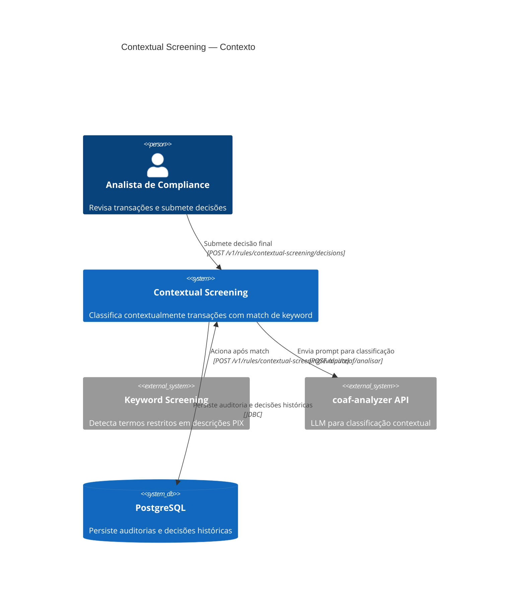
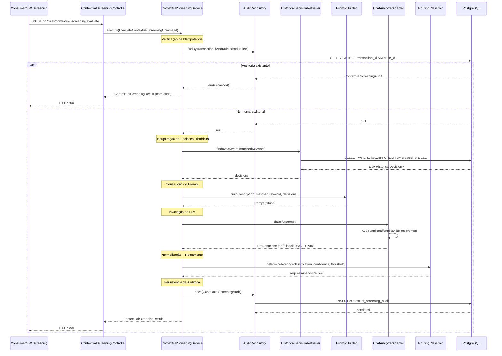
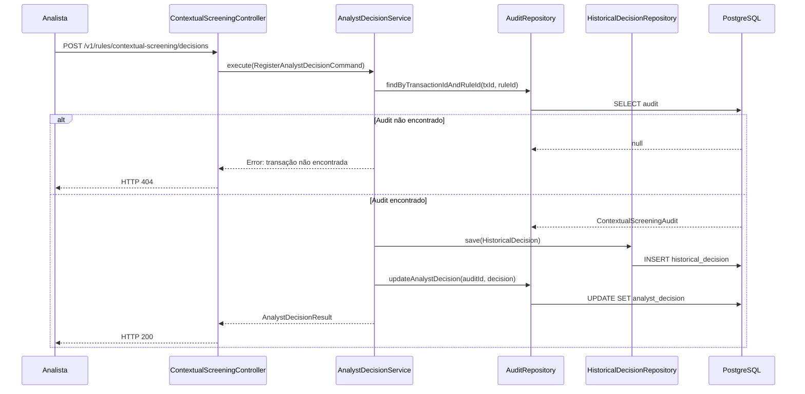
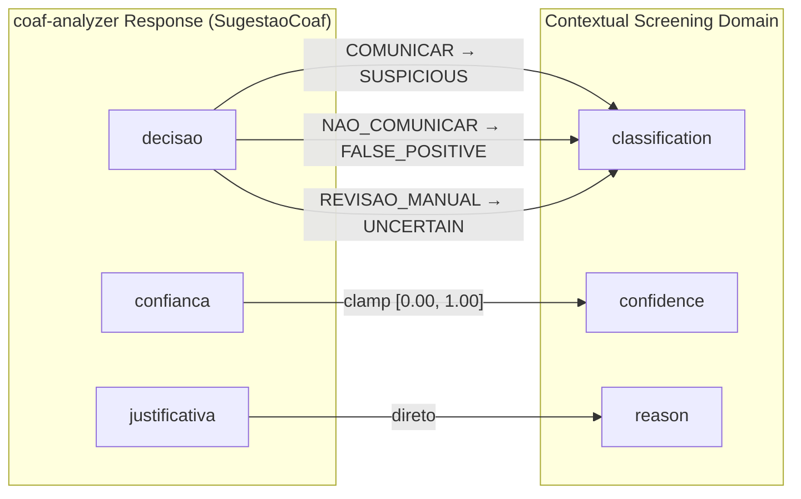
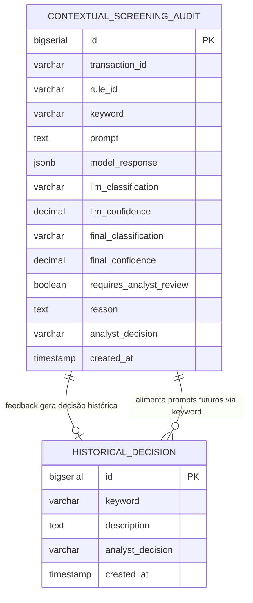

# Design Document — Contextual Screening

## Overview

O **Contextual Screening** é a segunda regra de screening do sistema, responsável por reduzir falsos positivos gerados pelo Keyword Screening. Após a detecção de termos monitorados, o Contextual Screening avalia semanticamente o contexto da transação usando um LLM (via coaf-analyzer API) combinado com decisões históricas de analistas (RAG — Retrieval Augmented Generation).

O serviço classifica transações em `FALSE_POSITIVE`, `SUSPICIOUS` ou `UNCERTAIN`, determina automaticamente a rota de encaminhamento (fechamento automático ou revisão manual) e persiste um registro de auditoria completo. O feedback dos analistas alimenta avaliações futuras via few-shot learning, criando um ciclo contínuo de melhoria sem retreinamento do modelo.

### Decisões de Design

| Decisão | Escolha | Justificativa |
|---|---|---|
| Integração com LLM | Port/Adapter (`LlmClassifierPort` → `CoafAnalyzerAdapter`) | Isolamento do provedor; troca de LLM sem impacto no domínio |
| Retrieval de decisões históricas | Consulta DB filtrada por keyword + ordenação por `createdAt` DESC | Simples, sem infra externa (Elasticsearch/Vector DB), suficiente para few-shot com ~10 exemplos |
| Construção de prompt | `PromptBuilder` como domain service puro | Testabilidade; prompt é função pura de (description, keyword, decisions) |
| Roteamento (routing) | Função pura `classification + confidence → requiresAnalystReview` | Determinístico, testável por PBT; threshold configurável via `application.yml` |
| Persistência de auditoria | Tabela `contextual_screening_audit` com JSONB para `model_response` | Flexibilidade para evoluir resposta do LLM; UNIQUE em (`transaction_id`, `rule_id`) |
| Idempotência | Verificação no `Audit_Repository` antes de invocar LLM | Evita chamadas duplicadas ao LLM (custo + latência); race condition tratada por constraint UNIQUE |
| Fallback em falha do LLM | Retorna `UNCERTAIN` / confidence=0.00 / requiresAnalystReview=true | Conservador: jamais fecha automaticamente sem classificação confiável |
| Feedback do analista | Persiste `HistoricalDecision` + atualiza `analystDecision` no audit | Dual write garante que feedback esteja disponível para RAG e que auditoria seja completa |
| Normalização de classificação | Enum parsing com fallback para `UNCERTAIN` | Robustez contra respostas inesperadas do LLM |
| Normalização de confidence | Clamp em [0.00, 1.00] | Robustez contra valores fora de range do LLM |
| HTTP Client | Spring `RestClient` (síncrono, Spring 6.1+) | Alinhado com o modelo blocking do projeto; simples de testar com MockWebServer |
| Timeout LLM | 30s padrão, configurável via `coaf.analyzer.timeout-seconds` | Balanceia latência aceitável vs tempo de resposta do LLM |

### Contexto de Extensibilidade

O Contextual Screening **não implementa** a interface `ScreeningRule` existente porque seu contrato de entrada é diferente (requer `matchedKeyword` além de `transactionId`/`description`). Ele é um serviço autônomo que opera como segunda camada após o Keyword Screening, com seu próprio use case e controller.

---

## Architecture

### Diagrama de Contexto



### Diagrama de Camadas (DDD)

```mermaid
graph TD
    subgraph Presentation
        CTRL[ContextualScreeningController]
        REQ[ContextualScreeningRequest]
        RESP[ContextualScreeningResponse]
        DREQ[AnalystDecisionRequest]
        DRESP[AnalystDecisionResponse]
    end

    subgraph Application
        UC_EVAL[EvaluateContextualScreeningUseCase]
        UC_DEC[RegisterAnalystDecisionUseCase]
        SVC[ContextualScreeningService]
        DEC_SVC[AnalystDecisionService]
    end

    subgraph Domain
        PB[PromptBuilder]
        RC[RoutingClassifier]
        RN[ResponseNormalizer]
        HD[HistoricalDecision]
        CSR[ContextualScreeningResult]
        CSA[ContextualScreeningAudit]
        CLS[Classification]
        PORT_LLM[LlmClassifierPort]
        PORT_HIST[HistoricalDecisionRepository]
        PORT_AUDIT[ContextualScreeningAuditRepository]
    end

    subgraph Infrastructure
        ADAPTER_LLM[CoafAnalyzerAdapter]
        ADAPTER_HIST[HistoricalDecisionRepositoryImpl]
        ADAPTER_AUDIT[ContextualScreeningAuditRepositoryImpl]
        CONFIG[ContextualScreeningConfig]
        ENTITY_AUDIT[ContextualScreeningAuditEntity]
        ENTITY_HIST[HistoricalDecisionEntity]
    end

    CTRL --> UC_EVAL
    CTRL --> UC_DEC
    UC_EVAL --> SVC
    UC_DEC --> DEC_SVC
    SVC --> PORT_LLM
    SVC --> PORT_HIST
    SVC --> PORT_AUDIT
    SVC --> PB
    SVC --> RC
    SVC --> RN
    DEC_SVC --> PORT_HIST
    DEC_SVC --> PORT_AUDIT
    ADAPTER_LLM -.-> PORT_LLM
    ADAPTER_HIST -.-> PORT_HIST
    ADAPTER_AUDIT -.-> PORT_AUDIT
```



### Fluxo de Avaliação Contextual



### Fluxo de Feedback do Analista



### Mapeamento coaf-analyzer → Contextual Screening



---

## Components and Interfaces

### Domain Layer

#### Value Objects e Enums

```kotlin
package br.com.screening.domain.model

enum class Classification {
    FALSE_POSITIVE,
    SUSPICIOUS,
    UNCERTAIN
}
```

```kotlin
package br.com.screening.domain.model

import java.time.Instant

/**
 * Resultado da avaliação contextual de uma transação.
 */
data class ContextualScreeningResult(
    val classification: Classification,
    val confidence: Double,
    val reason: String,
    val requiresAnalystReview: Boolean
)
```

```kotlin
package br.com.screening.domain.model

import java.time.Instant

/**
 * Decisão histórica de um analista, usada como exemplo para few-shot learning.
 */
data class HistoricalDecision(
    val id: Long? = null,
    val keyword: String,
    val description: String,
    val analystDecision: Classification,
    val createdAt: Instant
)
```

```kotlin
package br.com.screening.domain.model

import java.time.Instant

/**
 * Registro de auditoria completo de uma avaliação contextual.
 */
data class ContextualScreeningAudit(
    val id: Long? = null,
    val transactionId: String,
    val ruleId: String,
    val keyword: String,
    val prompt: String,
    val modelResponse: String?,        // JSONB — resposta bruta do LLM ou mensagem de erro
    val llmClassification: String?,    // Classificação original do LLM (antes de normalização)
    val llmConfidence: Double?,        // Confidence original do LLM (antes de clamp)
    val finalClassification: Classification,
    val finalConfidence: Double,
    val requiresAnalystReview: Boolean,
    val reason: String,
    val analystDecision: Classification? = null,
    val createdAt: Instant
)
```

#### Domain Services

```kotlin
package br.com.screening.domain.service

import br.com.screening.domain.model.HistoricalDecision

/**
 * Serviço de domínio puro responsável por construir o prompt para o LLM.
 * O prompt inclui: descrição, keyword, decisões históricas (few-shot) e instruções de classificação.
 */
@Component
class PromptBuilder {

    /**
     * Constrói o prompt completo para envio ao LLM.
     * - Sempre inclui: description, matchedKeyword, instruções de classificação e confiança
     * - Inclui seção de few-shot apenas se decisions não estiver vazia
     */
    fun build(
        description: String,
        matchedKeyword: String,
        decisions: List<HistoricalDecision>
    ): String
}
```

```kotlin
package br.com.screening.domain.service

import br.com.screening.domain.model.Classification
import br.com.screening.domain.model.ContextualScreeningResult

/**
 * Serviço de domínio puro que determina a decisão de roteamento
 * com base na classificação e pontuação de confiança.
 */
@Component
class RoutingClassifier {

    /**
     * Determina se a transação requer revisão do analista.
     *
     * Regras:
     * - SUSPICIOUS → sempre true
     * - UNCERTAIN → sempre true
     * - FALSE_POSITIVE + confidence >= threshold → false (auto-close)
     * - FALSE_POSITIVE + confidence < threshold → true (revisão conservadora)
     */
    fun requiresAnalystReview(
        classification: Classification,
        confidence: Double,
        autoCloseThreshold: Double
    ): Boolean
}
```

```kotlin
package br.com.screening.domain.service

import br.com.screening.domain.model.Classification

/**
 * Serviço de domínio puro que normaliza a resposta do LLM:
 * - Classificação inválida → UNCERTAIN
 * - Confidence fora de [0.00, 1.00] → clamp para limite mais próximo
 */
@Component
class ResponseNormalizer {

    /**
     * Normaliza a classificação: se não for um valor válido, retorna UNCERTAIN.
     */
    fun normalizeClassification(rawClassification: String?): Classification

    /**
     * Normaliza a confidence: clamp para [0.00, 1.00].
     */
    fun normalizeConfidence(rawConfidence: Double?): Double
}
```

#### Ports (Domain Interfaces)

```kotlin
package br.com.screening.domain.port

/**
 * Porta de saída para o classificador LLM.
 * Abstrai o provedor de LLM, permitindo substituição sem impacto no domínio.
 */
interface LlmClassifierPort {

    /**
     * Envia o prompt ao LLM e retorna a resposta bruta.
     * Em caso de falha (timeout, erro HTTP, JSON inválido), retorna LlmResponse com erro.
     */
    fun classify(prompt: String): LlmResponse
}

/**
 * Resposta do LLM, encapsulando sucesso ou falha.
 */
data class LlmResponse(
    val classification: String?,   // Decisão bruta do LLM (COMUNICAR, NAO_COMUNICAR, REVISAO_MANUAL)
    val confidence: Double?,       // Confiança bruta
    val reason: String?,           // Justificativa
    val rawResponse: String?,      // JSON bruto da resposta para auditoria
    val success: Boolean,          // true se a chamada foi bem-sucedida
    val errorMessage: String? = null  // Mensagem de erro em caso de falha
)
```

```kotlin
package br.com.screening.domain.port

import br.com.screening.domain.model.HistoricalDecision

/**
 * Porta de persistência para decisões históricas dos analistas.
 */
interface HistoricalDecisionRepository {

    /**
     * Recupera decisões históricas por keyword, ordenadas por createdAt DESC.
     * Retorna lista vazia se nenhuma decisão existir.
     */
    fun findByKeyword(keyword: String): List<HistoricalDecision>

    /**
     * Persiste uma nova decisão histórica.
     */
    fun save(decision: HistoricalDecision): HistoricalDecision
}
```

```kotlin
package br.com.screening.domain.port

import br.com.screening.domain.model.Classification
import br.com.screening.domain.model.ContextualScreeningAudit

/**
 * Porta de persistência para registros de auditoria do Contextual Screening.
 */
interface ContextualScreeningAuditRepository {

    /**
     * Busca auditoria existente pelo par (transactionId, ruleId).
     * Usado para idempotência.
     */
    fun findByTransactionIdAndRuleId(transactionId: String, ruleId: String): ContextualScreeningAudit?

    /**
     * Persiste um novo registro de auditoria.
     * Race condition tratada via constraint UNIQUE — em caso de violação,
     * recupera e retorna o registro existente.
     */
    fun save(audit: ContextualScreeningAudit): ContextualScreeningAudit

    /**
     * Atualiza o campo analystDecision de um registro de auditoria existente.
     */
    fun updateAnalystDecision(transactionId: String, ruleId: String, decision: Classification)
}
```

### Application Layer

#### Use Cases

```kotlin
package br.com.screening.application.usecase

data class EvaluateContextualScreeningCommand(
    val transactionId: String,
    val ruleId: String,
    val description: String,
    val matchedKeyword: String
)

interface EvaluateContextualScreeningUseCase {
    fun execute(command: EvaluateContextualScreeningCommand): ContextualScreeningResultDto
}

data class ContextualScreeningResultDto(
    val classification: String,
    val confidence: Double,
    val reason: String,
    val requiresAnalystReview: Boolean
)
```

```kotlin
package br.com.screening.application.usecase

data class RegisterAnalystDecisionCommand(
    val transactionId: String,
    val ruleId: String,
    val analystDecision: String  // Validado no service: deve ser Classification válida
)

interface RegisterAnalystDecisionUseCase {
    fun execute(command: RegisterAnalystDecisionCommand): AnalystDecisionResultDto
}

data class AnalystDecisionResultDto(
    val transactionId: String,
    val ruleId: String,
    val analystDecision: String,
    val registeredAt: String
)
```

#### ContextualScreeningService

```kotlin
package br.com.screening.application.service

import br.com.screening.application.usecase.*
import br.com.screening.domain.model.*
import br.com.screening.domain.port.*
import br.com.screening.domain.service.*
import org.springframework.beans.factory.annotation.Value
import org.springframework.stereotype.Service
import java.time.Instant

@Service
class ContextualScreeningService(
    private val auditRepository: ContextualScreeningAuditRepository,
    private val historicalDecisionRepository: HistoricalDecisionRepository,
    private val llmClassifier: LlmClassifierPort,
    private val promptBuilder: PromptBuilder,
    private val routingClassifier: RoutingClassifier,
    private val responseNormalizer: ResponseNormalizer,
    @Value("\${contextual-screening.auto-close-threshold:0.95}")
    private val autoCloseThreshold: Double
) : EvaluateContextualScreeningUseCase {

    companion object {
        private const val RULE_ID = "CONTEXTUAL_SCREENING"
    }

    override fun execute(command: EvaluateContextualScreeningCommand): ContextualScreeningResultDto {
        // 1. Idempotência: verifica se já existe auditoria para (transactionId, ruleId)
        val existingAudit = auditRepository.findByTransactionIdAndRuleId(
            command.transactionId, command.ruleId
        )
        if (existingAudit != null) {
            return existingAudit.toResultDto()
        }

        // 2. Recuperar decisões históricas (fallback: lista vazia em caso de erro)
        val decisions = retrieveHistoricalDecisions(command.matchedKeyword)

        // 3. Construir prompt
        val prompt = promptBuilder.build(
            description = command.description,
            matchedKeyword = command.matchedKeyword,
            decisions = decisions
        )

        // 4. Invocar LLM
        val llmResponse = llmClassifier.classify(prompt)

        // 5. Normalizar resposta
        val classification = responseNormalizer.normalizeClassification(
            mapDecisaoToClassification(llmResponse.classification)
        )
        val confidence = responseNormalizer.normalizeConfidence(llmResponse.confidence)
        val reason = llmResponse.reason ?: llmResponse.errorMessage ?: "Sem justificativa disponível"

        // 6. Determinar roteamento
        val requiresReview = routingClassifier.requiresAnalystReview(
            classification, confidence, autoCloseThreshold
        )

        // 7. Persistir auditoria
        val audit = ContextualScreeningAudit(
            transactionId = command.transactionId,
            ruleId = command.ruleId,
            keyword = command.matchedKeyword,
            prompt = prompt,
            modelResponse = llmResponse.rawResponse ?: llmResponse.errorMessage,
            llmClassification = llmResponse.classification,
            llmConfidence = llmResponse.confidence,
            finalClassification = classification,
            finalConfidence = confidence,
            requiresAnalystReview = requiresReview,
            reason = reason,
            createdAt = Instant.now()
        )
        auditRepository.save(audit)

        return ContextualScreeningResultDto(
            classification = classification.name,
            confidence = confidence,
            reason = reason,
            requiresAnalystReview = requiresReview
        )
    }

    private fun retrieveHistoricalDecisions(keyword: String): List<HistoricalDecision> =
        try {
            historicalDecisionRepository.findByKeyword(keyword)
        } catch (e: Exception) {
            // Fallback: prossegue com lista vazia
            emptyList()
        }

    /**
     * Mapeia decisões do coaf-analyzer para o domínio de classificação contextual.
     * COMUNICAR → SUSPICIOUS
     * NAO_COMUNICAR → FALSE_POSITIVE
     * REVISAO_MANUAL → UNCERTAIN
     * Outros → null (será normalizado para UNCERTAIN pelo ResponseNormalizer)
     */
    private fun mapDecisaoToClassification(decisao: String?): String? = when (decisao) {
        "COMUNICAR" -> "SUSPICIOUS"
        "NAO_COMUNICAR" -> "FALSE_POSITIVE"
        "REVISAO_MANUAL" -> "UNCERTAIN"
        else -> decisao  // Passa adiante para normalização
    }

    private fun ContextualScreeningAudit.toResultDto() = ContextualScreeningResultDto(
        classification = finalClassification.name,
        confidence = finalConfidence,
        reason = reason,
        requiresAnalystReview = requiresAnalystReview
    )
}
```

#### AnalystDecisionService

```kotlin
package br.com.screening.application.service

import br.com.screening.application.usecase.*
import br.com.screening.domain.model.*
import br.com.screening.domain.port.*
import org.springframework.stereotype.Service
import java.time.Instant

@Service
class AnalystDecisionService(
    private val auditRepository: ContextualScreeningAuditRepository,
    private val historicalDecisionRepository: HistoricalDecisionRepository
) : RegisterAnalystDecisionUseCase {

    override fun execute(command: RegisterAnalystDecisionCommand): AnalystDecisionResultDto {
        // 1. Validar classificação
        val decision = Classification.valueOf(command.analystDecision)

        // 2. Verificar se auditoria existe
        val audit = auditRepository.findByTransactionIdAndRuleId(
            command.transactionId, command.ruleId
        ) ?: throw ContextualScreeningAuditNotFoundException(command.transactionId, command.ruleId)

        // 3. Persistir como HistoricalDecision para RAG futuro
        val historicalDecision = HistoricalDecision(
            keyword = audit.keyword,
            description = audit.keyword, // Usa a descrição original da transação armazenada
            analystDecision = decision,
            createdAt = Instant.now()
        )
        historicalDecisionRepository.save(historicalDecision)

        // 4. Atualizar analystDecision no audit
        auditRepository.updateAnalystDecision(command.transactionId, command.ruleId, decision)

        return AnalystDecisionResultDto(
            transactionId = command.transactionId,
            ruleId = command.ruleId,
            analystDecision = decision.name,
            registeredAt = Instant.now().toString()
        )
    }
}
```

### Infrastructure Layer

#### CoafAnalyzerAdapter

```kotlin
package br.com.screening.infrastructure.llm

import br.com.screening.domain.port.LlmClassifierPort
import br.com.screening.domain.port.LlmResponse
import com.fasterxml.jackson.databind.ObjectMapper
import org.springframework.beans.factory.annotation.Value
import org.springframework.http.MediaType
import org.springframework.stereotype.Component
import org.springframework.web.client.RestClient
import java.time.Duration

@Component
class CoafAnalyzerAdapter(
    private val objectMapper: ObjectMapper,
    @Value("\${coaf.analyzer.base-url:http://localhost:8080}") private val baseUrl: String,
    @Value("\${coaf.analyzer.timeout-seconds:30}") private val timeoutSeconds: Long
) : LlmClassifierPort {

    private val restClient = RestClient.builder()
        .baseUrl(baseUrl)
        .build()

    override fun classify(prompt: String): LlmResponse {
        return try {
            val requestBody = mapOf("texto" to prompt, "prioridade" to "ALTA")

            val responseBody = restClient.post()
                .uri("/api/coaf/analisar")
                .contentType(MediaType.APPLICATION_JSON)
                .body(requestBody)
                .retrieve()
                .body(String::class.java)

            parseResponse(responseBody)
        } catch (e: Exception) {
            LlmResponse(
                classification = null,
                confidence = null,
                reason = null,
                rawResponse = null,
                success = false,
                errorMessage = "Erro na comunicação com LLM: ${e.message}"
            )
        }
    }

    private fun parseResponse(responseBody: String?): LlmResponse {
        if (responseBody == null) {
            return LlmResponse(
                classification = null, confidence = null, reason = null,
                rawResponse = null, success = false,
                errorMessage = "Resposta vazia do LLM"
            )
        }
        return try {
            val json = objectMapper.readTree(responseBody)
            LlmResponse(
                classification = json.get("decisao")?.asText(),
                confidence = json.get("confianca")?.asDouble(),
                reason = json.get("justificativa")?.asText(),
                rawResponse = responseBody,
                success = true
            )
        } catch (e: Exception) {
            LlmResponse(
                classification = null, confidence = null, reason = null,
                rawResponse = responseBody, success = false,
                errorMessage = "Erro ao parsear resposta do LLM: ${e.message}"
            )
        }
    }
}
```

#### Repository Implementations

```kotlin
package br.com.screening.infrastructure.persistence

import br.com.screening.domain.model.Classification
import br.com.screening.domain.model.ContextualScreeningAudit
import br.com.screening.domain.port.ContextualScreeningAuditRepository
import org.springframework.dao.DataIntegrityViolationException
import org.springframework.stereotype.Repository

@Repository
class ContextualScreeningAuditRepositoryImpl(
    private val jpaRepository: ContextualScreeningAuditJpaRepository,
    private val mapper: ContextualScreeningAuditMapper
) : ContextualScreeningAuditRepository {

    override fun findByTransactionIdAndRuleId(transactionId: String, ruleId: String): ContextualScreeningAudit? =
        jpaRepository.findByTransactionIdAndRuleId(transactionId, ruleId)?.let(mapper::toDomain)

    override fun save(audit: ContextualScreeningAudit): ContextualScreeningAudit =
        try {
            val entity = mapper.toEntity(audit)
            mapper.toDomain(jpaRepository.save(entity))
        } catch (e: DataIntegrityViolationException) {
            // Race condition: outro thread já persistiu — retorna o existente
            findByTransactionIdAndRuleId(audit.transactionId, audit.ruleId) ?: throw e
        }

    override fun updateAnalystDecision(transactionId: String, ruleId: String, decision: Classification) {
        jpaRepository.updateAnalystDecision(transactionId, ruleId, decision.name)
    }
}
```

```kotlin
package br.com.screening.infrastructure.persistence

import br.com.screening.domain.model.HistoricalDecision
import br.com.screening.domain.port.HistoricalDecisionRepository
import org.springframework.stereotype.Repository

@Repository
class HistoricalDecisionRepositoryImpl(
    private val jpaRepository: HistoricalDecisionJpaRepository,
    private val mapper: HistoricalDecisionMapper
) : HistoricalDecisionRepository {

    override fun findByKeyword(keyword: String): List<HistoricalDecision> =
        jpaRepository.findByKeywordOrderByCreatedAtDesc(keyword).map(mapper::toDomain)

    override fun save(decision: HistoricalDecision): HistoricalDecision {
        val entity = mapper.toEntity(decision)
        return mapper.toDomain(jpaRepository.save(entity))
    }
}
```

### Presentation Layer

```kotlin
package br.com.screening.presentation.controller

import br.com.screening.application.usecase.*
import br.com.screening.presentation.dto.*
import jakarta.validation.Valid
import org.springframework.http.ResponseEntity
import org.springframework.web.bind.annotation.*

@RestController
@RequestMapping("/v1/rules/contextual-screening")
class ContextualScreeningController(
    private val evaluateUseCase: EvaluateContextualScreeningUseCase,
    private val registerDecisionUseCase: RegisterAnalystDecisionUseCase
) {

    @PostMapping("/evaluate")
    fun evaluate(
        @Valid @RequestBody request: ContextualScreeningRequest
    ): ResponseEntity<ContextualScreeningResponse> {
        val command = EvaluateContextualScreeningCommand(
            transactionId = request.transactionId!!,
            ruleId = request.ruleId ?: "CONTEXTUAL_SCREENING",
            description = request.description!!,
            matchedKeyword = request.matchedKeyword!!
        )
        val result = evaluateUseCase.execute(command)
        return ResponseEntity.ok(result.toResponse())
    }

    @PostMapping("/decisions")
    fun registerDecision(
        @Valid @RequestBody request: AnalystDecisionRequest
    ): ResponseEntity<AnalystDecisionResponse> {
        val command = RegisterAnalystDecisionCommand(
            transactionId = request.transactionId!!,
            ruleId = request.ruleId ?: "CONTEXTUAL_SCREENING",
            analystDecision = request.analystDecision!!
        )
        val result = registerDecisionUseCase.execute(command)
        return ResponseEntity.ok(result.toResponse())
    }
}
```

```kotlin
package br.com.screening.presentation.dto

import jakarta.validation.constraints.NotBlank

data class ContextualScreeningRequest(
    @field:NotBlank(message = "transactionId é obrigatório")
    val transactionId: String?,

    val ruleId: String?,

    @field:NotBlank(message = "description é obrigatória")
    val description: String?,

    @field:NotBlank(message = "matchedKeyword é obrigatório")
    val matchedKeyword: String?
)

data class ContextualScreeningResponse(
    val classification: String,
    val confidence: Double,
    val reason: String,
    val requiresAnalystReview: Boolean
)

data class AnalystDecisionRequest(
    @field:NotBlank(message = "transactionId é obrigatório")
    val transactionId: String?,

    val ruleId: String?,

    @field:NotBlank(message = "analystDecision é obrigatório")
    val analystDecision: String?
)

data class AnalystDecisionResponse(
    val transactionId: String,
    val ruleId: String,
    val analystDecision: String,
    val registeredAt: String
)
```

---

## Data Models

### Modelo Relacional

```sql
-- V4__create_contextual_screening_audit.sql
CREATE TABLE contextual_screening_audit (
    id                   BIGSERIAL     PRIMARY KEY,
    transaction_id       VARCHAR(100)  NOT NULL,
    rule_id              VARCHAR(50)   NOT NULL,
    keyword              VARCHAR(255)  NOT NULL,
    prompt               TEXT          NOT NULL,
    model_response       JSONB,
    llm_classification   VARCHAR(50),
    llm_confidence       DECIMAL(4,3),
    final_classification VARCHAR(50)   NOT NULL,
    final_confidence     DECIMAL(4,3)  NOT NULL,
    requires_analyst_review BOOLEAN    NOT NULL,
    reason               TEXT          NOT NULL,
    analyst_decision     VARCHAR(50),
    created_at           TIMESTAMP     NOT NULL,
    CONSTRAINT uk_ctx_audit_tx_rule UNIQUE(transaction_id, rule_id)
);

CREATE INDEX idx_ctx_audit_tx_rule ON contextual_screening_audit(transaction_id, rule_id);
CREATE INDEX idx_ctx_audit_keyword ON contextual_screening_audit(keyword);
```

```sql
-- V5__create_historical_decision.sql
CREATE TABLE historical_decision (
    id               BIGSERIAL     PRIMARY KEY,
    keyword          VARCHAR(255)  NOT NULL,
    description      TEXT          NOT NULL,
    analyst_decision VARCHAR(50)   NOT NULL,
    created_at       TIMESTAMP     NOT NULL
);

CREATE INDEX idx_hist_decision_keyword ON historical_decision(keyword);
CREATE INDEX idx_hist_decision_keyword_date ON historical_decision(keyword, created_at DESC);
```

### Estrutura do JSONB `model_response`

```json
{
  "decisao": "NAO_COMUNICAR",
  "justificativa": "A descrição 'depósito pix salário' não apresenta indícios...",
  "enquadramentoLegal": ["Circular BACEN 3.978/2020"],
  "fundamentacaoTecnica": "Análise contextual indica operação regular...",
  "confianca": 0.97,
  "alertas": [],
  "timestamp": "2024-01-15T14:30:00.000Z"
}
```

### Diagrama ER



### Configuração `application.yml`

```yaml
# Contextual Screening
contextual-screening:
  auto-close-threshold: 0.95

coaf:
  analyzer:
    base-url: http://localhost:8080
    timeout-seconds: 30
```

---

## Correctness Properties

*A property is a characteristic or behavior that should hold true across all valid executions of a system — essentially, a formal statement about what the system should do. Properties serve as the bridge between human-readable specifications and machine-verifiable correctness guarantees.*

A biblioteca de PBT escolhida é **[Kotest Property Testing](https://kotest.io/docs/proptest/property-based-testing.html)** (módulo `kotest-property`), já configurada no projeto.

---

### Property 1: Invariante de classificação

*For any* `ContextualScreeningResult` produzido pelo sistema (independentemente da resposta do LLM, erros, timeouts ou respostas com classificações inválidas), o campo `classification` deve pertencer ao conjunto `{FALSE_POSITIVE, SUSPICIOUS, UNCERTAIN}`.

**Validates: Requirements 5.1, 5.4, 12.1, 12.10**

---

### Property 2: Invariante de confiança com clamping

*For any* valor de `confidence` retornado pelo LLM (incluindo valores negativos, maiores que 1.0, nulos ou NaN), o campo `confidence` no `ContextualScreeningResult` final deve estar no intervalo fechado [0.00, 1.00]. Especificamente: valores < 0.00 devem ser normalizados para 0.00, valores > 1.00 devem ser normalizados para 1.00, e valores nulos devem ser tratados como 0.00.

**Validates: Requirements 5.2, 5.5, 12.2**

---

### Property 3: Determinismo do roteamento

*For any* combinação de `(classification, confidence, autoCloseThreshold)` onde `classification ∈ {FALSE_POSITIVE, SUSPICIOUS, UNCERTAIN}`, `confidence ∈ [0.00, 1.00]` e `autoCloseThreshold ∈ [0.00, 1.00]`, a decisão `requiresAnalystReview` deve satisfazer:
- Se `classification = SUSPICIOUS` → `requiresAnalystReview = true`
- Se `classification = UNCERTAIN` → `requiresAnalystReview = true`
- Se `classification = FALSE_POSITIVE` e `confidence >= autoCloseThreshold` → `requiresAnalystReview = false`
- Se `classification = FALSE_POSITIVE` e `confidence < autoCloseThreshold` → `requiresAnalystReview = true`

**Validates: Requirements 6.1, 6.2, 6.3, 6.4, 6.6, 12.3, 12.4, 12.5**

---

### Property 4: Completude do prompt

*For any* tupla válida de `(description, matchedKeyword, decisions)` onde `description` e `matchedKeyword` são strings não vazias e `decisions` é uma lista (possivelmente vazia) de `HistoricalDecision`, o prompt construído pelo `PromptBuilder` deve conter: (a) a `description`, (b) a `matchedKeyword`, (c) instruções de classificação mencionando os três valores válidos, e (d) cada decisão histórica da lista `decisions` (quando não vazia).

**Validates: Requirements 3.1, 3.2, 3.3, 3.4, 3.5, 3.6**

---

### Property 5: Filtragem e ordenação de decisões históricas

*For any* conjunto de `HistoricalDecision` persistido com keywords variadas, a consulta por uma keyword específica deve retornar (a) apenas decisões cuja keyword seja igual à keyword consultada, e (b) os resultados devem estar em ordem decrescente de `createdAt`.

**Validates: Requirements 2.1, 2.2, 2.4**

---

### Property 6: Round-trip de persistência de feedback

*For any* `HistoricalDecision` válida (com keyword não vazio, description não vazia e analystDecision válido), após persistir via `HistoricalDecisionRepository.save()`, a decisão deve ser recuperável via `findByKeyword()` usando a mesma keyword, com todos os campos preservados.

**Validates: Requirements 8.1, 8.2, 12.7**

---

### Property 7: Idempotência de avaliação

*For any* `EvaluateContextualScreeningCommand` válido, executar o caso de uso duas vezes consecutivas com os mesmos parâmetros `(transactionId, ruleId)` deve produzir resultados com `classification`, `confidence` e `reason` idênticos, e o LLM não deve ser invocado na segunda chamada.

**Validates: Requirements 9.1, 9.2, 12.6**

---

### Property 8: Completude do registro de auditoria

*For any* avaliação contextual concluída (independentemente de sucesso ou falha do LLM), o registro de auditoria persistido deve conter os campos `transactionId`, `ruleId`, `keyword`, `prompt`, `finalClassification`, `finalConfidence`, `requiresAnalystReview`, `reason` e `createdAt` como não nulos.

**Validates: Requirements 7.1, 7.3, 7.4, 12.8**

---

### Property 9: Mapeamento correto de resposta do coaf-analyzer

*For any* resposta válida do coaf-analyzer (com `decisao ∈ {COMUNICAR, NAO_COMUNICAR, REVISAO_MANUAL}` e `confianca` numérico), o mapeamento para o domínio deve satisfazer: `COMUNICAR → SUSPICIOUS`, `NAO_COMUNICAR → FALSE_POSITIVE`, `REVISAO_MANUAL → UNCERTAIN`, e a `confianca` deve ser preservada (após clamp).

**Validates: Requirements 4.3, 5.1**

---

### Property 10: Validação de entrada — transactionId em branco

*For any* string composta exclusivamente de caracteres de espaço em branco (incluindo string vazia), quando utilizada como `transactionId` na `ContextualScreeningRequest`, o sistema deve retornar HTTP 400 com mensagem de erro descritiva, sem invocar o LLM ou acessar o banco de dados.

**Validates: Requirements 1.4**

---

### Property 11: Completude do resultado para entrada válida

*For any* `ContextualScreeningRequest` com `transactionId` não vazio, `description` não vazia e `matchedKeyword` não vazio, o sistema deve retornar um `ContextualScreeningResult` com `classification` não nulo (pertencente ao conjunto válido), `confidence` no intervalo [0.00, 1.00], `reason` não vazio e `requiresAnalystReview` definido (consistente com as regras de roteamento).

**Validates: Requirements 5.3, 12.9**

---

## Error Handling

### Estratégia de Tratamento de Erros

| Cenário | Comportamento | HTTP Status |
|---|---|---|
| `transactionId` ausente/vazio/branco | Erro de validação | 400 |
| `description` ausente/vazia | Erro de validação | 400 |
| `matchedKeyword` ausente/vazio | Erro de validação | 400 |
| `analystDecision` valor inválido (fora do enum) | Erro de validação com valores permitidos | 400 |
| `transactionId` não encontrado (para feedback) | Erro descritivo | 404 |
| LLM retorna erro HTTP (4xx/5xx) | Fallback: UNCERTAIN, confidence=0.00, requiresReview=true | 200 |
| LLM retorna timeout | Fallback: UNCERTAIN, confidence=0.00, requiresReview=true | 200 |
| LLM retorna JSON inválido | Fallback: UNCERTAIN, confidence=0.00, requiresReview=true | 200 |
| LLM retorna classificação inválida | Normalização para UNCERTAIN | 200 |
| LLM retorna confidence fora de range | Clamp para [0.00, 1.00] | 200 |
| Historical Decision Retriever falha (DB) | Prossegue com lista vazia | 200 |
| Race condition no audit (UNIQUE violation) | Recupera registro existente | 200 |
| Erro inesperado | Erro genérico | 500 |

### Exception Classes

```kotlin
package br.com.screening.application.exception

class ContextualScreeningAuditNotFoundException(
    val transactionId: String,
    val ruleId: String
) : RuntimeException(
    "Nenhuma avaliação contextual encontrada para transactionId=$transactionId, ruleId=$ruleId"
)

class InvalidAnalystDecisionException(
    val decision: String,
    val allowedValues: List<String>
) : RuntimeException(
    "Decisão inválida: '$decision'. Valores permitidos: $allowedValues"
)
```

### Global Exception Handler (extensão)

```kotlin
@RestControllerAdvice
class ContextualScreeningExceptionHandler {

    @ExceptionHandler(ContextualScreeningAuditNotFoundException::class)
    fun handleAuditNotFound(ex: ContextualScreeningAuditNotFoundException): ResponseEntity<ErrorResponse> =
        ResponseEntity.status(404).body(
            ErrorResponse(
                timestamp = Instant.now(),
                status = 404,
                error = "Not Found",
                message = ex.message ?: "Transação não encontrada"
            )
        )

    @ExceptionHandler(InvalidAnalystDecisionException::class)
    fun handleInvalidDecision(ex: InvalidAnalystDecisionException): ResponseEntity<ErrorResponse> =
        ResponseEntity.badRequest().body(
            ErrorResponse(
                timestamp = Instant.now(),
                status = 400,
                error = "Bad Request",
                message = ex.message ?: "Decisão inválida"
            )
        )
}
```

### Fluxo de Fallback do LLM

```
fun classify(prompt: String): LlmResponse {
    try {
        val response = restClient.post()...retrieve().body(String::class.java)
        return parseResponse(response)
    } catch (e: ResourceAccessException) {
        // Timeout ou erro de rede
        return LlmResponse(success=false, errorMessage="Timeout: ${e.message}")
    } catch (e: HttpClientErrorException) {
        // Erro HTTP 4xx/5xx
        return LlmResponse(success=false, errorMessage="HTTP ${e.statusCode}: ${e.message}")
    } catch (e: Exception) {
        // Qualquer outro erro
        return LlmResponse(success=false, errorMessage="Erro inesperado: ${e.message}")
    }
}
```

### Resiliência do Historical Decision Retriever

```
fun retrieveHistoricalDecisions(keyword: String): List<HistoricalDecision> {
    try {
        return historicalDecisionRepository.findByKeyword(keyword)
    } catch (e: Exception) {
        log.warn("Falha ao recuperar decisões históricas para keyword=$keyword. Prosseguindo com lista vazia.", e)
        return emptyList()
    }
}
```

---

## Testing Strategy

### Abordagem Dual

A estratégia combina testes unitários com exemplos específicos e testes baseados em propriedades (PBT) para cobertura abrangente.

**Biblioteca PBT:** [Kotest Property Testing](https://kotest.io/docs/proptest/property-based-testing.html) (`kotest-property`)
**Configuração mínima:** 1000 iterações por propriedade (padrão Kotest)
**Mock LLM:** MockWebServer (OkHttp) para testes do adapter; MockK para testes de service

### Testes de Propriedade (PBT)

Cada teste deve ser anotado com o tag:
```
// Feature: contextual-screening, Property N: <texto da propriedade>
```

| Property | Geradores | Verificação |
|---|---|---|
| P1: Invariante de classificação | `Arb.string()` para respostas LLM (incluindo inválidas) + `Arb.enum<Decisao>()` | `result.classification ∈ {FALSE_POSITIVE, SUSPICIOUS, UNCERTAIN}` |
| P2: Invariante de confiança | `Arb.double()` range [-10.0, 10.0] + `Arb.double().orNull()` | `result.confidence ∈ [0.00, 1.00]` |
| P3: Determinismo do roteamento | `Arb.enum<Classification>()` × `Arb.double(0.0..1.0)` × `Arb.double(0.0..1.0)` | Regras de routing satisfeitas |
| P4: Completude do prompt | `Arb.string(minSize=1)` × `Arb.string(minSize=1)` × `Arb.list(Arb.historicalDecision())` | Prompt contém description, keyword, instruções, e cada decisão |
| P5: Filtragem e ordenação | `Arb.list(Arb.historicalDecision())` com keywords variadas | Resultado filtrado por keyword e ordenado por createdAt DESC |
| P6: Round-trip de feedback | `Arb.historicalDecision()` | `save(d); findByKeyword(d.keyword).contains(d)` |
| P7: Idempotência | `Arb.contextualScreeningCommand()` | 2ª chamada = 1ª chamada; LLM não invocado na 2ª |
| P8: Completude do audit | `Arb.contextualScreeningCommand()` + mock LLM variado | Campos obrigatórios do audit são não nulos |
| P9: Mapeamento coaf-analyzer | `Arb.element("COMUNICAR", "NAO_COMUNICAR", "REVISAO_MANUAL")` × `Arb.double(0.0..1.0)` | Mapeamento correto para Classification enum |
| P10: Validação transactionId | `Arb.stringPattern("\\s*")` (whitespace-only strings) | HTTP 400 retornado |
| P11: Completude do resultado | `Arb.contextualScreeningCommand()` (campos válidos) | Resultado completo com classificação válida, confidence no range, reason não vazio |

### Geradores Customizados

```kotlin
// Gerador de HistoricalDecision
fun Arb.Companion.historicalDecision(): Arb<HistoricalDecision> = arbitrary {
    HistoricalDecision(
        keyword = Arb.string(minSize = 1, maxSize = 50).bind(),
        description = Arb.string(minSize = 1, maxSize = 200).bind(),
        analystDecision = Arb.enum<Classification>().bind(),
        createdAt = Arb.instant(
            minValue = Instant.parse("2020-01-01T00:00:00Z"),
            maxValue = Instant.now()
        ).bind()
    )
}

// Gerador de EvaluateContextualScreeningCommand
fun Arb.Companion.contextualScreeningCommand(): Arb<EvaluateContextualScreeningCommand> = arbitrary {
    EvaluateContextualScreeningCommand(
        transactionId = Arb.string(minSize = 1, maxSize = 50).bind(),
        ruleId = "CONTEXTUAL_SCREENING",
        description = Arb.string(minSize = 1, maxSize = 140).bind(),
        matchedKeyword = Arb.string(minSize = 1, maxSize = 50).bind()
    )
}
```

### Testes Unitários

| Componente | Cenários |
|---|---|
| `PromptBuilder` | Com decisões históricas, sem decisões, com descrição longa, com caracteres especiais |
| `RoutingClassifier` | SUSPICIOUS→true, UNCERTAIN→true, FP+high→false, FP+low→true, threshold exato |
| `ResponseNormalizer` | Classificações válidas/inválidas, confidence in-range/out-of-range, nulos |
| `ContextualScreeningService` | Fluxo completo com mock; idempotência; fallback LLM; fallback historical |
| `AnalystDecisionService` | Decisão válida; audit não encontrado; decisão inválida |
| `CoafAnalyzerAdapter` | Resposta OK; timeout; 500; JSON inválido |
| `ContextualScreeningController` | Validação request (400); response structure (200); not found (404) |

### Testes de Integração

| Cenário | Tipo |
|---|---|
| Fluxo end-to-end com banco real (Testcontainers + MockWebServer para LLM) | Integration |
| Constraint UNIQUE no audit (chamadas concorrentes) | Integration |
| Historical decision persist + retrieve round-trip no PostgreSQL | Integration |
| Update analyst decision no audit record | Integration |
| Flyway migrations executam sem erro | Integration |

### Testes de Smoke

| Cenário | Tipo |
|---|---|
| Endpoint `POST /v1/rules/contextual-screening/evaluate` responde | Smoke |
| Endpoint `POST /v1/rules/contextual-screening/decisions` responde | Smoke |
| Configuração do threshold carrega corretamente | Smoke |

### Exemplo de Teste de Propriedade

```kotlin
class RoutingClassifierPropertyTest : StringSpec({

    val routingClassifier = RoutingClassifier()

    // Feature: contextual-screening, Property 3: Determinismo do roteamento
    "routing é determinístico para qualquer combinação de classification, confidence e threshold" {
        forAll(
            Arb.enum<Classification>(),
            Arb.double(0.0, 1.0),
            Arb.double(0.0, 1.0)
        ) { classification, confidence, threshold ->
            val result = routingClassifier.requiresAnalystReview(classification, confidence, threshold)
            when {
                classification == Classification.SUSPICIOUS -> result == true
                classification == Classification.UNCERTAIN -> result == true
                classification == Classification.FALSE_POSITIVE && confidence >= threshold -> result == false
                classification == Classification.FALSE_POSITIVE && confidence < threshold -> result == true
                else -> false // Shouldn't reach here
            }
        }
    }
})
```

```kotlin
class ResponseNormalizerPropertyTest : StringSpec({

    val normalizer = ResponseNormalizer()

    // Feature: contextual-screening, Property 2: Invariante de confiança com clamping
    "confidence é sempre clampada para [0.00, 1.00]" {
        forAll(Arb.double(-100.0, 100.0)) { rawConfidence ->
            val result = normalizer.normalizeConfidence(rawConfidence)
            result in 0.0..1.0
        }
    }

    // Feature: contextual-screening, Property 1: Invariante de classificação
    "classificação inválida sempre resulta em UNCERTAIN" {
        forAll(Arb.string()) { rawClassification ->
            val result = normalizer.normalizeClassification(rawClassification)
            result in Classification.values()
        }
    }
})
```

```kotlin
class PromptBuilderPropertyTest : StringSpec({

    val promptBuilder = PromptBuilder()

    // Feature: contextual-screening, Property 4: Completude do prompt
    "prompt contém description, keyword e decisões históricas" {
        forAll(
            Arb.string(minSize = 1, maxSize = 100),
            Arb.string(minSize = 1, maxSize = 50),
            Arb.list(Arb.historicalDecision(), range = 0..5)
        ) { description, keyword, decisions ->
            val prompt = promptBuilder.build(description, keyword, decisions)
            prompt.contains(description) &&
                prompt.contains(keyword) &&
                decisions.all { d -> prompt.contains(d.description) }
        }
    }
})
```

### Dependências Adicionais (test)

```kotlin
// build.gradle.kts — adicionar
testImplementation("com.squareup.okhttp3:mockwebserver:4.12.0")
```
