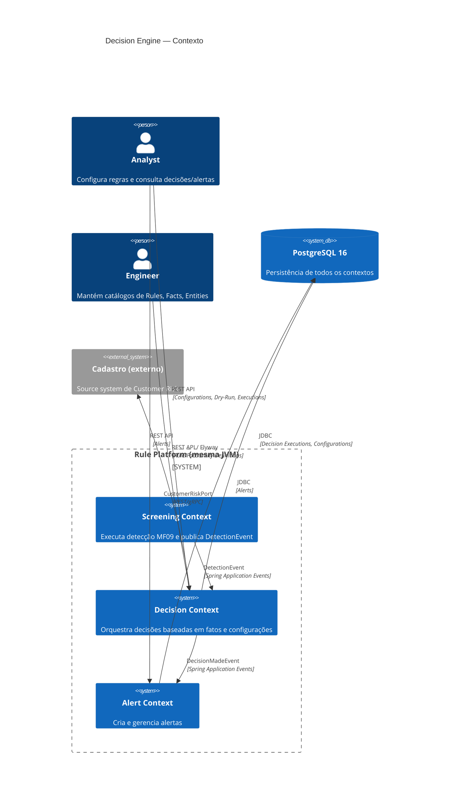
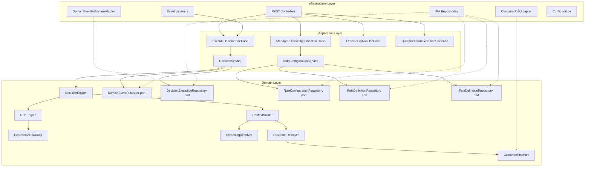
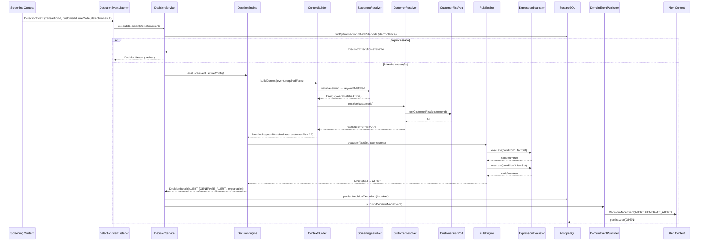
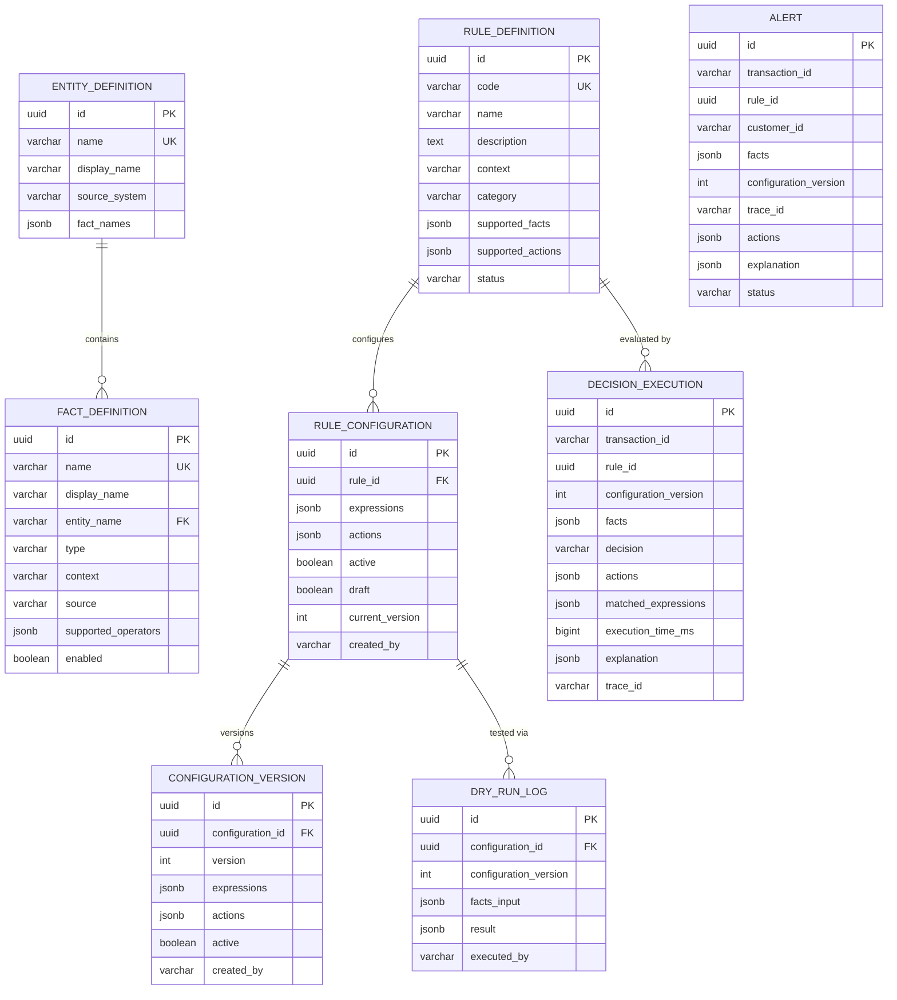
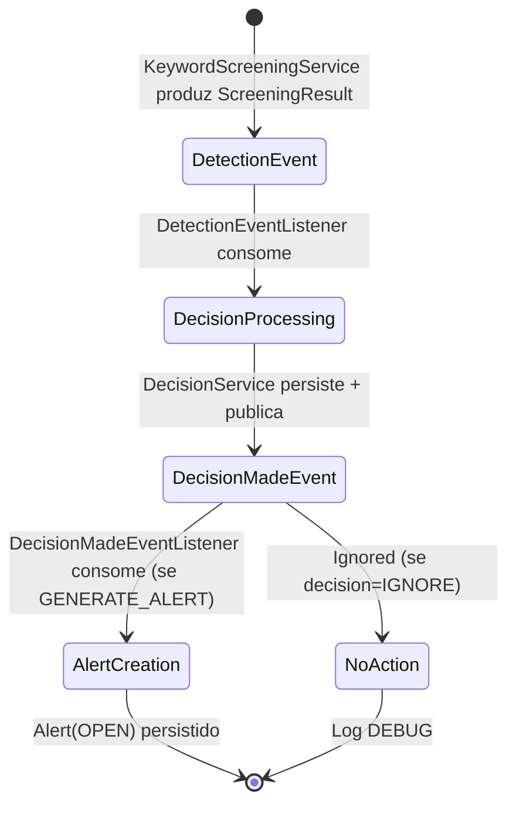

# Design Document — Decision Engine

## Overview

O **Decision Engine** introduz o bounded context **Decision Context** na Rule Platform de PLD. Ele desacopla a lógica de **detecção** (já existente no Screening Context — MF09 Keyword Screening) da lógica de **decisão** (quando gerar alertas, com quais critérios, baseado em quais fatos).

### Decisões de Design

| Decisão | Escolha | Justificativa |
|---|---|---|
| Comunicação inter-contexto | Spring Application Events (intra-processo) | MVP mono-deployment; preparado para migração Kafka/SQS via port abstraction |
| Modelo de expressões | Condition \| Group (sealed interface) | Extensível para AND/OR sem refatoração; MVP usa apenas Condition com AND implícito |
| Fact Resolvers | Interface + autodiscovery via Spring DI | Novos resolvers sem alterar Context Builder |
| Value Objects tipados | `@JvmInline value class` | Segurança de tipo em compile-time, zero overhead runtime |
| Persistência de execuções | JSONB (Decision_Explanation + facts) | Flexibilidade para evolução do schema sem migrations |
| Alert Context | Módulo separado, mesma JVM | Desacoplamento via eventos; preparado para microsserviço futuro |
| Dry-Run | Mesmo Rule Engine, sem side effects | Garante paridade comportamental com produção |
| DomainEventPublisher | Port abstraction (nunca ApplicationEventPublisher direto) | Independência de framework no domínio |
| Auditoria 7 etapas | Decision_Explanation imutável | Compliance regulatório COAF/BACEN — 5 anos retenção |


### Contexto Arquitetural

O Decision Context opera como um novo bounded context **ao lado** do Screening Context existente, dentro do mesmo deployment Spring Boot (mesma JVM). O Alert Context é um terceiro bounded context, também na mesma JVM.

```
br.com
├── shared/domain/                    # DomainException, DomainEvent, DomainEventPublisher
├── screening/                        # Contexto existente (MF09) — não alterado*
├── decision/                         # NOVO — Decision Context
│   ├── domain/
│   ├── application/
│   └── infrastructure/
└── alert/                            # NOVO — Alert Context
    ├── domain/
    ├── application/
    └── infrastructure/
```

*Alterações no Screening Context (mínimas):
1. Adicionar `customerId` ao `EvaluateKeywordScreeningCommand` e ao request da API (`EvaluateKeywordScreeningRequest`). O campo é obrigatório (non-blank, max 64 caracteres).
2. `KeywordScreeningService` passa a publicar `DetectionEvent` via `DomainEventPublisher` port após produzir `ScreeningResult`, incluindo `customerId` no payload do evento.

---

## Architecture

### Diagrama de Contexto (C4 Level 1)




### Diagrama de Camadas — Decision Context (Hexagonal)




### Fluxo de Decisão — Sequência Completa




### Layout de Pacotes — Decision Context

```
br.com.decision/
├── domain/
│   ├── model/
│   │   ├── RuleDefinition.kt              # Aggregate Root
│   │   ├── RuleConfiguration.kt           # Aggregate Root
│   │   ├── ConfigurationVersion.kt        # Entity (dentro de RuleConfiguration)
│   │   ├── DecisionExecution.kt           # Aggregate Root
│   │   ├── FactDefinition.kt              # Aggregate Root
│   │   ├── EntityDefinition.kt            # Entidade do Entity Registry
│   │   ├── Expression.kt                  # sealed interface: Condition | Group
│   │   ├── Condition.kt                   # Expressão atômica
│   │   ├── DecisionResult.kt              # Value Object
│   │   ├── DecisionExplanation.kt         # Value Object (7 etapas)
│   │   ├── Fact.kt                        # Value Object
│   │   └── enums/
│   │       ├── Decision.kt                # ALERT, IGNORE, REVIEW, BLOCK
│   │       ├── Action.kt                  # GENERATE_ALERT, IGNORE, REVIEW, BLOCK
│   │       ├── ComparisonOperator.kt      # EQUALS, NOT_EQUALS, GTE...
│   │       ├── CustomerRisk.kt            # BR, MR, AR (com ordering)
│   │       ├── FactType.kt                # BOOLEAN, ENUM, MONEY, STRING, NUMBER
│   │       ├── RuleContext.kt             # SCREENING, TRANSACTION, CUSTOMER, ACCOUNT
│   │       ├── RuleCategory.kt            # KEYWORD_SCREENING, SANCTIONS, AML...
│   │       └── RuleStatus.kt              # ACTIVE, INACTIVE, DEPRECATED
│   ├── valueobject/
│   │   ├── RuleId.kt                      # @JvmInline value class
│   │   ├── RuleCode.kt
│   │   ├── FactName.kt
│   │   ├── FactValue.kt                   # sealed class (BooleanValue, EnumValue...)
│   │   └── ConfigurationVersion.kt
│   ├── event/
│   │   ├── DetectionEvent.kt              # Evento consumido do Screening Context
│   │   └── DecisionMadeEvent.kt           # Evento publicado para Alert Context
│   │   # DomainEvent interface → br.com.shared.domain.DomainEvent
│   │   # DomainEventPublisher → br.com.shared.domain.DomainEventPublisher
│   ├── port/
│   │   ├── CustomerRiskPort.kt            # Output port: busca risk de sistema externo
│   │   ├── DecisionExecutionRepository.kt
│   │   ├── RuleConfigurationRepository.kt
│   │   ├── RuleDefinitionRepository.kt
│   │   ├── FactDefinitionRepository.kt
│   │   └── EntityDefinitionRepository.kt
│   ├── service/
│   │   ├── DecisionEngine.kt              # Orquestrador de decisão
│   │   ├── ContextBuilder.kt              # Orquestrador de Facts
│   │   ├── RuleEngine.kt                  # Avaliador de regras (puro)
│   │   ├── ExpressionEvaluator.kt         # Comparador de expressões (puro)
│   │   └── FactResolver.kt               # Interface base para resolvers
│   ├── resolver/
│   │   ├── ScreeningResolver.kt           # Extrai facts do DetectionEvent
│   │   └── CustomerResolver.kt            # Busca customerRisk via port
│   └── exception/
│       ├── InvalidConfigurationException.kt
│       ├── RuleConfigurationNotFoundException.kt
│       └── FactResolutionException.kt
│
├── application/
│   ├── usecase/
│   │   ├── ExecuteDecisionUseCase.kt      # Input port
│   │   ├── ExecuteDecisionCommand.kt
│   │   ├── ManageRuleConfigurationUseCase.kt
│   │   ├── CreateRuleConfigurationCommand.kt
│   │   ├── ExecuteDryRunUseCase.kt
│   │   ├── ExecuteDryRunCommand.kt
│   │   ├── QueryDecisionExecutionUseCase.kt
│   │   └── QueryDecisionExecutionResult.kt
│   └── service/
│       ├── DecisionService.kt             # Impl: ExecuteDecisionUseCase
│       ├── RuleConfigurationService.kt    # Impl: ManageRuleConfigurationUseCase
│       ├── DryRunService.kt               # Impl: ExecuteDryRunUseCase
│       └── DecisionQueryService.kt        # Impl: QueryDecisionExecutionUseCase
│
└── infrastructure/
    ├── input/
    │   ├── http/
    │   │   ├── RuleConfigurationController.kt
    │   │   ├── DecisionExecutionController.kt
    │   │   ├── DryRunController.kt
    │   │   ├── dto/
    │   │   │   ├── CreateRuleConfigurationRequest.kt
    │   │   │   ├── RuleConfigurationResponse.kt
    │   │   │   ├── DecisionExecutionResponse.kt
    │   │   │   ├── DryRunRequest.kt
    │   │   │   └── DryRunResponse.kt
    │   │   └── handler/
    │   │       └── DecisionExceptionHandler.kt
    │   └── event/
    │       └── DetectionEventListener.kt   # @EventListener → invoca ExecuteDecisionUseCase
    ├── output/
    │   ├── persistence/
    │   │   ├── entity/
    │   │   │   ├── RuleDefinitionEntity.kt
    │   │   │   ├── RuleConfigurationEntity.kt
    │   │   │   ├── ConfigurationVersionEntity.kt
    │   │   │   ├── DecisionExecutionEntity.kt
    │   │   │   ├── FactDefinitionEntity.kt
    │   │   │   ├── EntityDefinitionEntity.kt
    │   │   │   └── DryRunLogEntity.kt
    │   │   ├── mapper/
    │   │   │   ├── RuleDefinitionMapper.kt
    │   │   │   ├── RuleConfigurationMapper.kt
    │   │   │   ├── DecisionExecutionMapper.kt
    │   │   │   └── FactDefinitionMapper.kt
    │   │   └── repository/
    │   │       ├── RuleDefinitionJpaRepository.kt
    │   │       ├── RuleConfigurationJpaRepository.kt
    │   │       ├── DecisionExecutionJpaRepository.kt
    │   │       ├── FactDefinitionJpaRepository.kt
    │   │       └── EntityDefinitionJpaRepository.kt
    │   ├── event/
    │   │   └── DomainEventPublisherAdapter.kt   # Adapter: ApplicationEventPublisher
    │   └── rest/
    │       └── CustomerRiskAdapter.kt      # Adapter: CustomerRiskPort → REST call
    └── configuration/
        ├── DecisionContextConfiguration.kt
        └── CustomerRiskProperties.kt
```


### Layout de Pacotes — Alert Context

```
br.com.alert/
├── domain/
│   ├── model/
│   │   ├── Alert.kt                       # Aggregate Root
│   │   └── enums/
│   │       └── AlertStatus.kt             # OPEN, UNDER_REVIEW, CLOSED, FALSE_POSITIVE
│   ├── valueobject/
│   │   └── AlertId.kt
│   ├── port/
│   │   └── AlertRepository.kt
│   └── exception/
│       ├── AlertNotFoundException.kt
│       └── InvalidAlertTransitionException.kt
│
├── application/
│   ├── usecase/
│   │   ├── CreateAlertUseCase.kt
│   │   ├── QueryAlertUseCase.kt
│   │   └── UpdateAlertStatusUseCase.kt
│   └── service/
│       ├── AlertService.kt
│       └── AlertQueryService.kt
│
└── infrastructure/
    ├── input/
    │   ├── http/
    │   │   ├── AlertController.kt
    │   │   ├── dto/
    │   │   │   ├── AlertResponse.kt
    │   │   │   └── UpdateAlertStatusRequest.kt
    │   │   └── handler/
    │   │       └── AlertExceptionHandler.kt
    │   └── event/
    │       └── DecisionMadeEventListener.kt  # @TransactionalEventListener
    ├── output/
    │   └── persistence/
    │       ├── entity/AlertEntity.kt
    │       ├── mapper/AlertMapper.kt
    │       └── repository/AlertJpaRepository.kt
    └── configuration/
        └── AlertContextConfiguration.kt
```

---

## Components and Interfaces

### Domain Layer — Value Objects

```kotlin
// Tipagem forte via @JvmInline value class (zero overhead)
@JvmInline value class RuleId(val value: UUID)
@JvmInline value class RuleCode(val value: String)
@JvmInline value class FactName(val value: String)
@JvmInline value class ConfigurationVersion(val value: Int)

// FactValue — sealed class para tipagem segura
sealed class FactValue {
    data class BooleanValue(val value: Boolean) : FactValue()
    data class EnumValue(val value: String) : FactValue()
    data class NumberValue(val value: BigDecimal) : FactValue()
    data class StringValue(val value: String) : FactValue()
    data class MoneyValue(val amount: BigDecimal, val currency: String) : FactValue()
}
```


### Domain Layer — Enums

```kotlin
enum class Decision { ALERT, IGNORE, REVIEW, BLOCK }

enum class Action { GENERATE_ALERT, IGNORE, REVIEW, BLOCK }

enum class ComparisonOperator {
    EQUALS, NOT_EQUALS,
    GREATER_THAN, GREATER_THAN_OR_EQUAL,
    LESS_THAN, LESS_THAN_OR_EQUAL,
    IN, NOT_IN, CONTAINS
}

enum class CustomerRisk : Comparable<CustomerRisk> {
    BR, MR, AR;
    // BR < MR < AR — natural ordering via ordinal
}

enum class FactType { BOOLEAN, ENUM, MONEY, STRING, NUMBER }

enum class RuleContext { SCREENING, TRANSACTION, CUSTOMER, ACCOUNT }

enum class RuleCategory { KEYWORD_SCREENING, SANCTIONS, AML, FRAUD, VELOCITY }

enum class RuleStatus { ACTIVE, INACTIVE, DEPRECATED }

enum class AlertStatus {
    OPEN, UNDER_REVIEW, CLOSED, FALSE_POSITIVE;

    fun canTransitionTo(target: AlertStatus): Boolean = when (this) {
        OPEN -> target == UNDER_REVIEW
        UNDER_REVIEW -> target == CLOSED || target == FALSE_POSITIVE
        CLOSED -> false
        FALSE_POSITIVE -> false
    }
}
```

### Domain Layer — Expression Model (sealed interface)

```kotlin
/**
 * Modelo composicional de expressões.
 * MVP: apenas Condition. Extensível para Group sem refatoração.
 */
sealed interface Expression

/**
 * Expressão atômica: compara um Fact contra um valor esperado.
 */
data class Condition(
    val factName: FactName,
    val operator: ComparisonOperator,
    val expectedValue: FactValue
) : Expression

/**
 * Expressão composta (MVP3): combina múltiplas Expressions com AND/OR.
 */
data class Group(
    val logicalOperator: LogicalOperator,
    val expressions: List<Expression>
) : Expression

enum class LogicalOperator { AND, OR }
```


### Domain Layer — Aggregate Roots

```kotlin
/** Aggregate Root: definição técnica imutável de regra */
data class RuleDefinition(
    val id: RuleId,
    val code: RuleCode,
    val name: String,
    val description: String,
    val context: RuleContext,
    val category: RuleCategory,
    val supportedFacts: List<FactName>,
    val supportedActions: List<Action>,
    val status: RuleStatus,
    val createdAt: Instant
)

/** Aggregate Root: configuração editável pelo analista */
data class RuleConfiguration(
    val id: UUID,
    val ruleId: RuleId,
    val expressions: List<Expression>,  // MVP: List<Condition>
    val actions: List<Action>,
    val active: Boolean,
    val draft: Boolean,
    val currentVersion: ConfigurationVersion,
    val versions: List<ConfigurationVersionEntry>,
    val createdBy: String,
    val createdAt: Instant,
    val updatedAt: Instant
) {
    /** Invariante: máximo 10 expressions */
    init {
        require(expressions.size <= 10) { "Máximo 10 expressions por configuração" }
    }
}

data class ConfigurationVersionEntry(
    val version: ConfigurationVersion,
    val expressions: List<Expression>,
    val actions: List<Action>,
    val active: Boolean,
    val createdBy: String,
    val createdAt: Instant
)

/** Aggregate Root: registro imutável de execução */
data class DecisionExecution(
    val id: UUID,
    val transactionId: String,
    val ruleId: RuleId,
    val configurationVersion: ConfigurationVersion,
    val facts: Map<FactName, FactValue>,
    val result: DecisionResult,
    val explanation: DecisionExplanation,
    val executionTimeMs: Long,
    val traceId: String,
    val timestamp: Instant
)

/** Aggregate Root: definição de fato no catálogo */
data class FactDefinition(
    val id: UUID,
    val name: FactName,
    val displayName: String,
    val entity: String,          // Nome da Entity (Customer, Risk, Screening...)
    val type: FactType,
    val context: RuleContext,
    val source: String,          // Bounded context de origem
    val supportedOperators: List<ComparisonOperator>,
    val enabled: Boolean
)

/** Entidade: definição de Entity no catálogo */
data class EntityDefinition(
    val id: UUID,
    val name: String,            // Customer, Risk, Transaction, Screening
    val displayName: String,
    val sourceSystem: String,    // Cadastro, PLD, Core Banking, Screening
    val factNames: List<FactName>
)
```


### Domain Layer — Decision Result & Explanation

```kotlin
data class DecisionResult(
    val decision: Decision,
    val actions: List<Action>,
    val matchedExpressions: List<ExpressionEvaluation>,
    val failedExpressions: List<ExpressionEvaluation>,
    val executionTimeMs: Long,
    val configurationVersion: ConfigurationVersion,
    val facts: Map<FactName, FactValue>
)

data class ExpressionEvaluation(
    val factName: FactName,
    val operator: ComparisonOperator,
    val expectedValue: FactValue,
    val actualValue: FactValue?,  // null se Fact ausente
    val satisfied: Boolean,
    val justification: String     // human-readable
)

/**
 * Trilha completa de auditoria — 7 etapas imutáveis.
 * Persistida como JSONB junto ao DecisionExecution.
 */
data class DecisionExplanation(
    val traceId: String,
    val steps: List<ExplanationStep>
)

sealed interface ExplanationStep {
    val stepNumber: Int
    val stepName: String
    val timestamp: Instant
}

data class ReceptionStep(
    override val stepNumber: Int = 1,
    override val stepName: String = "RECEPTION",
    override val timestamp: Instant,
    val transactionId: String,
    val customerId: String,
    val ruleCode: RuleCode,
    val eventPayload: Map<String, Any>
) : ExplanationStep

data class RuleIdentificationStep(
    override val stepNumber: Int = 2,
    override val stepName: String = "RULE_IDENTIFICATION",
    override val timestamp: Instant,
    val ruleDefinition: RuleCode,
    val ruleName: String,
    val configurationVersion: ConfigurationVersion,
    val expressions: List<Expression>,
    val actions: List<Action>
) : ExplanationStep

data class ContextBuildingStep(
    override val stepNumber: Int = 3,
    override val stepName: String = "CONTEXT_BUILDING",
    override val timestamp: Instant,
    val resolverResults: List<ResolverResult>
) : ExplanationStep

data class ResolverResult(
    val resolverName: String,
    val entity: String,
    val sourceSystem: String,
    val startedAt: Instant,
    val finishedAt: Instant,
    val durationMs: Long,
    val result: ResolverOutcome
)

sealed interface ResolverOutcome {
    data class Success(val factName: FactName, val value: FactValue) : ResolverOutcome
    data class Failure(val factName: FactName, val error: String, val reason: String) : ResolverOutcome
}

data class EvaluationStep(
    override val stepNumber: Int = 4,
    override val stepName: String = "EVALUATION",
    override val timestamp: Instant,
    val evaluations: List<ExpressionEvaluation>
) : ExplanationStep

data class DecisionStep(
    override val stepNumber: Int = 5,
    override val stepName: String = "DECISION",
    override val timestamp: Instant,
    val decision: Decision,
    val actions: List<Action>,
    val justification: String
) : ExplanationStep

data class PersistenceStep(
    override val stepNumber: Int = 6,
    override val stepName: String = "PERSISTENCE",
    override val timestamp: Instant,
    val executionId: UUID
) : ExplanationStep

data class PublicationStep(
    override val stepNumber: Int = 7,
    override val stepName: String = "PUBLICATION",
    override val timestamp: Instant,
    val eventId: String
) : ExplanationStep
```


### Domain Layer — Events

```kotlin
/** 
 * Marker interface para eventos de domínio.
 * Localização: br.com.shared.domain (compartilhado entre todos os bounded contexts)
 */
interface DomainEvent {
    val eventId: String
    val traceId: String
    val timestamp: Instant
}

/** Evento consumido do Screening Context */
data class DetectionEvent(
    override val eventId: String,
    override val traceId: String,
    override val timestamp: Instant,
    val transactionId: String,
    val customerId: String,
    val ruleCode: String,
    val detectionResult: DetectionResult
) : DomainEvent

data class DetectionResult(
    val matched: Boolean,
    val matches: List<DetectionMatch>
)

data class DetectionMatch(
    val term: String,
    val category: String
)

/** Evento publicado para Alert Context e outros consumidores */
data class DecisionMadeEvent(
    override val eventId: String,
    override val traceId: String,
    override val timestamp: Instant,
    val transactionId: String,
    val customerId: String,
    val ruleId: RuleId,
    val ruleCode: RuleCode,
    val decision: Decision,
    val actions: List<Action>,
    val facts: Map<FactName, FactValue>,
    val matchedExpressions: List<ExpressionEvaluation>,
    val configurationVersion: ConfigurationVersion,
    val executionTimeMs: Long,
    val explanation: DecisionExplanation
) : DomainEvent
```

### Domain Layer — Ports (Output Interfaces)

```kotlin
/** 
 * Abstração para publicação de eventos — NUNCA depender de ApplicationEventPublisher.
 * Localização: br.com.shared.domain (compartilhado entre Screening, Decision e Alert contexts)
 */
interface DomainEventPublisher {
    fun publish(event: DomainEvent)
}

/** Port para busca de Customer Risk em sistema externo */
interface CustomerRiskPort {
    fun getCustomerRisk(customerId: String): CustomerRisk?
}

/** Repositories como output ports */
interface DecisionExecutionRepository {
    fun save(execution: DecisionExecution): DecisionExecution
    fun findByTransactionIdAndRuleId(transactionId: String, ruleId: RuleId): DecisionExecution?
    fun findByTransactionId(transactionId: String, pageable: Pageable): Page<DecisionExecution>
    fun findByRuleId(ruleId: RuleId, pageable: Pageable): Page<DecisionExecution>
    fun findByDecision(decision: Decision, pageable: Pageable): Page<DecisionExecution>
    fun findByTraceId(traceId: String): DecisionExecution?
}

interface RuleDefinitionRepository {
    fun findByCode(code: RuleCode): RuleDefinition?
    fun findAll(): List<RuleDefinition>
    fun findByContextAndCategory(context: RuleContext?, category: RuleCategory?): List<RuleDefinition>
}

interface RuleConfigurationRepository {
    fun save(config: RuleConfiguration): RuleConfiguration
    fun findById(id: UUID): RuleConfiguration?
    fun findActiveByRuleId(ruleId: RuleId): RuleConfiguration?
    fun findByRuleId(ruleId: RuleId): List<RuleConfiguration>
}

interface FactDefinitionRepository {
    fun findByName(name: FactName): FactDefinition?
    fun findAll(): List<FactDefinition>
    fun findEnabled(): List<FactDefinition>
}

interface EntityDefinitionRepository {
    fun findByName(name: String): EntityDefinition?
    fun findAll(): List<EntityDefinition>
}
```


### Domain Layer — Domain Services

```kotlin
/**
 * Decision Engine — orquestrador principal.
 * Responsabilidades: carregar config, invocar ContextBuilder, invocar RuleEngine, montar resultado.
 * NÃO é um @Service Spring — é um domain service puro registrado via @Configuration.
 */
class DecisionEngine(
    private val contextBuilder: ContextBuilder,
    private val ruleEngine: RuleEngine
) {
    fun evaluate(
        event: DetectionEvent,
        configuration: RuleConfiguration,
        traceId: String
    ): DecisionResult
}

/**
 * Context Builder — orquestra Fact Resolvers.
 * Identifica quais Facts são necessários e invoca apenas os resolvers relevantes.
 */
class ContextBuilder(
    private val resolvers: List<FactResolver>
) {
    fun buildContext(
        event: DetectionEvent,
        requiredFacts: List<FactName>
    ): FactSet
}

data class FactSet(
    val facts: Map<FactName, FactValue>,
    val resolverResults: List<ResolverResult>
)

/**
 * Fact Resolver — interface base.
 * Cada implementação conhece apenas seu domínio.
 */
interface FactResolver {
    /** Quais FactNames este resolver é capaz de produzir */
    val producedFacts: Set<FactName>

    /** Entity à qual os facts pertencem */
    val entity: String

    /** Resolve os facts a partir do contexto do evento */
    fun resolve(event: DetectionEvent): List<Fact>
}

data class Fact(
    val name: FactName,
    val value: FactValue,
    val entity: String,
    val resolvedAt: Instant
)

/**
 * Rule Engine — avaliador puro.
 * Recebe Facts e Expressions, retorna resultado. Zero conhecimento de infraestrutura.
 */
class RuleEngine(
    private val expressionEvaluator: ExpressionEvaluator
) {
    fun evaluate(
        facts: Map<FactName, FactValue>,
        expressions: List<Expression>
    ): RuleEvaluationResult
}

data class RuleEvaluationResult(
    val allSatisfied: Boolean,
    val evaluations: List<ExpressionEvaluation>
)

/**
 * Expression Evaluator — comparador puro.
 * Avalia uma única Expression contra o conjunto de Facts.
 */
class ExpressionEvaluator {
    fun evaluate(expression: Expression, facts: Map<FactName, FactValue>): ExpressionEvaluation
}
```

### Domain Layer — Fact Resolvers (MVP)

```kotlin
/**
 * Extrai facts do DetectionEvent sem chamadas externas.
 * Entity: Screening, sourceSystem: Screening
 */
class ScreeningResolver : FactResolver {
    override val producedFacts = setOf(FactName("keywordMatched"))
    override val entity = "Screening"

    override fun resolve(event: DetectionEvent): List<Fact> {
        return listOf(
            Fact(
                name = FactName("keywordMatched"),
                value = FactValue.BooleanValue(event.detectionResult.matched),
                entity = entity,
                resolvedAt = Instant.now()
            )
        )
    }
}

/**
 * Busca Customer Risk via port externo.
 * Entity: Risk, sourceSystem: PLD
 */
class CustomerResolver(
    private val customerRiskPort: CustomerRiskPort
) : FactResolver {
    override val producedFacts = setOf(FactName("customerRisk"))
    override val entity = "Risk"

    override fun resolve(event: DetectionEvent): List<Fact> {
        val risk = customerRiskPort.getCustomerRisk(event.customerId)
            ?: return emptyList()  // Fact ausente se resolver falhar

        return listOf(
            Fact(
                name = FactName("customerRisk"),
                value = FactValue.EnumValue(risk.name),
                entity = entity,
                resolvedAt = Instant.now()
            )
        )
    }
}
```


### Application Layer — Use Cases

```kotlin
/** Input port: execução de decisão (disparada por evento) */
interface ExecuteDecisionUseCase {
    fun execute(command: ExecuteDecisionCommand): DecisionResult
}

data class ExecuteDecisionCommand(
    val transactionId: String,
    val customerId: String,
    val ruleCode: String,
    val detectionResult: DetectionResult
)

/** Input port: gerenciamento de configurações */
interface ManageRuleConfigurationUseCase {
    fun create(command: CreateRuleConfigurationCommand): RuleConfiguration
    fun update(id: UUID, command: UpdateRuleConfigurationCommand): RuleConfiguration
    fun activate(id: UUID): RuleConfiguration
    fun deactivate(id: UUID): RuleConfiguration
}

data class CreateRuleConfigurationCommand(
    val ruleCode: String,
    val expressions: List<ConditionDto>,
    val actions: List<String>,
    val createdBy: String
)

data class ConditionDto(
    val factName: String,
    val operator: String,
    val expectedValue: Any
)

/** Input port: dry-run */
interface ExecuteDryRunUseCase {
    fun execute(command: ExecuteDryRunCommand): DryRunResult
}

data class ExecuteDryRunCommand(
    val configurationId: UUID,
    val facts: Map<String, Any>
)

data class DryRunResult(
    val decision: Decision,
    val actions: List<Action>,
    val matchedExpressions: List<ExpressionEvaluation>,
    val failedExpressions: List<ExpressionEvaluation>,
    val explanation: DecisionExplanation
)

/** Input port: consulta de execuções */
interface QueryDecisionExecutionUseCase {
    fun findByTransactionId(transactionId: String, page: Int, size: Int): Page<DecisionExecution>
    fun findByRuleId(ruleId: UUID, page: Int, size: Int): Page<DecisionExecution>
    fun findByDecision(decision: String, page: Int, size: Int): Page<DecisionExecution>
    fun findByTraceId(traceId: String): DecisionExecution?
}
```

### Application Layer — Service Implementation (DecisionService)

```kotlin
@Service
@Transactional
class DecisionService(
    private val decisionEngine: DecisionEngine,
    private val ruleDefinitionRepository: RuleDefinitionRepository,
    private val ruleConfigurationRepository: RuleConfigurationRepository,
    private val decisionExecutionRepository: DecisionExecutionRepository,
    private val domainEventPublisher: DomainEventPublisher
) : ExecuteDecisionUseCase {

    override fun execute(command: ExecuteDecisionCommand): DecisionResult {
        val traceId = generateTraceId()

        // 1. Idempotência
        val ruleId = resolveRuleId(command.ruleCode)
        val existing = decisionExecutionRepository
            .findByTransactionIdAndRuleId(command.transactionId, ruleId)
        if (existing != null) return existing.result

        // 2. Buscar configuração ativa
        val config = ruleConfigurationRepository.findActiveByRuleId(ruleId)
        if (config == null) {
            return persistAndPublish(buildIgnoreResult(command, traceId, "No active configuration"))
        }

        // 3. Avaliar
        val event = toDetectionEvent(command, traceId)
        val result = decisionEngine.evaluate(event, config, traceId)

        // 4. Persistir + Publicar
        return persistAndPublish(result, command, traceId)
    }
}
```


### Alert Context — Domain Model

```kotlin
/** Aggregate Root: Alert */
data class Alert(
    val id: UUID,
    val transactionId: String,
    val ruleId: RuleId,
    val customerId: String,
    val facts: Map<FactName, FactValue>,
    val configurationVersion: ConfigurationVersion,
    val traceId: String,
    val actions: List<Action>,
    val explanation: DecisionExplanation,
    val status: AlertStatus,
    val createdAt: Instant,
    val updatedAt: Instant
) {
    fun transitionTo(newStatus: AlertStatus): Alert {
        require(status.canTransitionTo(newStatus)) {
            "Transição inválida: $status → $newStatus"
        }
        return copy(status = newStatus, updatedAt = Instant.now())
    }
}

interface AlertRepository {
    fun save(alert: Alert): Alert
    fun findById(id: UUID): Alert?
    fun findByTransactionIdAndRuleId(transactionId: String, ruleId: RuleId): Alert?
    fun findByTransactionId(transactionId: String): List<Alert>
    fun findByRuleId(ruleId: RuleId, pageable: Pageable): Page<Alert>
}
```

### Alert Context — Event Listener

```kotlin
@Component
class DecisionMadeEventListener(
    private val alertService: AlertService
) {
    @TransactionalEventListener(phase = TransactionPhase.AFTER_COMMIT)
    fun handle(event: DecisionMadeEvent) {
        if (Action.GENERATE_ALERT !in event.actions) {
            log.debug("Decision IGNORE for traceId=${event.traceId}, no alert created")
            return
        }

        // Idempotência: verifica se já existe alerta para (transactionId, ruleId)
        alertService.createAlertIfNotExists(event)
    }
}
```

---

## Data Models

### Modelo Relacional — Decision Context

```sql
-- =============================================================
-- V2__create_decision_context_tables.sql (Flyway migration)
-- =============================================================

-- Entity Registry
CREATE TABLE entity_definition (
    id              UUID PRIMARY KEY DEFAULT gen_random_uuid(),
    name            VARCHAR(50)  NOT NULL UNIQUE,
    display_name    VARCHAR(100) NOT NULL,
    source_system   VARCHAR(50)  NOT NULL,
    fact_names      JSONB        NOT NULL DEFAULT '[]',
    created_at      TIMESTAMP    NOT NULL DEFAULT NOW()
);

-- Fact Registry
CREATE TABLE fact_definition (
    id                  UUID PRIMARY KEY DEFAULT gen_random_uuid(),
    name                VARCHAR(100) NOT NULL UNIQUE,
    display_name        VARCHAR(200) NOT NULL,
    entity_name         VARCHAR(50)  NOT NULL REFERENCES entity_definition(name),
    type                VARCHAR(20)  NOT NULL,
    context             VARCHAR(20)  NOT NULL,
    source              VARCHAR(50)  NOT NULL,
    supported_operators JSONB        NOT NULL DEFAULT '[]',
    enabled             BOOLEAN      NOT NULL DEFAULT TRUE,
    created_at          TIMESTAMP    NOT NULL DEFAULT NOW()
);

CREATE INDEX idx_fact_definition_entity ON fact_definition(entity_name);
CREATE INDEX idx_fact_definition_enabled ON fact_definition(enabled);

-- Rule Catalog
CREATE TABLE rule_definition (
    id                UUID PRIMARY KEY DEFAULT gen_random_uuid(),
    code              VARCHAR(50)  NOT NULL UNIQUE,
    name              VARCHAR(200) NOT NULL,
    description       TEXT,
    context           VARCHAR(20)  NOT NULL,
    category          VARCHAR(30)  NOT NULL,
    supported_facts   JSONB        NOT NULL DEFAULT '[]',
    supported_actions JSONB        NOT NULL DEFAULT '[]',
    status            VARCHAR(20)  NOT NULL DEFAULT 'ACTIVE',
    created_at        TIMESTAMP    NOT NULL DEFAULT NOW()
);

CREATE INDEX idx_rule_definition_code ON rule_definition(code);
CREATE INDEX idx_rule_definition_status ON rule_definition(status);
```


```sql
-- Rule Configuration (Aggregate Root)
CREATE TABLE rule_configuration (
    id                  UUID PRIMARY KEY DEFAULT gen_random_uuid(),
    rule_id             UUID         NOT NULL REFERENCES rule_definition(id),
    expressions         JSONB        NOT NULL,
    actions             JSONB        NOT NULL DEFAULT '[]',
    active              BOOLEAN      NOT NULL DEFAULT FALSE,
    draft               BOOLEAN      NOT NULL DEFAULT TRUE,
    current_version     INT          NOT NULL DEFAULT 1,
    created_by          VARCHAR(100) NOT NULL,
    created_at          TIMESTAMP    NOT NULL DEFAULT NOW(),
    updated_at          TIMESTAMP    NOT NULL DEFAULT NOW(),
    CONSTRAINT uk_rule_configuration_active UNIQUE (rule_id) WHERE (active = TRUE)
);

CREATE INDEX idx_rule_configuration_rule_id ON rule_configuration(rule_id);
CREATE INDEX idx_rule_configuration_active ON rule_configuration(active) WHERE active = TRUE;

-- Configuration Versions (imutáveis)
CREATE TABLE configuration_version (
    id                  UUID PRIMARY KEY DEFAULT gen_random_uuid(),
    configuration_id    UUID         NOT NULL REFERENCES rule_configuration(id),
    version             INT          NOT NULL,
    expressions         JSONB        NOT NULL,
    actions             JSONB        NOT NULL DEFAULT '[]',
    active              BOOLEAN      NOT NULL,
    created_by          VARCHAR(100) NOT NULL,
    created_at          TIMESTAMP    NOT NULL DEFAULT NOW(),
    CONSTRAINT uk_config_version UNIQUE (configuration_id, version)
);

CREATE INDEX idx_config_version_lookup ON configuration_version(configuration_id, version DESC);

-- Decision Execution (imutável — write-once, never update/delete)
CREATE TABLE decision_execution (
    id                      UUID PRIMARY KEY DEFAULT gen_random_uuid(),
    transaction_id          VARCHAR(64)  NOT NULL,
    rule_id                 UUID         NOT NULL,
    configuration_version   INT          NOT NULL,
    facts                   JSONB        NOT NULL,
    decision                VARCHAR(20)  NOT NULL,
    actions                 JSONB        NOT NULL DEFAULT '[]',
    matched_expressions     JSONB        NOT NULL DEFAULT '[]',
    execution_time_ms       BIGINT       NOT NULL,
    explanation             JSONB        NOT NULL,
    trace_id                VARCHAR(64)  NOT NULL,
    created_at              TIMESTAMP    NOT NULL DEFAULT NOW(),
    CONSTRAINT uk_decision_execution UNIQUE (transaction_id, rule_id)
);

CREATE INDEX idx_decision_execution_tx ON decision_execution(transaction_id);
CREATE INDEX idx_decision_execution_rule ON decision_execution(rule_id);
CREATE INDEX idx_decision_execution_decision ON decision_execution(decision);
CREATE INDEX idx_decision_execution_trace ON decision_execution(trace_id);
CREATE INDEX idx_decision_execution_created ON decision_execution(created_at DESC);

-- Dry-Run Log (registro leve para validação de ativação)
CREATE TABLE dry_run_log (
    id                      UUID PRIMARY KEY DEFAULT gen_random_uuid(),
    configuration_id        UUID         NOT NULL REFERENCES rule_configuration(id),
    configuration_version   INT          NOT NULL,
    facts_input             JSONB        NOT NULL,
    result                  JSONB        NOT NULL,
    executed_by             VARCHAR(100) NOT NULL,
    created_at              TIMESTAMP    NOT NULL DEFAULT NOW()
);

CREATE INDEX idx_dry_run_log_config ON dry_run_log(configuration_id, configuration_version);
```


### Modelo Relacional — Alert Context

```sql
-- =============================================================
-- V3__create_alert_context_tables.sql (Flyway migration)
-- =============================================================

CREATE TABLE alert (
    id                      UUID PRIMARY KEY DEFAULT gen_random_uuid(),
    transaction_id          VARCHAR(64)  NOT NULL,
    rule_id                 UUID         NOT NULL,
    customer_id             VARCHAR(64)  NOT NULL,
    facts                   JSONB        NOT NULL,
    configuration_version   INT          NOT NULL,
    trace_id                VARCHAR(64)  NOT NULL,
    actions                 JSONB        NOT NULL DEFAULT '[]',
    explanation             JSONB        NOT NULL,
    status                  VARCHAR(20)  NOT NULL DEFAULT 'OPEN',
    created_at              TIMESTAMP    NOT NULL DEFAULT NOW(),
    updated_at              TIMESTAMP    NOT NULL DEFAULT NOW(),
    CONSTRAINT uk_alert_idempotent UNIQUE (transaction_id, rule_id)
);

CREATE INDEX idx_alert_transaction ON alert(transaction_id);
CREATE INDEX idx_alert_rule ON alert(rule_id);
CREATE INDEX idx_alert_status ON alert(status);
CREATE INDEX idx_alert_customer ON alert(customer_id);
CREATE INDEX idx_alert_created ON alert(created_at DESC);
```

### Estruturas JSONB

**`decision_execution.expressions` (Rule Configuration)**
```json
[
  {
    "type": "CONDITION",
    "factName": "keywordMatched",
    "operator": "EQUALS",
    "expectedValue": { "type": "BOOLEAN", "value": true }
  },
  {
    "type": "CONDITION",
    "factName": "customerRisk",
    "operator": "GREATER_THAN_OR_EQUAL",
    "expectedValue": { "type": "ENUM", "value": "MR" }
  }
]
```

**`decision_execution.facts`**
```json
{
  "keywordMatched": { "type": "BOOLEAN", "value": true },
  "customerRisk": { "type": "ENUM", "value": "AR" }
}
```

**`decision_execution.explanation` (7 etapas)**
```json
{
  "traceId": "trace-abc-123",
  "steps": [
    {
      "stepNumber": 1,
      "stepName": "RECEPTION",
      "timestamp": "2026-07-02T10:35:00.001Z",
      "transactionId": "TX-001",
      "customerId": "CUST-42",
      "ruleCode": "KEYWORD_SCREENING",
      "eventPayload": { "matched": true, "matches": [{"term":"lavagem","category":"AML"}] }
    },
    {
      "stepNumber": 2,
      "stepName": "RULE_IDENTIFICATION",
      "timestamp": "2026-07-02T10:35:00.002Z",
      "ruleDefinition": "KEYWORD_SCREENING",
      "configurationVersion": 3,
      "expressions": [...],
      "actions": ["GENERATE_ALERT"]
    },
    {
      "stepNumber": 3,
      "stepName": "CONTEXT_BUILDING",
      "timestamp": "2026-07-02T10:35:00.003Z",
      "resolverResults": [
        { "resolverName": "ScreeningResolver", "entity": "Screening", "durationMs": 0, "result": {"factName":"keywordMatched","value":true} },
        { "resolverName": "CustomerResolver", "entity": "Risk", "durationMs": 8, "result": {"factName":"customerRisk","value":"AR"} }
      ]
    },
    {
      "stepNumber": 4,
      "stepName": "EVALUATION",
      "timestamp": "2026-07-02T10:35:00.011Z",
      "evaluations": [
        { "factName": "keywordMatched", "operator": "EQUALS", "expected": true, "actual": true, "satisfied": true, "justification": "keywordMatched EQUALS true → valor real: true → ✅ Condição satisfeita" },
        { "factName": "customerRisk", "operator": "GREATER_THAN_OR_EQUAL", "expected": "MR", "actual": "AR", "satisfied": true, "justification": "customerRisk GTE MR → valor real: AR → ✅ AR >= MR" }
      ]
    },
    {
      "stepNumber": 5,
      "stepName": "DECISION",
      "timestamp": "2026-07-02T10:35:00.011Z",
      "decision": "ALERT",
      "actions": ["GENERATE_ALERT"],
      "justification": "Todas as 2 Conditions satisfeitas → decision ALERT, action GENERATE_ALERT"
    },
    {
      "stepNumber": 6,
      "stepName": "PERSISTENCE",
      "timestamp": "2026-07-02T10:35:00.015Z",
      "executionId": "exec-uuid-001"
    },
    {
      "stepNumber": 7,
      "stepName": "PUBLICATION",
      "timestamp": "2026-07-02T10:35:00.016Z",
      "eventId": "evt-uuid-001"
    }
  ]
}
```

### Diagrama ER




---

## API Design

### Decision Context — REST Endpoints

#### Rule Configuration Management

```
POST   /v1/decision/rules/{ruleCode}/configurations
GET    /v1/decision/rules/{ruleCode}/configurations
GET    /v1/decision/rule-configurations/{id}
PUT    /v1/decision/rule-configurations/{id}
POST   /v1/decision/rule-configurations/{id}/activate
POST   /v1/decision/rule-configurations/{id}/deactivate
GET    /v1/decision/rule-configurations/{id}/versions
```

**POST /v1/decision/rules/{ruleCode}/configurations**

Request:
```json
{
  "expressions": [
    {
      "type": "CONDITION",
      "factName": "keywordMatched",
      "operator": "EQUALS",
      "expectedValue": true
    },
    {
      "type": "CONDITION",
      "factName": "customerRisk",
      "operator": "GREATER_THAN_OR_EQUAL",
      "expectedValue": "MR"
    }
  ],
  "actions": ["GENERATE_ALERT"]
}
```

Response 201:
```json
{
  "id": "cfg-uuid-001",
  "ruleCode": "KEYWORD_SCREENING",
  "version": 1,
  "active": false,
  "draft": true,
  "expressions": [...],
  "actions": ["GENERATE_ALERT"],
  "createdBy": "analyst@company.com",
  "createdAt": "2026-07-02T10:30:00Z"
}
```

#### Dry-Run

```
POST   /v1/decision/rule-configurations/{id}/dry-run
```

Request:
```json
{
  "facts": {
    "keywordMatched": true,
    "customerRisk": "MR"
  }
}
```

Response 200:
```json
{
  "decision": "ALERT",
  "actions": ["GENERATE_ALERT"],
  "matchedExpressions": [
    { "factName": "keywordMatched", "operator": "EQUALS", "expected": true, "actual": true, "satisfied": true, "justification": "..." },
    { "factName": "customerRisk", "operator": "GREATER_THAN_OR_EQUAL", "expected": "MR", "actual": "MR", "satisfied": true, "justification": "..." }
  ],
  "failedExpressions": [],
  "explanation": { ... }
}
```

#### Decision Execution Queries

```
GET    /v1/decision/executions?transactionId={id}&page=0&size=20
GET    /v1/decision/executions?ruleId={id}&page=0&size=20
GET    /v1/decision/executions?decision=ALERT&page=0&size=20
GET    /v1/decision/executions?traceId={traceId}
GET    /v1/decision/executions/{id}
```

Response 200 (paginated):
```json
{
  "content": [
    {
      "id": "exec-uuid-001",
      "transactionId": "TX-001",
      "ruleCode": "KEYWORD_SCREENING",
      "decision": "ALERT",
      "actions": ["GENERATE_ALERT"],
      "facts": { "keywordMatched": true, "customerRisk": "AR" },
      "matchedExpressions": [...],
      "configurationVersion": 3,
      "executionTimeMs": 12,
      "traceId": "trace-abc-123",
      "explanation": { ... },
      "timestamp": "2026-07-02T10:35:00Z"
    }
  ],
  "page": 0,
  "size": 20,
  "totalElements": 1
}
```

#### Rule Catalog (read-only para Analysts)

```
GET    /v1/decision/rules
GET    /v1/decision/rules?context=SCREENING&category=KEYWORD_SCREENING
GET    /v1/decision/rules/{code}
```

#### Fact Registry (read-only para Analysts)

```
GET    /v1/decision/facts
GET    /v1/decision/facts?entity=Risk&enabled=true
GET    /v1/decision/entities
```

### Alert Context — REST Endpoints

```
GET    /v1/alerts?transactionId={id}
GET    /v1/alerts?ruleId={id}&page=0&size=20
GET    /v1/alerts/{alertId}
PATCH  /v1/alerts/{alertId}/status
```

**PATCH /v1/alerts/{alertId}/status**

Request:
```json
{
  "status": "UNDER_REVIEW"
}
```

Response 200:
```json
{
  "id": "alert-uuid-001",
  "transactionId": "TX-001",
  "ruleId": "...",
  "customerId": "CUST-42",
  "status": "UNDER_REVIEW",
  "previousStatus": "OPEN",
  "updatedAt": "2026-07-02T11:00:00Z"
}
```

---

## Event Catalog

| Evento | Publicador | Consumidor | Payload | Garantias |
|---|---|---|---|---|
| `DetectionEvent` | Screening Context (`KeywordScreeningService`) | Decision Context (`DetectionEventListener`) | transactionId, customerId, ruleCode, detectionResult (matched, matches[]) | At-least-once (idempotente no consumidor) |
| `DecisionMadeEvent` | Decision Context (`DecisionService`) | Alert Context (`DecisionMadeEventListener`) | traceId, ruleId, transactionId, customerId, decision, actions, facts, matchedExpressions, explanation, configVersion, executionTimeMs | At-least-once, publicado AFTER_COMMIT |

### Ciclo de Vida dos Eventos



### Contrato de Eventos

```kotlin
// DetectionEvent — publicado pelo Screening Context
data class DetectionEvent(
    val eventId: String,          // UUID gerado pelo publisher
    val traceId: String,          // Correlação end-to-end
    val timestamp: Instant,
    val transactionId: String,    // max 64 chars
    val customerId: String,       // max 64 chars
    val ruleCode: String,         // "KEYWORD_SCREENING"
    val detectionResult: DetectionResult
)

// DecisionMadeEvent — publicado pelo Decision Context
data class DecisionMadeEvent(
    val eventId: String,
    val traceId: String,
    val timestamp: Instant,
    val transactionId: String,
    val customerId: String,
    val ruleId: RuleId,
    val ruleCode: RuleCode,
    val decision: Decision,       // ALERT | IGNORE
    val actions: List<Action>,    // [GENERATE_ALERT] ou []
    val facts: Map<FactName, FactValue>,
    val matchedExpressions: List<ExpressionEvaluation>,
    val configurationVersion: ConfigurationVersion,
    val executionTimeMs: Long,
    val explanation: DecisionExplanation
)
```


---

## Correctness Properties

*A property is a characteristic or behavior that should hold true across all valid executions of a system — essentially, a formal statement about what the system should do. Properties serve as the bridge between human-readable specifications and machine-verifiable correctness guarantees.*

A biblioteca de PBT é **[jqwik](https://jqwik.net/)** (`net.jqwik:jqwik-kotlin`), integrada nativamente com JUnit5, configurada para **1000 iterações** por propriedade via `@Property(tries = 1000)`.

---

### Property 1: Configuration Validation Correctness

*For any* `CreateRuleConfigurationCommand` contendo Conditions, a validação DEVE rejeitar a configuração se e somente se: (a) algum `factName` não existe no Fact Registry com `enabled=true`, OU (b) algum `factName` não está na lista `supportedFacts` da RuleDefinition, OU (c) algum `operator` não está na lista `supportedOperators` da FactDefinition correspondente, OU (d) algum `expectedValue` é incompatível em tipo com a FactDefinition, OU (e) alguma `action` não está na lista `supportedActions` da RuleDefinition, OU (f) a RuleDefinition tem status INACTIVE ou DEPRECATED. Configurações que não violam nenhum destes critérios DEVEM ser aceitas.

**Validates: Requirements 1.2, 1.3, 1.4, 1.5, 2.2, 2.3, 2.4, 8.5, 8.6**

---

### Property 2: Expression Evaluation Correctness

*For any* `Condition` (factName, operator, expectedValue) e *for any* conjunto de Facts, o `ExpressionEvaluator` DEVE retornar `satisfied=true` se e somente se: (a) o Fact identificado por factName está presente no conjunto, E (b) a comparação usando o operator entre o valor real do Fact e o expectedValue é verdadeira segundo a semântica do operador. Para `CustomerRisk`, a ordenação DEVE ser BR < MR < AR. Se o Fact está ausente, a Condition DEVE ser `satisfied=false`.

**Validates: Requirements 5.3, 5.4, 5.5, 5.7**

---

### Property 3: Decision Logic — AND Semantics

*For any* conjunto de Facts e *for any* `RuleConfiguration` ativa com N Conditions: (a) se TODAS as N Conditions são satisfeitas, o `DecisionResult.decision` DEVE ser `ALERT` e `actions` DEVE conter as actions configuradas; (b) se QUALQUER Condition não é satisfeita, o `DecisionResult.decision` DEVE ser `IGNORE` e `actions` DEVE ser vazia; (c) se a RuleConfiguration é inativa, o resultado DEVE ser `IGNORE` independente dos Facts; (d) se não existe RuleConfiguration ativa para o ruleCode, o resultado DEVE ser `IGNORE`.

**Validates: Requirements 5.6, 5.8, 6.4, 6.5, 6.6**

---

### Property 4: Decision Execution Idempotency

*For any* `DetectionEvent` válido com (transactionId, ruleCode), executar o fluxo de decisão duas vezes com o mesmo evento DEVE retornar resultados idênticos, e a segunda execução NÃO DEVE criar um novo `DecisionExecution` no banco nem publicar um novo `DecisionMadeEvent`.

**Validates: Requirements 4.7, 9.2**

---


### Property 5: Alert Generation Correctness

*For any* `DecisionMadeEvent`: (a) se `actions` contém `GENERATE_ALERT`, um `Alert` com status `OPEN` DEVE ser criado contendo transactionId, ruleId, customerId, facts, configurationVersion, traceId, e explanation; (b) se `actions` NÃO contém `GENERATE_ALERT`, nenhum Alert DEVE ser criado; (c) se um Alert para o par (transactionId, ruleId) já existe, processar o evento novamente NÃO DEVE criar um segundo Alert (idempotência).

**Validates: Requirements 12.2, 12.3, 12.4, 12.8**

---

### Property 6: Configuration Version Monotonicity

*For any* sequência de atualizações a uma `RuleConfiguration`, os números de `ConfigurationVersion` DEVEM ser monotonicamente crescentes, começando em 1 e incrementando exatamente 1 para cada atualização subsequente. Cada `ConfigurationVersionEntry` DEVE ser imutável após criação.

**Validates: Requirements 8.2, 11.1, 11.2, 11.5**

---

### Property 7: Dry-Run Parity with Production

*For any* `RuleConfiguration` e *for any* conjunto de Facts válidos, o resultado do dry-run (decision, matchedExpressions, failedExpressions) DEVE ser idêntico ao resultado que o `DecisionEngine` produziria com os mesmos Facts e a mesma configuração no fluxo produtivo. O dry-run NÃO DEVE produzir `DecisionExecution`, `DecisionMadeEvent`, ou `Alert`.

**Validates: Requirements 17.2, 17.3**

---

### Property 8: Decision Explanation Completeness

*For any* execução do `DecisionEngine` que produz um `DecisionResult`, a `DecisionExplanation` associada DEVE conter exatamente 7 etapas ordenadas (RECEPTION, RULE_IDENTIFICATION, CONTEXT_BUILDING, EVALUATION, DECISION, PERSISTENCE, PUBLICATION), cada uma com timestamp e dados obrigatórios para sua etapa. Cada Expression avaliada DEVE ter uma justificativa legível (human-readable).

**Validates: Requirements 16.1, 16.2, 16.4, 16.5**

---

### Property 9: FactValue Serialization Round-Trip

*For any* `FactValue` válido (BooleanValue, EnumValue, NumberValue, StringValue, MoneyValue), serializar como JSON e deserializar DEVE produzir um FactValue equivalente ao original, preservando tipo e valor.

**Validates: Requirements 13.6, 9.1**

---

### Property 10: Context Builder Selective Resolution

*For any* conjunto de Facts requeridos por uma `RuleConfiguration` e *for any* conjunto de `FactResolver`s registrados, o `ContextBuilder` DEVE invocar apenas os resolvers cujos `producedFacts` contêm pelo menos um dos Facts requeridos. Resolvers não relevantes NÃO DEVEM ser invocados. Se um resolver falhar, o Fact correspondente DEVE ser ausente no FactSet resultante (sem exceção propagada).

**Validates: Requirements 3.1, 3.3, 3.6**

---

### Property 11: DetectionEvent Validation

*For any* `DetectionEvent` recebido: (a) se transactionId é vazio/nulo/branco ou excede 64 caracteres, OU customerId é vazio/nulo/branco ou excede 64 caracteres, OU ruleCode não corresponde a uma RuleDefinition registrada, ENTÃO o evento DEVE ser descartado sem invocar o Decision Engine; (b) se todos os campos são válidos, o evento DEVE ser processado normalmente.

**Validates: Requirements 4.4, 4.5, 4.6**

---

### Property 12: Activation Requires Prior Dry-Run

*For any* `RuleConfiguration` em estado draft: (a) se NÃO existe nenhum registro de dry-run para a `ConfigurationVersion` sendo ativada, a ativação DEVE ser rejeitada; (b) se existe pelo menos um registro de dry-run, a ativação DEVE ser permitida (transição draft→active).

**Validates: Requirements 18.1, 18.2, 18.4, 18.5, 18.6**

---

**Reflection sobre redundância das propriedades finais:**

- P1 (Validation) e P3 (Decision Logic) são complementares: P1 valida a **criação** de configs, P3 valida a **execução** com configs válidas.
- P2 (Expression Evaluation) e P3 (Decision Logic) operam em camadas distintas: P2 testa o `ExpressionEvaluator` isolado, P3 testa o `RuleEngine` + `DecisionEngine` compostos.
- P4 (Idempotency) e P5 (Alert Generation) cobrem idempotência em aggregates distintos (`DecisionExecution` vs `Alert`).
- P7 (Dry-Run Parity) e P3 (Decision Logic) são complementares: P7 garante que dry-run usa a mesma lógica de P3.
- P9 (Round-Trip) é ortogonal aos demais — testa serialização, não lógica de negócio.
- P10 (Selective Resolution) e P2 (Expression Evaluation) operam em camadas distintas: P10 testa a obtenção de facts, P2 testa a avaliação com facts já obtidos.


---

## Error Handling

### Estratégia por Camada

| Camada | Estratégia | Comportamento |
|---|---|---|
| **Domain** | Exceptions de domínio (sem framework) | `InvalidConfigurationException`, `FactResolutionException` |
| **Application** | Catch + retry + log estruturado | Retry 3x para persistence failures, log com traceId |
| **Infrastructure/Input** | `@ControllerAdvice` global | Traduz exceptions → HTTP responses padronizados |
| **Infrastructure/Event** | Catch + log + discard (para eventos inválidos) | Eventos malformados são logados e descartados |

### Tabela de Erros

| Cenário | Comportamento | HTTP Status |
|---|---|---|
| RuleConfiguration com factName inválido | Rejeitar com mensagem específica | 422 |
| RuleConfiguration com operator não suportado | Rejeitar com mensagem específica | 422 |
| RuleConfiguration com tipo incompatível | Rejeitar com mensagem específica | 422 |
| RuleConfiguration com action não suportada | Rejeitar com mensagem específica | 422 |
| RuleConfiguration com > 10 expressions | Rejeitar com mensagem | 422 |
| RuleDefinition INACTIVE/DEPRECATED | Rejeitar criação de config | 422 |
| Config ativa duplicada para mesma Rule | Rejeitar com mensagem | 409 (Conflict) |
| Ativação sem dry-run prévio | Rejeitar com mensagem | 422 |
| DetectionEvent com campos inválidos | Log WARN + descartar | N/A (event) |
| DetectionEvent com ruleCode desconhecido | Log WARN + descartar | N/A (event) |
| Fact Resolver timeout (5s) | Fact ausente no set, log ERROR | N/A (internal) |
| Fact Resolver erro de conexão | Fact ausente no set, log ERROR | N/A (internal) |
| Falha na persistência de DecisionExecution | Retry 3x, após falha: log CRITICAL + alerta ops | 500 (se via API) |
| Race condition idempotência (UNIQUE) | Recuperar resultado existente | 200 |
| DecisionExecution não encontrado | 404 | 404 |
| Alert não encontrado | 404 | 404 |
| Transição de status inválida (Alert) | Rejeitar com mensagem | 422 |
| Dry-run com FactName inválido | Rejeitar com mensagem | 422 |
| Dry-run com tipo incompatível | Rejeitar com mensagem | 422 |

### Global Exception Handler — Decision Context

```kotlin
@RestControllerAdvice(basePackages = ["br.com.decision"])
class DecisionExceptionHandler {

    @ExceptionHandler(InvalidConfigurationException::class)
    fun handleInvalidConfig(ex: InvalidConfigurationException): ResponseEntity<ErrorResponse> =
        ResponseEntity.unprocessableEntity().body(
            ErrorResponse(Instant.now(), 422, "Unprocessable Entity", ex.message ?: "Configuração inválida")
        )

    @ExceptionHandler(RuleConfigurationNotFoundException::class)
    fun handleNotFound(ex: RuleConfigurationNotFoundException): ResponseEntity<ErrorResponse> =
        ResponseEntity.status(404).body(
            ErrorResponse(Instant.now(), 404, "Not Found", ex.message ?: "Recurso não encontrado")
        )

    @ExceptionHandler(DuplicateActiveConfigException::class)
    fun handleConflict(ex: DuplicateActiveConfigException): ResponseEntity<ErrorResponse> =
        ResponseEntity.status(409).body(
            ErrorResponse(Instant.now(), 409, "Conflict", ex.message ?: "Configuração ativa duplicada")
        )
}

data class ErrorResponse(
    val timestamp: Instant,
    val status: Int,
    val error: String,
    val message: String,
    val details: List<ValidationDetail>? = null
)

data class ValidationDetail(
    val field: String,
    val message: String
)
```

### Tratamento de Falha em Fact Resolvers

```kotlin
// No ContextBuilder:
fun buildContext(event: DetectionEvent, requiredFacts: List<FactName>): FactSet {
    val facts = mutableMapOf<FactName, FactValue>()
    val resolverResults = mutableListOf<ResolverResult>()

    for (resolver in resolvers.filter { it.producedFacts.any { f -> f in requiredFacts } }) {
        val startedAt = Instant.now()
        try {
            val resolved = resolver.resolve(event)
            resolved.forEach { facts[it.name] = it.value }
            resolverResults.add(ResolverResult(resolver::class.simpleName!!, resolver.entity, "...", startedAt, Instant.now(), Duration.between(startedAt, Instant.now()).toMillis(), ResolverOutcome.Success(resolved.first().name, resolved.first().value)))
        } catch (ex: Exception) {
            val finishedAt = Instant.now()
            log.error("Resolver ${resolver::class.simpleName} failed for ${event.transactionId}", ex)
            resolverResults.add(ResolverResult(resolver::class.simpleName!!, resolver.entity, "...", startedAt, finishedAt, Duration.between(startedAt, finishedAt).toMillis(), ResolverOutcome.Failure(resolver.producedFacts.first(), ex::class.simpleName ?: "Unknown", ex.message ?: "")))
            // Fact fica AUSENTE no map — Condition será not satisfied
        }
    }

    return FactSet(facts, resolverResults)
}
```

### Logs Estruturados

Todos os logs seguem formato JSON com campos obrigatórios:

```json
{
  "timestamp": "2026-07-02T10:35:00.011Z",
  "level": "INFO",
  "traceId": "trace-abc-123",
  "transactionId": "TX-001",
  "ruleCode": "KEYWORD_SCREENING",
  "component": "DecisionEngine",
  "message": "Decision completed",
  "data": { "decision": "ALERT", "executionTimeMs": 12 }
}
```


---

## Testing Strategy

### Abordagem Dual

A estratégia combina **testes unitários** (exemplos específicos, edge cases) com **testes baseados em propriedades** (PBT, propriedades universais) para cobertura abrangente.

**Framework de testes:** JUnit 5 com `@Nested` para contextos semelhantes ao Kotest
**Biblioteca PBT:** [jqwik](https://jqwik.net/) (`net.jqwik:jqwik-kotlin`) — integração nativa com JUnit5
**Configuração:** 1000 iterações por propriedade via `@Property(tries = 1000)`

### Organização de Testes

```
src/test/kotlin/br/com/decision/
├── domain/
│   ├── service/
│   │   ├── ExpressionEvaluatorPropertyTest.kt    # P2: Expression Evaluation
│   │   ├── RuleEnginePropertyTest.kt             # P3: Decision Logic
│   │   ├── ContextBuilderPropertyTest.kt         # P10: Selective Resolution
│   │   └── DecisionEngineTest.kt                 # Unit tests orquestração
│   ├── model/
│   │   ├── FactValueSerializationPropertyTest.kt # P9: Round-Trip
│   │   ├── AlertStatusTransitionTest.kt          # State machine tests
│   │   └── CustomerRiskOrderingTest.kt           # Ordering tests
│   └── resolver/
│       ├── ScreeningResolverTest.kt              # Unit tests
│       └── CustomerResolverTest.kt               # Unit tests
├── application/
│   └── service/
│       ├── DecisionServicePropertyTest.kt        # P4: Idempotency
│       ├── RuleConfigurationServicePropertyTest.kt # P1: Validation, P6: Versioning
│       ├── DryRunServicePropertyTest.kt          # P7: Dry-Run Parity
│       └── DecisionQueryServiceTest.kt           # Unit tests
├── infrastructure/
│   ├── input/
│   │   ├── http/
│   │   │   ├── RuleConfigurationControllerTest.kt
│   │   │   ├── DecisionExecutionControllerTest.kt
│   │   │   └── DryRunControllerTest.kt
│   │   └── event/
│   │       └── DetectionEventListenerPropertyTest.kt  # P11: Event Validation
│   └── output/
│       ├── persistence/mapper/
│       │   └── DecisionExecutionMapperTest.kt
│       └── event/
│           └── DomainEventPublisherAdapterTest.kt
├── integration/
│   ├── DecisionFlowIntegrationTest.kt           # End-to-end com Testcontainers
│   ├── AlertCreationIntegrationTest.kt          # P5: Alert Generation (com DB)
│   └── ActivationFlowIntegrationTest.kt         # P12: Activation requires dry-run
└── alert/
    ├── domain/
    │   └── AlertPropertyTest.kt                  # Status transitions
    └── application/
        └── AlertServicePropertyTest.kt           # P5: Alert Generation
```

### Testes de Propriedade (PBT) — Detalhamento

Cada teste de propriedade DEVE ser anotado com o tag correspondente:
```
// Feature: decision-engine, Property N: <texto da propriedade>
```

| Property | Componente | Geradores (jqwik Arbitraries) | Verificação |
|---|---|---|---|
| P1 | `RuleConfigurationService` | `@Provide condition()` com factNames válidos/inválidos, operators válidos/inválidos, types compatíveis/incompatíveis | Validação aceita iff todos os critérios satisfeitos |
| P2 | `ExpressionEvaluator` | `@Provide condition()` × `@Provide factSet()` × `@Provide customerRisk()` | Resultado correto per operator semantics |
| P3 | `RuleEngine` + `DecisionEngine` | `Arbitraries.list(condition(), 1..10)` × `@Provide factSet()` × `@ForAll boolean` (active flag) | ALERT iff all satisfied AND config active |
| P4 | `DecisionService` | `@Provide detectionEvent()` duplicado | Segundo resultado idêntico, sem nova persistência |
| P5 | `AlertService` | `@Provide decisionMadeEvent()` com/sem GENERATE_ALERT | Alert criado iff GENERATE_ALERT, idempotente |
| P6 | `RuleConfigurationService` | `Arbitraries.list(updateCommand(), 1..5)` sequencial | Versions consecutivas 1,2,3,..., todas imutáveis |
| P7 | `DryRunService` | `@Provide ruleConfiguration()` × `@Provide factMap()` | Resultado dry-run == resultado engine, zero side effects |
| P8 | `DecisionEngine` | `@Provide detectionEvent()` × `@Provide ruleConfiguration()` | Explanation tem 7 steps, cada step tem campos obrigatórios |
| P9 | `FactValue` (serialization) | `@Provide factValue()` (all subtypes) | `deserialize(serialize(fv)) == fv` |
| P10 | `ContextBuilder` | `Arbitraries.list(factName(), 1..5)` + mock resolvers | Apenas resolvers relevantes invocados; falha → fact ausente |
| P11 | `DetectionEventListener` | `@Provide detectionEvent()` com campos inválidos/válidos | Válido → processado; inválido → descartado |
| P12 | `RuleConfigurationService` | `@Provide ruleConfiguration(draft=true)` com/sem dry-run log | Ativação sucede iff dry-run existe |

Os geradores customizados (jqwik `@Provide` methods) estão definidos na classe `DecisionArbitraryProvider` na seção de exemplos acima.

### Testes Unitários

| Componente | Cenários |
|---|---|
| `ExpressionEvaluator` | EQUALS true/false, NOT_EQUALS, GTE com cada par BR/MR/AR, Fact ausente |
| `RuleEngine` | 0 conditions → ALERT (vacuous truth), 1 condition matched, 1 condition failed, mix |
| `ContextBuilder` | 0 resolvers needed, 1 resolver, multiple resolvers, resolver timeout |
| `DecisionEngine` | Config ativa, config inativa, sem config, idempotente |
| `ScreeningResolver` | matched=true, matched=false |
| `CustomerResolver` | BR, MR, AR, null (falha), timeout |
| `RuleConfigurationService` | Criação válida, cada tipo de validação failure, max 10 expressions |
| `DryRunService` | Resultado ALERT, resultado IGNORE, fact inválido, config draft vs active |
| `AlertService` | Criação de alert, idempotência, transições de status válidas/inválidas |
| Controllers | Request válido (200/201), validação (400/422), not found (404), conflict (409) |

### Testes de Integração

| Cenário | Tipo | Infraestrutura |
|---|---|---|
| Fluxo completo: DetectionEvent → Decision → Alert | Integration | Testcontainers (PG) |
| Idempotência com banco real (UNIQUE constraint) | Integration | Testcontainers (PG) |
| Flyway migrations + seed data (MF09, Facts) | Integration | Testcontainers (PG) |
| CustomerRiskAdapter timeout e retry | Integration | MockWebServer |
| Spring Application Events end-to-end | Integration | Spring context |
| Paginação de DecisionExecutions | Integration | Testcontainers (PG) |

### Testes de Smoke

| Cenário | Verificação |
|---|---|
| Endpoints respondem (health check) | 200 OK |
| Seed data presente após migration | MF09 RuleDefinition + FactDefinitions |
| Spring context inicializa sem erros | ApplicationStartedEvent |

### Configuração JUnit5 + jqwik

```kotlin
// build.gradle.kts
dependencies {
    testImplementation("org.junit.jupiter:junit-jupiter:5.10.2")
    testImplementation("net.jqwik:jqwik-kotlin:1.8.4")
    testImplementation("io.mockk:mockk:1.13.10")
    testImplementation("org.testcontainers:postgresql:1.19.7")
    testImplementation("org.springframework.boot:spring-boot-starter-test")
}

// jqwik.properties (src/test/resources)
// jqwik.tries.default=1000
```

### Exemplo de Teste de Propriedade (JUnit5 + jqwik)

```kotlin
// Feature: decision-engine, Property 2: Expression Evaluation Correctness
@DisplayName("ExpressionEvaluator — Property Tests")
class ExpressionEvaluatorPropertyTest {

    private val evaluator = ExpressionEvaluator()

    @Nested
    @DisplayName("EQUALS on CustomerRisk")
    inner class EqualsOnCustomerRisk {

        @Property(tries = 1000)
        fun `satisfies when values match`(@ForAll risk: CustomerRisk) {
            val condition = Condition(
                factName = FactName("customerRisk"),
                operator = ComparisonOperator.EQUALS,
                expectedValue = FactValue.EnumValue(risk.name)
            )
            val facts = mapOf(FactName("customerRisk") to FactValue.EnumValue(risk.name))
            val result = evaluator.evaluate(condition, facts)
            assertThat(result.satisfied).isTrue()
        }
    }

    @Nested
    @DisplayName("GREATER_THAN_OR_EQUAL on CustomerRisk")
    inner class GteOnCustomerRisk {

        @Property(tries = 1000)
        fun `respects ordering BR less than MR less than AR`(
            @ForAll actual: CustomerRisk,
            @ForAll expected: CustomerRisk
        ) {
            val condition = Condition(
                factName = FactName("customerRisk"),
                operator = ComparisonOperator.GREATER_THAN_OR_EQUAL,
                expectedValue = FactValue.EnumValue(expected.name)
            )
            val facts = mapOf(FactName("customerRisk") to FactValue.EnumValue(actual.name))
            val result = evaluator.evaluate(condition, facts)
            assertThat(result.satisfied).isEqualTo(actual.ordinal >= expected.ordinal)
        }
    }

    @Nested
    @DisplayName("Absent fact")
    inner class AbsentFact {

        @Property(tries = 1000)
        fun `always evaluates to not satisfied`(@ForAll condition: Condition) {
            val emptyFacts = emptyMap<FactName, FactValue>()
            val result = evaluator.evaluate(condition, emptyFacts)
            assertThat(result.satisfied).isFalse()
        }
    }
}
```

```kotlin
// Feature: decision-engine, Property 3: Decision Logic — AND Semantics
@DisplayName("RuleEngine — Property Tests")
class RuleEnginePropertyTest {

    private val evaluator = ExpressionEvaluator()
    private val ruleEngine = RuleEngine(evaluator)

    @Nested
    @DisplayName("AND semantics")
    inner class AndSemantics {

        @Property(tries = 1000)
        fun `all conditions satisfied produces allSatisfied=true`(
            @ForAll @From("validFactSet") facts: Map<FactName, FactValue>
        ) {
            // Build conditions that match the generated facts
            val conditions = facts.map { (name, value) ->
                Condition(name, ComparisonOperator.EQUALS, value)
            }
            val result = ruleEngine.evaluate(facts, conditions)
            assertThat(result.allSatisfied).isTrue()
        }

        @Property(tries = 1000)
        fun `any unsatisfied condition produces allSatisfied=false`(
            @ForAll @From("validFactSet") facts: Map<FactName, FactValue>
        ) {
            // Add a condition referencing a fact NOT in the set
            val missingCondition = Condition(
                FactName("nonExistentFact"),
                ComparisonOperator.EQUALS,
                FactValue.BooleanValue(true)
            )
            val conditions = facts.map { (name, value) ->
                Condition(name, ComparisonOperator.EQUALS, value)
            } + missingCondition
            val result = ruleEngine.evaluate(facts, conditions)
            assertThat(result.allSatisfied).isFalse()
        }
    }
}
```

### Geradores Customizados (jqwik Arbitraries)

```kotlin
class DecisionArbitraryProvider : ArbitraryProviderBase() {

    @Provide
    fun customerRisk(): Arbitrary<CustomerRisk> =
        Arbitraries.of(*CustomerRisk.entries.toTypedArray())

    @Provide
    fun factValue(): Arbitrary<FactValue> = Arbitraries.oneOf(
        Arbitraries.of(true, false).map { FactValue.BooleanValue(it) },
        Arbitraries.of("BR", "MR", "AR").map { FactValue.EnumValue(it) },
        Arbitraries.bigDecimals().between(BigDecimal("0.01"), BigDecimal("999999.99")).map { FactValue.NumberValue(it) },
        Arbitraries.strings().alpha().ofMinLength(1).ofMaxLength(100).map { FactValue.StringValue(it) }
    )

    @Provide
    fun condition(): Arbitrary<Condition> = Arbitraries.oneOf(
        // Boolean condition (keywordMatched)
        Arbitraries.of(true, false).map { value ->
            Condition(FactName("keywordMatched"), ComparisonOperator.EQUALS, FactValue.BooleanValue(value))
        },
        // Enum condition (customerRisk)
        Arbitraries.of("BR", "MR", "AR").flatMap { value ->
            Arbitraries.of(ComparisonOperator.EQUALS, ComparisonOperator.NOT_EQUALS, ComparisonOperator.GREATER_THAN_OR_EQUAL)
                .map { op -> Condition(FactName("customerRisk"), op, FactValue.EnumValue(value)) }
        }
    )

    @Provide
    fun validFactSet(): Arbitrary<Map<FactName, FactValue>> =
        Arbitraries.of(true, false).flatMap { keyword ->
            Arbitraries.of("BR", "MR", "AR").map { risk ->
                mapOf(
                    FactName("keywordMatched") to FactValue.BooleanValue(keyword),
                    FactName("customerRisk") to FactValue.EnumValue(risk)
                )
            }
        }

    @Provide
    fun detectionEvent(): Arbitrary<DetectionEvent> =
        Arbitraries.strings().alpha().ofLength(10).flatMap { txId ->
            Arbitraries.strings().alpha().ofLength(8).flatMap { custId ->
                Arbitraries.of(true, false).map { matched ->
                    DetectionEvent(
                        eventId = UUID.randomUUID().toString(),
                        traceId = UUID.randomUUID().toString(),
                        timestamp = Instant.now(),
                        transactionId = txId,
                        customerId = custId,
                        ruleCode = "KEYWORD_SCREENING",
                        detectionResult = DetectionResult(
                            matched = matched,
                            matches = if (matched) listOf(DetectionMatch("lavagem", "AML")) else emptyList()
                        )
                    )
                }
            }
        }
}
``````


---

## Notas de Implementação (Post-Implementation)

### Decisões Divergentes do Design Original

| Aspecto | Design Original | Implementação Final | ADR |
|---------|-----------------|--------------------|----|
| PBT Framework | jqwik 1.8.4 | Kotest Property 5.9.1 | ADR-003 |
| Migration versioning | V2, V3, V4 | V6, V7, V8 (V1-V5 já existiam) | ADR-007 |
| DDL style | CREATE TABLE | CREATE TABLE IF NOT EXISTS | ADR-007 |
| DML style (seed) | INSERT INTO | INSERT ... ON CONFLICT DO NOTHING | ADR-007 |
| API documentation | Não especificado | OpenAPI 3.1 (API First) | ADR-005 |
| DecisionResult | Sem explanation inline | `explanation: DecisionExplanation?` field adicionado | — |
| DryRunLog | "log leve" | Domain model completo + repository port | — |
| KotestConfig iterations | jqwik.tries=1000 | PropertyTesting.defaultIterationCount = 1000 | ADR-003 |

### Artefatos de Documentação Adicionados

```
docs/
├── api/
│   └── openapi.yaml              # Movido para src/main/resources/openapi/openapi.yaml
├── adr/
│   ├── 001-hexagonal-architecture.md
│   ├── 002-spring-application-events.md
│   ├── 003-kotest-property-based-testing.md
│   ├── 004-idempotency-unique-constraints.md
│   ├── 005-api-first-openapi.md
│   ├── 006-bounded-contexts-same-jvm.md
│   ├── 007-flyway-idempotent-migrations.md
│   └── 008-dry-run-activation-workflow.md
└── user-guide.md                 # Guia de uso da API para analistas
```

### Endpoints Implementados (conforme OpenAPI spec)

| Método | Path | Tag |
|--------|------|-----|
| GET | /v1/decision/rules | Rule Catalog |
| GET | /v1/decision/rules/{code} | Rule Catalog |
| GET | /v1/decision/facts | Fact Registry |
| GET | /v1/decision/entities | Fact Registry |
| POST | /v1/decision/rules/{ruleCode}/configurations | Rule Configuration |
| GET | /v1/decision/rules/{ruleCode}/configurations | Rule Configuration |
| GET | /v1/decision/rule-configurations/{id} | Rule Configuration |
| PUT | /v1/decision/rule-configurations/{id} | Rule Configuration |
| POST | /v1/decision/rule-configurations/{id}/activate | Rule Configuration |
| POST | /v1/decision/rule-configurations/{id}/deactivate | Rule Configuration |
| GET | /v1/decision/rule-configurations/{id}/versions | Rule Configuration |
| POST | /v1/decision/rule-configurations/{id}/dry-run | Dry-Run |
| GET | /v1/decision/executions | Decision Execution |
| GET | /v1/decision/executions/{id} | Decision Execution |
| GET | /v1/alerts | Alerts |
| GET | /v1/alerts/{alertId} | Alerts |
| PATCH | /v1/alerts/{alertId}/status | Alerts |

### Testes Implementados

| Categoria | Quantidade | Framework |
|-----------|-----------|-----------|
| Property-Based Tests | 12 | Kotest Property (1000 iterações) |
| Unit Tests | ~100+ | Kotest + JUnit5 + MockK |
| Controller Tests (MockMvc) | 24 | Kotest + MockMvc |
| Integration Tests (Testcontainers) | 3 | Kotest + Testcontainers PostgreSQL |

### Modificações no Screening Context

1. `EvaluateKeywordScreeningCommand` — campo `customerId: String` adicionado
2. `EvaluateKeywordScreeningRequest` — campo `customerId` com `@NotBlank @Size(max=64)`
3. `KeywordScreeningService` — injeção de `DomainEventPublisher`, publicação de `DetectionEvent` após persist
4. `KeywordScreeningController` — passa `customerId` do request para o command
