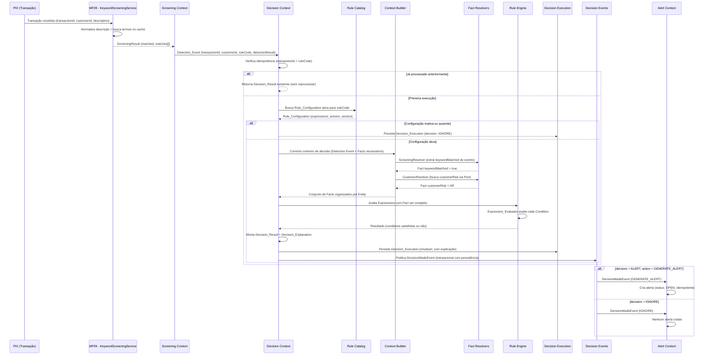

# Requirements Document

## Introduction

**Rule Platform** para regras de PLD (Prevenção à Lavagem de Dinheiro). Este módulo introduz um novo Bounded Context — **Decision Context** — que vai muito além de um simples Rule Engine. Trata-se de uma plataforma completa de decisão que desacopla a lógica de geração de alertas da execução dos algoritmos de screening, oferecendo extensibilidade para múltiplas regras, múltiplos contextos e múltiplas fontes de fatos.

### Visão Arquitetural

```
Decision Context
  ├── Rule Catalog          → Catálogo de definições de regras (MF09, MF10, MF11...)
  ├── Rule Configuration    → Configurações editáveis pelo analista por regra
  ├── Entity Registry       → Catálogo de entidades de negócio (Customer, Transaction...)
  ├── Fact Registry         → Registro tipado de fatos disponíveis, organizados por Entity
  ├── Context Builder       → Orquestrador da construção do contexto de decisão
  │     └── Fact Resolvers  → Resolvers especializados por domínio (CustomerResolver, ScreeningResolver...)
  ├── Decision Engine       → Orquestrador: carrega config, invoca Context Builder, invoca Rule Engine
  │     └── Rule Engine     → Avaliador de regras contra fatos
  │           └── Expression Evaluator → Avaliador de expressões (Condition | Group)
  ├── Decision Execution    → Persistência de TODAS as execuções com explicação estruturada
  ├── Decision Events       → Publicação de eventos de decisão para contextos downstream
  └── Dry-Run               → Teste de configurações com inputs manuais antes da publicação
```

### Roadmap Evolutivo

- **MVP1**: MF09 (Keyword Screening) + Customer Risk → GENERATE_ALERT + Explainability + Dry-Run
- **MVP2**: PEP, Segmento, País como novos Facts
- **MVP3**: Expressões compostas (AND, OR, Groups)
- **MVP4**: Simulação em batch (dataset histórico), Rule Testing avançado
- **MVP5**: Workflow, Approval, Publish
- **MVP6**: Metrics, Precision, Recall, False Positive

O MVP foca na integração com a regra MF09 (Keyword Screening), que **já existe e está em produção** no Screening Context (`KeywordScreeningService`, spec em `.kiro/specs/mf09-keyword-screening/`). O Decision Context **consome** eventos de detecção publicados pelo MF09 — não reimplementa a lógica de screening. A única modificação necessária no Screening Context é a publicação de um Detection_Event após a avaliação de keywords, que será consumido pelo Decision Context.

O modelo de domínio é desenhado para suportar evolução desde o dia 1: múltiplas regras (MF09, MF10, MF11, MF12), múltiplos contextos (SCREENING, TRANSACTION, CUSTOMER, ACCOUNT), múltiplas ações (GENERATE_ALERT, IGNORE, REVIEW, BLOCK), e expressões compostas (AND, OR). O MVP implementa apenas o subconjunto mínimo, mas sem necessidade de refatoração para evoluir.

## Princípios Arquiteturais

Estes princípios são invioláveis e protegem a integridade dos bounded contexts ao longo da evolução do sistema:

1. **O Decision Context nunca executa algoritmos de detecção.** Ele recebe fatos já produzidos pelo Screening Context — nunca normaliza texto, busca keywords, ou executa qualquer lógica de screening.

2. **O Screening Context nunca decide gerar alertas.** Ele detecta condições e publica eventos. A decisão de alertar pertence exclusivamente ao Decision Context.

3. **RuleDefinitions são técnicas e somente leitura para analistas.** Criadas e mantidas pela engenharia. Analistas não podem alterar, criar ou desativar Rule Definitions — apenas configurá-las via Rule Configurations.

4. **RuleConfigurations pertencem ao domínio de negócio.** São o artefato que analistas controlam para definir políticas de alerta sem intervenção técnica. Ciclo de vida independente das Rule Definitions. O analista só manipula Rule Configurations — combinando Facts e operadores que já existem no catálogo. Ele escolhe quais facts usar e com quais critérios, mas nunca cria facts ou entities novas.

5. **Analistas nunca criam Entities, Facts ou Rule Definitions.** Isso é intencional porque: (a) um Fact novo exige um Fact Resolver (código) para buscá-lo, (b) uma Entity nova exige integração com um sourceSystem, (c) validação de tipos e operadores depende da definição técnica. Apenas a engenharia pode expandir o catálogo — o analista consome o que já está disponível.

6. **Todo DecisionExecution é imutável.** Uma vez persistido, nunca é alterado ou deletado. Representa o registro histórico fiel da decisão tomada naquele momento com aqueles fatos e aquela configuração.

7. **Todo evento publicado deve ser idempotente.** Consumidores devem tratar eventos duplicados sem efeitos colaterais. Tanto o Decision Context (ao consumir Detection Events) quanto o Alert Context (ao consumir Decision Events) garantem idempotência.

8. **Facts representam o estado observado, nunca comandos.** Um Fact é um dado de leitura (ex.: "o risco do cliente É AR") — nunca uma instrução para o sistema fazer algo. O Decision Engine avalia fatos, não executa ações diretamente.

9. **Fact Resolvers são a única forma de acessar dados de outros bounded contexts.** O Decision Context nunca consulta diretamente APIs, bancos, ou serviços de outros contextos. Todo acesso externo é encapsulado em um Fact Resolver que transforma o dado em um Fact tipado. O Context Builder coordena os Resolvers.

10. **O Rule Engine é puro e isolado.** Recebe Facts e Expressions, retorna resultado. Não conhece infraestrutura, persistência, eventos, ou a origem dos dados. Testável sem mocks de framework.

11. **Separação entre orquestração e avaliação.** O Decision Engine orquestra (carrega config, busca fatos, persiste, publica). O Rule Engine apenas avalia. O Expression Evaluator apenas compara. Cada camada tem responsabilidade única.

## Recomendações Arquiteturais — Eventos Internos do Decision Context

Padronização da comunicação entre módulos e Bounded Contexts internos do Decision Context utilizando eventos de domínio, mantendo baixo acoplamento e permitindo evolução futura da arquitetura.

### 1. Separar Eventos de Integração de Eventos Internos

**Eventos de Integração** — AWS SQS exclusivamente para comunicação entre serviços ou sistemas externos:
- Garantia de entrega, retry, Dead Letter Queue (DLQ), persistência
- Comunicação entre microsserviços
- Exemplos: `TransactionReceived`, `CustomerUpdated`, `WatchlistImported`

**Eventos Internos** — Domain/Application Events para comunicação entre módulos do mesmo processo:
- Baixo acoplamento, alta coesão
- Comunicação apenas dentro do Decision Context
- Não utilizados como mecanismo de integração externa
- Exemplos: `DecisionCompleted`, `RuleMatched`, `RuleEvaluationFinished`, `ScreeningCompleted`, `CaseSuggested`, `AlertGenerated`

### 2. Nunca Depender Diretamente do ApplicationEventPublisher

O domínio e os casos de uso não devem conhecer Spring Framework. Criar abstração própria:

```
Port:       DomainEventPublisher / EventPublisher
Adapter:    SpringDomainEventPublisher (usa ApplicationEventPublisher)
```

Benefícios: independência de framework, facilidade para testes, possibilidade de substituir a infraestrutura futuramente.

### 3. Publicar Eventos Somente Após Persistência

Sempre que o evento depender de dados gravados no banco, utilizar publicação após commit:

```
@TransactionalEventListener(phase = AFTER_COMMIT)
```

Objetivos: evitar leitura de dados ainda não persistidos, evitar inconsistências durante rollback, garantir que listeners recebam apenas estados válidos.

### 4. Comunicação entre Contextos Apenas por Eventos

Evitar chamadas diretas entre Bounded Contexts:

```
❌ Evitar:                          ✅ Preferir:
Decision → CaseService             DecisionCompletedEvent
Decision → AuditService              ↓ Case Context
Decision → MetricsService            ↓ Audit Context
                                     ↓ Metrics Context
                                     ↓ Notification Context
```

Cada contexto reage ao evento sem dependência dos demais.

### 5. Eventos Representam Fatos de Negócio

Eventos representam algo que **aconteceu**. Usar nomes no passado:

```
✅ Preferir:              ❌ Evitar:
RuleMatched              ExecuteRule
RuleExecuted             ProcessDecision
ScreeningCompleted       CreateAlert
DecisionApproved
DecisionRejected
AlertGenerated
```

### 6. Eventos Devem Ser Imutáveis

Todos os eventos devem ser objetos imutáveis (`data class`). Devem conter apenas:
- Identificadores
- Dados necessários para processamento
- Timestamp
- CorrelationId (traceId)
- CausationId (quando aplicável — id do evento que causou este)

Nunca transportar entidades JPA completas.

### 7. Listeners Devem Possuir Responsabilidade Única

Cada listener executa apenas uma responsabilidade:

```
AuditEventListener           → persiste registro de auditoria
MetricsEventListener         → emite métricas
NotificationEventListener    → dispara notificação
CaseCreationListener         → cria caso para análise
HistoryListener              → registra no histórico
```

Evitar listeners que executem diversas ações de negócio.

### 8. Não Utilizar Eventos para Fluxo Principal

Eventos internos **não** controlam o fluxo principal da aplicação:
- O caso de uso deve ser completamente executado antes da publicação dos eventos
- Eventos representam efeitos colaterais ou reações ao resultado da operação
- O fluxo principal (Detection → Decision → Persist) é síncrono e orquestrado pelo Decision Engine

### 9. Preparar Evolução para Transactional Outbox

Os eventos internos devem possuir estrutura compatível com futura publicação externa. Caso um evento precise ser compartilhado entre serviços, será promovido para evento de integração utilizando o padrão **Transactional Outbox** sem alterar sua semântica de negócio.

### 10. Catálogo de Eventos do Decision Context

Criar catálogo centralizado contendo:

| Campo | Descrição |
|---|---|
| Nome do evento | Identificador único (ex.: `DecisionCompleted`) |
| Descrição | O que o evento representa |
| Contexto publicador | Quem publica (Decision, Screening, Alert) |
| Contextos consumidores | Quem consome |
| Payload | Estrutura de dados do evento |
| Versão | Versão do schema do evento |
| Garantias de entrega | At-least-once, exactly-once, best-effort |

O catálogo serve como contrato arquitetural entre os módulos.

### 11. Observabilidade

Todos os eventos publicados devem gerar:
- Log estruturado (JSON)
- CorrelationId (traceId)
- EventId (identificador único do evento)
- Timestamp
- Nome do evento
- Tempo de processamento dos listeners

Permitir rastreamento completo do fluxo de decisão end-to-end.

### 12. Roadmap de Evolução de Eventos

| Fase | Mecanismo | Uso |
|---|---|---|
| MVP | Spring Application Events | Comunicação interna entre módulos |
| Fase 2 | Transactional Outbox | Eventos que precisam ser publicados externamente |
| Fase 3 | AWS SQS | Integração entre serviços/microsserviços |

Evolução transparente para arquitetura distribuída sem alterar o domínio.

## Diagrama de Sequência — Fluxo Completo



## Exemplos de Funcionamento

### Cenário 1: Alerta gerado (keyword match + risco HIGH)

```
1. PIX recebido: transactionId="TX-001", customerId="CUST-42", description="pagamento lavagem carro"

2. KeywordScreeningService (existente) executa:
   → Normaliza: "pagamento lavagem carro"
   → Match: "lavagem" (category: AML)
   → Resultado: ScreeningResult(matched=true, matches=[{term:"lavagem", category:AML}])

3. Screening Context publica Detection_Event:
   {
     transactionId: "TX-001",
     customerId: "CUST-42",
     ruleCode: "KEYWORD_SCREENING",
     detectionResult: { matched: true, matches: [{term: "lavagem", category: "AML"}] }
   }

4. Decision Context consome o evento:
   a) Detection_Event_Mapper converte → Fact: keywordMatched = true
   b) Decision Engine busca Rule_Configuration ativa para "KEYWORD_SCREENING"
   c) Rule_Configuration encontrada (version 3):
      - Expressions: [
          { factName: "keywordMatched", operator: EQUALS, expectedValue: true },
          { factName: "customerRisk", operator: GREATER_THAN_OR_EQUAL, expectedValue: "MR" }
        ]
      - Actions: [GENERATE_ALERT]
   d) Decision Engine identifica Facts necessários: keywordMatched (já tem), customerRisk (precisa buscar)
   e) CustomerRiskProvider busca via CustomerRiskPort → retorna: AR
   f) Fact set montado: { keywordMatched: true, customerRisk: AR }

5. Rule Engine avalia Expressions:
   - keywordMatched EQUALS true → ✅ satisfeita
   - customerRisk GREATER_THAN_OR_EQUAL MR → AR >= MR → ✅ satisfeita
   - Todas satisfeitas → decision: ALERT

6. Decision_Result produzido:
   {
     decision: ALERT,
     actions: [GENERATE_ALERT],
     matchedExpressions: [ambas],
     facts: { keywordMatched: true, customerRisk: AR },
     configurationVersion: 3,
     executionTimeMs: 12
   }

7. Decision_Execution persistido (imutável, auditoria)

8. DecisionMadeEvent publicado → Alert Context cria alerta com status OPEN
```

### Cenário 2: Sem alerta (keyword match + risco BR)

```
1. PIX recebido: transactionId="TX-002", customerId="CUST-99", description="transferencia terrorismo"

2. KeywordScreeningService → matched=true, matches=[{term:"terrorismo", category:TERRORISM}]

3. Detection_Event publicado (matched=true)

4. Decision Context:
   a) keywordMatched = true (do evento)
   b) CustomerRiskProvider busca risco → retorna: BR
   c) Fact set: { keywordMatched: true, customerRisk: BR }

5. Rule Engine avalia:
   - keywordMatched EQUALS true → ✅ satisfeita
   - customerRisk GREATER_THAN_OR_EQUAL MR → BR >= MR → ❌ NÃO satisfeita
   - Semântica AND: uma falhou → decision: IGNORE

6. Decision_Result: { decision: IGNORE, actions: [], matchedExpressions: [apenas keywordMatched] }

7. Decision_Execution persistido (IGNORE também é auditado)

8. DecisionMadeEvent publicado (decision: IGNORE) → Alert Context NÃO cria alerta
```

### Cenário 3: Sem alerta (nenhum keyword match)

```
1. PIX recebido: transactionId="TX-003", description="pagamento aluguel mensal"

2. KeywordScreeningService → matched=false, matches=[]

3. Detection_Event publicado (matched=false)

4. Decision Context:
   a) keywordMatched = false (do evento)
   b) CustomerRiskProvider busca risco → retorna: AR
   c) Fact set: { keywordMatched: false, customerRisk: AR }

5. Rule Engine avalia:
   - keywordMatched EQUALS true → false == true → ❌ NÃO satisfeita
   - Semântica AND: uma falhou → decision: IGNORE
   (nota: mesmo com risco AR, sem keyword match não gera alerta)

6. Decision_Result: { decision: IGNORE, actions: [] }
```

### Cenário 4: Configuração inativa (rule desativada pelo analista)

```
1. Detection_Event recebido (matched=true, ruleCode="KEYWORD_SCREENING")

2. Decision Engine busca Rule_Configuration para "KEYWORD_SCREENING"
   → Encontra configuração com active=false

3. Rule Engine NÃO avalia Expressions → retorna decision: IGNORE diretamente

4. Decision_Execution persistido com nota de configuração inativa
```

### Cenário 5: Falha no Fact Provider (CustomerRiskPort indisponível)

```
1. Detection_Event recebido (matched=true)

2. Decision Engine:
   a) keywordMatched = true (do evento)
   b) CustomerRiskProvider tenta buscar → timeout após 5 segundos
   c) Erro logado: "CustomerRiskProvider falhou para CUST-42, TX-001"
   d) Fact customerRisk AUSENTE no set
   e) Fact set: { keywordMatched: true }  (customerRisk ausente)

3. Rule Engine avalia:
   - keywordMatched EQUALS true → ✅ satisfeita
   - customerRisk GREATER_THAN_OR_EQUAL MR → Fact ausente → ❌ condição NÃO satisfeita
   - decision: IGNORE (comportamento seguro: na dúvida, não gera alerta)

4. Decision_Execution persistido com facts parciais para auditoria
```

### Cenário 6: Idempotência (evento duplicado)

```
1. Detection_Event recebido pela segunda vez: transactionId="TX-001", ruleCode="KEYWORD_SCREENING"

2. Decision Context verifica: já existe Decision_Execution para (TX-001, KEYWORD_SCREENING)?
   → Sim, encontrado

3. Retorna Decision_Result previamente computado sem reexecutar

4. Nenhum novo Decision_Execution criado, nenhum novo evento publicado
```

### Exemplo de Configuração via API (criação pelo Analyst)

```json
POST /v1/decision/rules/KEYWORD_SCREENING/configurations

{
  "expressions": [
    {
      "type": "CONDITION",
      "factName": "keywordMatched",
      "operator": "EQUALS",
      "expectedValue": true
    },
    {
      "type": "CONDITION",
      "factName": "customerRisk",
      "operator": "GREATER_THAN_OR_EQUAL",
      "expectedValue": "MR"
    }
  ],
  "actions": ["GENERATE_ALERT"],
  "active": true
}

Response 201:
{
  "id": "cfg-uuid-001",
  "ruleCode": "KEYWORD_SCREENING",
  "version": 1,
  "active": true,
  "expressions": [...],
  "actions": ["GENERATE_ALERT"],
  "createdBy": "analyst@company.com",
  "createdAt": "2026-07-02T10:30:00Z"
}
```

### Exemplo de Consulta de Auditoria

```json
GET /v1/decision/executions?transactionId=TX-001

Response 200:
{
  "content": [
    {
      "id": "exec-uuid-001",
      "transactionId": "TX-001",
      "ruleCode": "KEYWORD_SCREENING",
      "decision": "ALERT",
      "actions": ["GENERATE_ALERT"],
      "facts": {
        "keywordMatched": true,
        "customerRisk": "AR"
      },
      "matchedExpressions": [
        { "factName": "keywordMatched", "operator": "EQUALS", "expectedValue": true, "actualValue": true },
        { "factName": "customerRisk", "operator": "GREATER_THAN_OR_EQUAL", "expectedValue": "MR", "actualValue": "AR" }
      ],
      "configurationVersion": 3,
      "executionTimeMs": 12,
      "timestamp": "2026-07-02T10:35:00Z"
    }
  ],
  "page": 0,
  "size": 20,
  "totalElements": 1
}
```

### Evolução Futura — Exemplo com múltiplas condições (MVP3)

```json
// Rule Configuration para MF09 com AND/OR (pós-MVP)
{
  "expressions": [
    {
      "type": "GROUP",
      "operator": "AND",
      "expressions": [
        { "type": "CONDITION", "factName": "keywordMatched", "operator": "EQUALS", "expectedValue": true },
        {
          "type": "GROUP",
          "operator": "OR",
          "expressions": [
            { "type": "CONDITION", "factName": "customerRisk", "operator": "GREATER_THAN_OR_EQUAL", "expectedValue": "MR" },
            { "type": "CONDITION", "factName": "pep", "operator": "EQUALS", "expectedValue": true }
          ]
        }
      ]
    }
  ],
  "actions": ["GENERATE_ALERT", "REVIEW"]
}

// Lê-se: keyword match AND (risco >= MR OR cliente PEP) → gerar alerta + enviar para revisão
```

## Glossary

### Componentes Arquiteturais

- **Decision_Context**: Bounded Context responsável por receber eventos de detecção, construir o contexto de decisão via Fact Resolvers, avaliar configurações de regras e decidir quais ações executar. Contém todos os componentes da Rule Platform.
- **Decision_Engine**: Componente orquestrador do Decision Context. Responsável por: (1) carregar a Rule Configuration ativa do Rule Catalog, (2) invocar o Context Builder para obter Facts, (3) invocar o Rule Engine para avaliação, e (4) produzir um DecisionResult com explicação estruturada.
- **Context_Builder**: Componente orquestrador da construção do contexto de decisão. Recebe o Detection Event, identifica quais Entities e Facts são necessários, invoca os Fact Resolvers correspondentes e entrega o conjunto completo de Facts ao Decision Engine.
- **Fact_Resolver**: Componente especializado por domínio que obtém, transforma e calcula Facts de um bounded context específico. Cada Resolver conhece apenas seu domínio. Exemplos: CustomerResolver (customerRisk, pep, segment), ScreeningResolver (keywordMatched), TransactionResolver (amount, currency, channel).
- **Rule_Engine**: Componente interno ao Decision Engine responsável por avaliar um conjunto de Facts contra as Expressions de uma Rule Configuration. Não conhece a origem dos fatos nem o destino das decisões.
- **Expression_Evaluator**: Componente interno ao Rule Engine responsável por avaliar expressões individuais (Condition ou Group). Isola a lógica de comparação de operadores.
- **Rule_Catalog**: Componente que organiza e disponibiliza as Rule Definitions e suas Configurations. Ponto central de consulta para o Decision Engine saber quais regras existem e suas configurações ativas.
- **Entity_Registry**: Catálogo de entidades de negócio do sistema. Define quais Entities existem (Customer, Transaction, Account, Device) e quais Facts pertencem a cada Entity. Organiza o modelo conceitual para que Facts não existam isoladamente.
- **Fact_Registry**: Registro tipado de todos os Facts disponíveis no sistema, organizados por Entity. Garante que o Rule Engine nunca trabalhe com Strings não tipadas — cada Fact possui tipo, Entity, operadores suportados e contexto definido.
- **Detection_Event_Mapper**: Componente responsável por converter Detection Events em Facts tipados. Implementado como um Fact Resolver especializado em eventos do Screening Context.
- **Simulation_Engine**: (Roadmap MVP4) Motor de simulação batch que permitirá executar Rule Configurations contra datasets históricos de Decision_Executions. Não implementado no MVP — substituído pelo Dry-Run com inputs manuais.
- **Screening_Context**: Bounded Context **já existente** responsável por executar algoritmos de screening (MF09 — `KeywordScreeningService`) e, após modificações mínimas, publicar Detection_Events. Modificações necessárias: (1) adicionar `customerId` ao `EvaluateKeywordScreeningCommand` e ao request REST, (2) publicar `DetectionEvent` via `DomainEventPublisher` após produzir o resultado. **Este contexto NÃO faz parte do escopo deste spec** — já possui spec próprio em `.kiro/specs/mf09-keyword-screening/`.
- **Alert_Context**: Bounded Context **novo** responsável por receber DecisionMadeEvents via Spring Application Events, criar e persistir alertas, e disponibilizá-los para consulta pelos analistas. Módulo separado dentro do mesmo deployment (mesma JVM no MVP). Preparado para se tornar microsserviço independente no futuro. Possui seu próprio modelo de domínio (Alert aggregate), persistência (tabelas próprias), e API REST.

### Modelo de Domínio — Regras

- **Rule_Definition**: Aggregate Root. Definição técnica e imutável de uma regra de screening (ex.: MF09 — Keyword Screening). Criada e mantida pela engenharia. Contém: id (RuleId), code (RuleCode), name, description, context (RuleContext), category (RuleCategory), supportedFacts, supportedActions, status (ACTIVE, INACTIVE, DEPRECATED). Ciclo de vida estático — evolui com deploys. Referenciada por Rule_Configurations via ruleId, mas NÃO as agrega.
- **Rule_Configuration**: Aggregate Root. Configuração operacional editável pelo analista que define critérios adicionais para geração de ação (ex.: alerta) associados a uma Rule Definition. Contém uma ou mais Expressions, uma lista de Actions desejadas, e agrega suas Configuration_Versions. Ciclo de vida operacional — evolui com edições do analista. Referencia uma Rule_Definition via ruleId (não é filho dela).
- **Configuration_Version**: Entidade interna ao aggregate Rule_Configuration. Registro imutável de uma Rule Configuration em um ponto no tempo. Cada alteração cria uma nova versão. Utilizado para auditoria e rastreabilidade.
- **RuleContext**: Contexto ao qual uma Rule Definition pertence. Valores: SCREENING, TRANSACTION, CUSTOMER, ACCOUNT. Prepara o modelo para múltiplos contextos de avaliação.
- **RuleCategory**: Categoria funcional de uma regra. Valores: KEYWORD_SCREENING, SANCTIONS, AML, FRAUD, VELOCITY. Facilita filtros na UI e agrupamento lógico.

### Modelo de Domínio — Entidades de Negócio

- **Entity**: Representa uma entidade de negócio utilizada pelo Decision Engine. Uma Entity agrupa Facts relacionados a um mesmo conceito do domínio. Cada Entity possui um **sistema de origem** (source system) que identifica de onde os dados vêm. Exemplos: Customer (origem: Cadastro), Transaction (origem: Core Banking), Account (origem: Cadastro), Device (origem: Antifraude), Risk (origem: PLD). Facts não existem isoladamente — pertencem sempre a uma Entity.
- **Entity_Definition**: Define quais Facts pertencem a uma determinada Entity e identifica o sistema de origem. Contém: id, name, displayName, sourceSystem (sistema que detém a informação: Cadastro, PLD, Core Banking, Antifraude, Screening), e lista de FactNames. Exemplos: Customer (origem: Cadastro, facts: pep, segment, country), Risk (origem: PLD, facts: customerRisk, riskScore), Transaction (origem: Core Banking, facts: amount, currency, channel), Screening (origem: Screening, facts: keywordMatched). Permite que o Decision Engine saiba de onde buscar cada grupo de informações.

### Modelo de Domínio — Fatos

- **Fact**: Dado contextual tipado utilizado pelo Rule Engine na avaliação. Cada Fact é identificado por um FactName, possui um FactValue tipado, e pertence a uma Entity. O Rule Engine nunca trabalha com Strings brutas.
- **Fact_Definition**: Aggregate Root. Entrada no catálogo de fatos disponíveis para o motor. Contém: id, name (FactName), displayName, entity (Entity à qual pertence — que por sua vez indica o sourceSystem de origem), type (BOOLEAN, ENUM, MONEY, STRING, NUMBER), context (SCREENING, CUSTOMER, TRANSACTION, ACCOUNT), source (indica o bounded context de origem, derivado do sourceSystem da Entity), supportedOperators, enabled. Ciclo de vida estático — mantido pela engenharia. Permite: UI dinâmica, validação automática, novos fatos sem alterar o engine.
- **Customer_Risk**: Nível de risco do cliente. Valores possíveis: BR (Baixo Risco), MR (Médio Risco), AR (Alto Risco). Ordenação: BR < MR < AR.
- **Detection_Event**: Evento publicado pelo Screening Context (pelo `KeywordScreeningService` existente, após modificação mínima) indicando que uma regra detectou uma condição. O payload é derivado do `ScreeningResult` existente: contém `ruleCode: String` ("KEYWORD_SCREENING"), `matched: Boolean`, e `matches: List<MatchResult>` onde cada `MatchResult` possui `term: String` e `category: Category` (TERRORISM, AML, FRAUD, FINANCIAL_CRIME, SANCTIONS).

### Modelo de Domínio — Expressões e Avaliação

- **Expression**: Modelo composicional para condições de avaliação. Uma Expression pode ser: (a) uma **Condition** (comparação atômica: factName + operator + expectedValue), ou (b) um **Group** (combinação lógica de Expressions com operador AND ou OR). No MVP, apenas Condition é utilizado. Nenhuma refatoração necessária quando Groups forem introduzidos.
- **Condition**: Expressão atômica representando uma comparação única: factName (FactName), operator (ComparisonOperator), expectedValue (FactValue). É um caso específico de Expression.
- **Group**: Expressão composta que combina múltiplas Expressions com um operador lógico (AND, OR). Não implementado no MVP, mas o modelo já suporta.
- **ComparisonOperator**: Operador de comparação suportado pelo Expression Evaluator. Valores modelados no domínio: EQUALS, NOT_EQUALS, GREATER_THAN, GREATER_THAN_OR_EQUAL, LESS_THAN, LESS_THAN_OR_EQUAL, IN, NOT_IN, CONTAINS. No MVP, apenas EQUALS, NOT_EQUALS e GREATER_THAN_OR_EQUAL são implementados.

### Modelo de Domínio — Decisões e Ações

- **Decision_Result**: Resultado rico da avaliação do Decision Engine contendo: decision (Decision), actions (lista de Action), matchedExpressions (expressões satisfeitas), executionTimeMs, configurationVersion, facts (fatos avaliados). Substitui o modelo simplificado de shouldGenerateAlert.
- **Decision**: Value Object representando o veredito do Decision Engine. Valores: ALERT, IGNORE, REVIEW, BLOCK. No MVP, apenas ALERT e IGNORE são produzidos.
- **Action**: Conceito de ação a ser executada como resultado de uma decisão. Valores modelados: GENERATE_ALERT, IGNORE, REVIEW, BLOCK. No MVP, apenas GENERATE_ALERT é suportado como Action efetiva. O modelo é extensível para novos tipos sem alteração na lógica core.
- **Decision_Execution**: Aggregate Root. Registro operacional e imutável de TODAS as execuções do Decision Engine (não apenas alertas). Contém: id, transactionId, ruleId, configurationVersion, facts, result (DecisionResult completo), explanation (DecisionExplanation), executionTimeMs, timestamp. Ciclo de vida write-once — nunca modificado após criação. Um Alert nasce de um DecisionExecution — nunca diretamente. Referencia Rule_Definition e ConfigurationVersion, mas NÃO é filho de nenhum deles.
- **Decision_Explanation**: Trilha completa de auditoria de uma execução do Decision Engine. Contém 7 etapas ordenadas cronologicamente: (1) Recebimento do evento, (2) Identificação da regra e configuração, (3) Construção de contexto (cada resolver com timing e resultado), (4) Avaliação (cada expression com valor real, esperado e justificativa legível), (5) Decisão final com justificativa, (6) Persistência, (7) Publicação. Inclui traceId para correlação com logs, métricas de performance por etapa, e justificativas human-readable. Permite que auditores/reguladores reconstruam qualquer decisão sem acesso ao código-fonte. Persistida integralmente como registro imutável.
- **Decision_Event**: Evento publicado após cada execução de decisão (DecisionMadeEvent). Contém o DecisionResult completo para que contextos downstream possam reagir.
- **Simulation_Execution**: (Roadmap MVP4) Aggregate Root futuro. Registro de uma execução de simulação batch de Rule Configuration contra um dataset histórico. Não implementado no MVP.
- **Simulation_Result**: (Roadmap MVP4) Resultado individual de uma simulação batch para uma transação específica. Não implementado no MVP.
- **Simulation_Statistics**: (Roadmap MVP4) Estatísticas agregadas de uma simulação batch. Não implementado no MVP.

### Modelo de Domínio — Alert Context

- **Alert**: Aggregate Root do Alert Context. Representa um alerta gerado como resultado de uma decisão do Decision Engine. Contém: id (AlertId), transactionId, ruleId, customerId, facts (snapshot dos fatos no momento da decisão), configurationVersion, traceId (correlação com Decision_Execution), actions, Decision_Explanation (ou referência), status (OPEN, UNDER_REVIEW, CLOSED, FALSE_POSITIVE), createdAt, updatedAt. Ciclo de vida operacional — criado como OPEN, evolui com ações do analista.
- **AlertStatus**: Status do ciclo de vida de um alerta. Valores: OPEN (recém-criado), UNDER_REVIEW (analista analisando), CLOSED (encerrado com decisão), FALSE_POSITIVE (encerrado como falso positivo). Transições permitidas: OPEN → UNDER_REVIEW → CLOSED | FALSE_POSITIVE.

### Value Objects

- **RuleId**: Identificador único de uma Rule Definition. Tipo forte, não String.
- **RuleCode**: Código legível de uma regra (ex.: "MF09", "KEYWORD_SCREENING"). Tipo forte, não String.
- **FactName**: Nome tipado de um Fact (ex.: "keywordMatched", "customerRisk"). Tipo forte, não String.
- **FactValue**: Valor tipado de um Fact. Encapsula o valor real com seu tipo (Boolean, Enum, Money, String, Number).
- **ConfigurationVersion**: Número de versão imutável de uma Configuration. Tipo forte, não Int.

### Atores

- **Analyst**: Usuário do sistema com permissão para criar e editar Rule Configurations.
- **Engineer**: Responsável por criar Rule Definitions e Fact Definitions no catálogo. Não editável por analistas.

### Aggregate Roots

O Decision Context possui 4 Aggregate Roots independentes no MVP, cada um com ciclo de vida, dono e invariantes próprios:

| Aggregate Root | Dono | Ciclo de Vida | Contém |
|---|---|---|---|
| **RuleDefinition** | Engenharia | Estático (evolui com deploys) | code, name, context, category, supportedFacts, supportedActions, status |
| **RuleConfiguration** | Analista | Operacional (evolui com edições) | ruleId (ref→RuleDefinition), expressions, actions, active/draft, ConfigurationVersions[] |
| **DecisionExecution** | Sistema | Imutável (write-once) | transactionId, ruleId (ref), configurationVersion (ref), facts, result, explanation, executionTimeMs, timestamp |
| **FactDefinition** | Engenharia | Estático (catálogo de fatos) | name, displayName, entity, type, context, source, supportedOperators, enabled |

Futuro (MVP4):

| Aggregate Root | Dono | Ciclo de Vida | Contém |
|---|---|---|---|
| **SimulationExecution** | Analista | Imutável após conclusão | configurationVersion (draft), dataset, startedAt, finishedAt, results[], statistics |

O Alert Context possui 1 Aggregate Root próprio:

| Aggregate Root | Dono | Ciclo de Vida | Contém |
|---|---|---|---|
| **Alert** | Sistema/Analista | Operacional (criado→analisado→encerrado) | transactionId, ruleId, customerId, facts, configurationVersion, traceId, actions, explanation, status, createdAt, updatedAt |

Invariantes de cada aggregate:
- **RuleDefinition**: supportedFacts referenciam FactDefinitions existentes. Status controla se novas Configurations podem ser criadas.
- **RuleConfiguration**: uma única Configuration ativa por RuleDefinition. ConfigurationVersions são imutáveis e monotonicamente crescentes. Validação cruzada com Rule_Definition (supportedFacts, supportedActions) e Fact_Registry (operators, types).
- **DecisionExecution**: imutável após criação. Referencia ConfigurationVersion exata usada na avaliação. Inclui DecisionExplanation completa. Nunca modificado ou deletado.
- **FactDefinition**: name é único no catálogo. Cada Fact pertence a exatamente uma Entity. Desativar um FactDefinition impede novas Configurations que o referenciem, mas não invalida Configurations existentes.

Invariantes do Alert Context:
- **Alert**: idempotente por (transactionId, ruleId) — não permite duplicatas. Status segue máquina de estados: OPEN → UNDER_REVIEW → CLOSED | FALSE_POSITIVE. Contém snapshot completo dos dados da decisão para rastreabilidade sem dependência do Decision Context.

## Requirements

### Requirement 1: Catálogo de Definições de Fatos (Fact Registry)

**User Story:** Como Engineer, quero manter um catálogo tipado de Facts disponíveis no sistema, para que o Decision Engine valide configurações automaticamente e a UI possa renderizar formulários dinâmicos sem alteração de código.

#### Acceptance Criteria

1. O Fact_Registry DEVE manter um catálogo de Fact_Definitions, cada uma contendo: id, name (FactName), displayName, entity (Entity à qual pertence, que carrega o sourceSystem de origem), type (BOOLEAN, ENUM, MONEY, STRING, NUMBER), context (SCREENING, CUSTOMER, TRANSACTION, ACCOUNT), source (bounded context de origem, derivado do sourceSystem da Entity), supportedOperators (lista de ComparisonOperator), e flag enabled.
2. QUANDO uma Rule_Configuration é criada ou atualizada, O Decision_Context DEVE validar que cada Condition referencia um FactName registrado no Fact_Registry com status enabled.
3. QUANDO uma Rule_Configuration referencia um FactName, O Decision_Context DEVE validar que o operador utilizado na Condition está presente na lista de supportedOperators da Fact_Definition correspondente.
4. QUANDO uma Rule_Configuration referencia um FactName, O Decision_Context DEVE validar que o expectedValue da Condition é compatível com o type definido na Fact_Definition correspondente.
5. SE uma Condition referencia um FactName não registrado, um operador não suportado, ou um valor incompatível em tipo, ENTÃO O Decision_Context DEVE rejeitar a configuração com mensagem indicando a falha de validação específica.
6. No MVP, o Fact_Registry DEVE conter as seguintes Fact_Definitions pré-cadastradas: keywordMatched (entity: Screening/sourceSystem: Screening, type: BOOLEAN, operators: EQUALS, NOT_EQUALS) e customerRisk (entity: Risk/sourceSystem: PLD, type: ENUM, operators: EQUALS, NOT_EQUALS, GREATER_THAN_OR_EQUAL).
7. O Fact_Registry DEVE permitir adicionar novas Fact_Definitions sem alteração no código do Decision_Engine ou Rule_Engine.

### Requirement 2: Catálogo de Regras (Rule Catalog)

**User Story:** Como Engineer, quero registrar definições de regras com contexto, categoria e fatos suportados, para que o sistema saiba quais regras existem e quais configurações são válidas para cada uma.

#### Acceptance Criteria

1. O Rule_Catalog DEVE manter Rule_Definitions, cada uma contendo: id (RuleId), code (RuleCode), name, description, context (RuleContext: SCREENING, TRANSACTION, CUSTOMER, ACCOUNT), category (RuleCategory: KEYWORD_SCREENING, SANCTIONS, AML, FRAUD, VELOCITY), supportedFacts (lista de FactNames válidos para esta regra), supportedActions (lista de Actions válidas para esta regra), e status (ACTIVE, INACTIVE, DEPRECATED).
2. QUANDO uma Rule_Configuration é criada para uma Rule_Definition, O Decision_Context DEVE validar que todas as Conditions referenciam apenas FactNames presentes na lista supportedFacts da Rule_Definition.
3. QUANDO uma Rule_Configuration define Actions, O Decision_Context DEVE validar que todas as Actions estão presentes na lista supportedActions da Rule_Definition.
4. ENQUANTO uma Rule_Definition está com status INACTIVE ou DEPRECATED, O Decision_Context DEVE rejeitar a criação de novas Rule_Configurations para aquela definição.
5. No MVP, o Rule_Catalog DEVE conter a Rule_Definition para MF09 (Keyword Screening) com: code "KEYWORD_SCREENING", context SCREENING, category KEYWORD_SCREENING, supportedFacts [keywordMatched, customerRisk], supportedActions [GENERATE_ALERT, IGNORE], status ACTIVE.
6. O Rule_Catalog DEVE ser modelado para suportar múltiplas regras (MF09, MF10, MF11, MF12) desde o dia 1, mesmo que o MVP implemente apenas MF09.
7. QUANDO um Analyst consulta o Rule_Catalog, O Decision_Context DEVE retornar as Rule_Definitions filtráveis por context e category.

### Requirement 3: Context Builder e Fact Resolvers

**User Story:** Como Decision Engine, quero que um Context Builder orquestre a obtenção de fatos via Fact Resolvers especializados, para que novos fatos possam ser adicionados ao sistema criando novos resolvers sem alterar o engine.

#### Acceptance Criteria

1. O Decision_Context DEVE definir o Context_Builder como componente orquestrador responsável por: receber o Detection Event, identificar quais Entities e Facts são necessários com base na Rule_Configuration ativa, invocar os Fact_Resolvers correspondentes, e entregar o conjunto completo de Facts ao Decision Engine.
2. O Decision_Context DEVE definir a abstração Fact_Resolver como interface especializada por domínio, responsável por: buscar informações de um bounded context externo e transformá-las em Facts tipados. Cada Resolver conhece apenas seu domínio.
3. QUANDO um Detection_Event é recebido, O Context_Builder DEVE identificar quais Facts são necessários para a Rule_Configuration ativa e invocar apenas os Fact_Resolvers que produzem esses Facts.
4. O Decision_Context DEVE implementar no MVP os seguintes Fact Resolvers: (a) ScreeningResolver — transforma dados do Detection_Event em Facts (keywordMatched), e (b) CustomerResolver — busca Customer_Risk via CustomerRiskPort e produz o Fact customerRisk.
5. QUANDO o CustomerResolver é invocado para um customerId, O Fact_Resolver DEVE buscar o Customer_Risk via CustomerRiskPort dentro de um timeout máximo de 5 segundos.
6. SE um Fact_Resolver falhar em retornar um valor (timeout, erro de conexão, resposta inválida), ENTÃO O Context_Builder DEVE registrar o erro com transactionId e customerId, e o Fact correspondente DEVE ser ausente no conjunto de Facts entregue ao Decision Engine.
7. SE o CustomerResolver retornar uma resposta que não corresponde a um valor válido de Customer_Risk (BR, MR, AR), ENTÃO O Context_Builder DEVE tratar a resposta como falha do resolver.
8. O modelo DEVE permitir adicionar novos Fact Resolvers (PEPResolver, TransactionResolver, CountryResolver) sem alteração no Context Builder ou Decision Engine — apenas registro de novo resolver e nova Fact_Definition.
9. Cada Fact_Resolver DEVE declarar quais FactNames é capaz de produzir e a qual Entity pertencem, permitindo que o Context Builder invoque apenas os resolvers necessários.
10. O Context_Builder DEVE organizar os Facts obtidos por Entity antes de entregar ao Decision Engine, mantendo a rastreabilidade de origem.

### Requirement 4: Mapeamento de Eventos de Detecção (Detection Event Mapper)

**User Story:** Como Decision Context, quero converter eventos de detecção em Facts tipados via um mapper dedicado, para que novos tipos de evento possam ser suportados sem alteração no engine.

#### Acceptance Criteria

1. QUANDO um Detection_Event é publicado pelo `KeywordScreeningService` existente no Screening_Context, O Decision_Context DEVE consumir o evento e invocar o Detection_Event_Mapper para conversão em Facts.
2. O Detection_Event_Mapper DEVE extrair do payload do evento os seguintes campos e convertê-los em Facts tipados: transactionId (string não vazia, máximo 64 caracteres), customerId (string não vazia, máximo 64 caracteres), ruleCode (RuleCode correspondendo a uma Rule_Definition registrada no Rule_Catalog), e detectionResult (derivado do modelo `ScreeningResult` existente, contendo `matched: Boolean` e `matches: List<MatchResult>`).
3. O Detection_Event_Mapper DEVE produzir o Fact keywordMatched (tipo BOOLEAN) a partir do campo `matched` do Detection_Event.
4. SE um Detection_Event é recebido com algum campo obrigatório ausente, nulo ou vazio, ENTÃO O Decision_Context DEVE registrar um erro indicando quais campos falharam na validação e descartar o evento sem invocar o Decision Engine.
5. SE um Detection_Event é recebido com um valor de campo excedendo seu comprimento máximo, ENTÃO O Decision_Context DEVE registrar um erro indicando a violação de restrição e descartar o evento sem invocar o Decision Engine.
6. SE um Detection_Event referencia um ruleCode que não corresponde a nenhuma Rule_Definition no Rule_Catalog, ENTÃO O Decision_Context DEVE registrar um erro e descartar o evento.
7. QUANDO um Detection_Event com o mesmo transactionId e ruleCode de um evento previamente processado é recebido, O Decision_Context DEVE retornar o Decision_Result previamente computado sem reexecutar a lógica de decisão (idempotência).
8. O modelo DEVE permitir adicionar novos Event Mappers para futuros tipos de evento (TransactionEvent, AccountEvent) sem alteração na lógica do Decision Engine.

### Requirement 5: Modelo de Expressões (Expression Model)

**User Story:** Como Decision Engine, quero avaliar condições usando um modelo composicional de expressões, para que a evolução para expressões complexas (AND/OR/Groups) não exija refatoração do modelo existente.

#### Acceptance Criteria

1. O Rule_Engine DEVE modelar critérios de avaliação como Expression, onde uma Expression pode ser: (a) uma Condition (comparação atômica: factName, operator, expectedValue), ou (b) um Group (operador lógico AND/OR aplicado a uma lista de Expressions filhas).
2. QUANDO um conjunto de Facts e uma Rule_Configuration são fornecidos, O Rule_Engine DEVE avaliar cada Expression da configuração delegando ao Expression_Evaluator.
3. O Expression_Evaluator DEVE avaliar uma Condition comparando o valor do Fact identificado pelo factName contra o expectedValue usando o operator especificado.
4. O Expression_Evaluator DEVE suportar no MVP os operadores: EQUALS e NOT_EQUALS para Facts do tipo BOOLEAN (keywordMatched), e EQUALS, NOT_EQUALS e GREATER_THAN_OR_EQUAL para Facts do tipo ENUM com ordenação (customerRisk).
5. O Expression_Evaluator DEVE avaliar Customer_Risk usando a ordenação BR < MR < AR, onde GREATER_THAN_OR_EQUAL é satisfeito quando o Customer_Risk fornecido é igual ou superior ao valor esperado nesta ordenação.
6. No MVP, uma Rule_Configuration DEVE conter apenas Conditions (sem Groups). A avaliação de múltiplas Conditions em uma mesma configuração utiliza semântica AND implícita (todas devem ser satisfeitas).
7. SE uma Condition referencia um FactName que não está presente no conjunto de Facts fornecido, ENTÃO O Expression_Evaluator DEVE tratar aquela Condition como não satisfeita.
8. ENQUANTO uma Rule_Configuration está marcada como inativa, O Rule_Engine DEVE retornar um Decision_Result com decision IGNORE sem avaliar as Expressions.
9. O modelo de Expression DEVE ser extensível para suportar Groups (AND/OR) em versões futuras sem necessidade de refatoração do Expression_Evaluator ou do Rule_Engine.

### Requirement 6: Orquestração de Decisão (Decision Engine)

**User Story:** Como Decision Context, quero que o Decision Engine orquestre o fluxo completo de decisão (carregar config, buscar fatos, avaliar regras), separado do Rule Engine que apenas avalia, para que cada componente tenha responsabilidade única e clara.

#### Acceptance Criteria

1. O Decision_Engine DEVE orquestrar o fluxo de decisão em etapas distintas: (a) identificar a Rule_Configuration ativa no Rule_Catalog para o ruleCode recebido, (b) invocar o Context_Builder passando o Detection Event e a lista de Facts necessários com base nas Expressions da configuração, (c) receber o conjunto de Facts organizados por Entity do Context Builder, (d) invocar o Rule_Engine passando Facts e Expressions, (e) produzir um Decision_Result completo com DecisionExplanation.
2. O Rule_Engine DEVE ser um componente separado do Decision_Engine, recebendo apenas Facts e Expressions como entrada, e retornando o resultado da avaliação. O Rule_Engine NÃO DEVE conhecer Context Builder, Fact Resolvers, persistence, ou eventos.
3. O Expression_Evaluator DEVE ser um componente separado do Rule_Engine, responsável exclusivamente por avaliar uma Expression individual contra um conjunto de Facts.
4. QUANDO todas as Expressions na Rule_Configuration são satisfeitas, O Decision_Engine DEVE produzir um Decision_Result com decision ALERT e actions contendo as actions configuradas na Rule_Configuration (no MVP, apenas GENERATE_ALERT).
5. QUANDO qualquer Expression na Rule_Configuration não é satisfeita, O Decision_Engine DEVE produzir um Decision_Result com decision IGNORE e actions vazia.
6. SE não existe Rule_Configuration ativa para o ruleCode recebido, ENTÃO O Decision_Engine DEVE produzir um Decision_Result com decision IGNORE e registrar a ausência de configuração.
7. O Decision_Result DEVE conter: decision (Decision), actions (lista de Action), matchedExpressions (lista de Expressions satisfeitas), executionTimeMs (duração da avaliação), configurationVersion (ConfigurationVersion utilizada), e facts (mapa de Facts avaliados).

### Requirement 7: Conceito de Action

**User Story:** Como Decision Context, quero que o resultado de decisão inclua ações tipadas, para que o sistema possa evoluir para múltiplas ações (REVIEW, BLOCK) sem refatoração.

#### Acceptance Criteria

1. O Decision_Context DEVE modelar Actions como enum com valores: GENERATE_ALERT, IGNORE, REVIEW, BLOCK. Cada Rule_Configuration define quais Actions são disparadas quando as Expressions são satisfeitas.
2. No MVP, apenas GENERATE_ALERT é suportado como Action efetiva — o Alert Context DEVE reagir apenas a esta action. As demais actions (IGNORE, REVIEW, BLOCK) são modeladas no domínio mas não produzem efeitos colaterais no MVP.
3. QUANDO o Decision_Result contém a action GENERATE_ALERT, O Decision_Context DEVE incluir esta informação no DecisionMadeEvent publicado para que o Alert Context possa criar o alerta.
4. QUANDO o Decision_Result contém apenas a action IGNORE, O Decision_Context DEVE publicar o DecisionMadeEvent com a action correspondente, mas o Alert Context NÃO DEVE criar um alerta.
5. O modelo de Action DEVE ser extensível para suportar novas actions sem alteração na lógica do Decision Engine ou Rule Engine.
6. Cada Rule_Definition no Rule_Catalog DEVE declarar sua lista de supportedActions, e Rule_Configurations DEVEM referenciar apenas Actions presentes nessa lista.

### Requirement 8: Gerenciar Rule Configurations

**User Story:** Como Analyst, quero criar e editar Rule Configurations com expressões e ações, para que eu possa controlar quando uma regra dispara uma ação sem alterações de código.

#### Acceptance Criteria

1. QUANDO um Analyst cria uma Rule_Configuration, O Decision_Context DEVE persistir a configuração com: ruleId (referenciando uma Rule_Definition ativa no Rule_Catalog), status ativo, uma ou mais Expressions (no MVP, apenas Conditions — cada uma contendo factName, operator, expectedValue), actions desejadas (no MVP, apenas GENERATE_ALERT), e uma Configuration_Version inicial.
2. QUANDO um Analyst atualiza uma Rule_Configuration, O Decision_Context DEVE criar uma nova Configuration_Version e definir a configuração atualizada como a versão ativa.
3. SE um Analyst tenta criar uma Rule_Configuration para uma Rule_Definition que já possui uma Rule_Configuration ativa, ENTÃO O Decision_Context DEVE rejeitar a requisição com uma mensagem de erro indicando configuração ativa duplicada.
4. QUANDO um Analyst desativa uma Rule_Configuration, O Decision_Context DEVE definir o status ativo como false, fazendo com que o Decision_Engine produza Decision_Result com decision IGNORE para aquela regra.
5. O Decision_Context DEVE validar que: (a) factNames referenciam Fact_Definitions registradas no Fact_Registry com status enabled, (b) factNames estão presentes na lista supportedFacts da Rule_Definition, (c) operators estão na lista supportedOperators da Fact_Definition referenciada, (d) expectedValues são compatíveis em tipo com a Fact_Definition, (e) actions estão na lista supportedActions da Rule_Definition.
6. SE um Analyst fornece qualquer campo inválido conforme as validações do critério 5, ENTÃO O Decision_Context DEVE rejeitar a configuração com mensagem indicando a falha de validação específica.
7. O Decision_Context DEVE limitar cada Rule_Configuration a um máximo de 10 Expressions.
8. Rule_Configuration é um Aggregate Root independente. Referencia Rule_Definition via ruleId, mas NÃO é filho dela. Agrega internamente suas Configuration_Versions.

### Requirement 9: Persistência de Execuções (Decision Execution)

**User Story:** Como Analyst, quero que TODAS as execuções do Decision Engine sejam persistidas (não apenas alertas), para que eu possa auditar qualquer decisão tomada pelo sistema — inclusive decisões de IGNORE.

#### Acceptance Criteria

1. QUANDO o Decision_Engine produz um Decision_Result (independente de decision ser ALERT ou IGNORE), O Decision_Context DEVE persistir um Decision_Execution contendo: id, transactionId, ruleId (RuleId), configurationVersion (ConfigurationVersion utilizada), facts (mapa completo de Facts avaliados), result (Decision_Result completo incluindo decision, actions, matchedExpressions), executionTimeMs, e timestamp UTC.
2. O Decision_Context DEVE garantir que Decision_Executions são registros imutáveis — NÃO DEVE permitir exclusão ou modificação de um Decision_Execution persistido.
3. O Decision_Context DEVE reter registros de Decision_Execution por um mínimo de 5 anos para cumprir requisitos regulatórios de PLD.
4. QUANDO um Analyst consulta Decision_Executions por transactionId, O Decision_Context DEVE retornar registros correspondentes ordenados por timestamp decrescente, paginados com tamanho de página padrão de 20 e tamanho máximo de página de 100.
5. QUANDO um Analyst consulta Decision_Executions por ruleId, O Decision_Context DEVE retornar registros correspondentes ordenados por timestamp decrescente, paginados com tamanho de página padrão de 20 e tamanho máximo de página de 100.
6. QUANDO um Analyst consulta Decision_Executions por decision (ALERT ou IGNORE), O Decision_Context DEVE retornar registros filtrados pelo tipo de decisão.
7. SE o Decision_Context falhar em persistir o Decision_Execution, ENTÃO O Decision_Context DEVE realizar nova tentativa da operação de persistência até 3 vezes antes de registrar a falha e emitir um alerta operacional.
8. SE um Analyst consulta Decision_Executions e nenhum registro corresponde aos critérios fornecidos, ENTÃO O Decision_Context DEVE retornar um conjunto de resultados vazio com contagem total igual a zero.
9. Decision_Execution é um Aggregate Root independente e imutável. Referencia a ConfigurationVersion utilizada no momento da avaliação via configurationVersion, mas NÃO pertence ao aggregate de Rule_Configuration nem de Rule_Definition.

### Requirement 10: Comunicação entre Contextos e Publicação de Eventos

**User Story:** Como Decision Context, quero publicar eventos de decisão via Spring Application Events (intra-processo) para que o Alert Context e outros consumidores possam reagir, mantendo desacoplamento entre módulos dentro da mesma JVM.

#### Acceptance Criteria

1. A comunicação entre bounded contexts no MVP DEVE utilizar Spring Application Events (`ApplicationEventPublisher` / `@TransactionalEventListener`) como mecanismo intra-processo na mesma JVM. Não há messaging externo (Kafka, SQS) no MVP.

2. O fluxo de eventos DEVE seguir a cadeia:
   - **Screening Context → Decision Context**: O `KeywordScreeningService` existente, após produzir o `ScreeningResult`, DEVE publicar um `DetectionEvent` via `ApplicationEventPublisher`. O Decision Context consome via `@TransactionalEventListener(phase = AFTER_COMMIT)` ou `@EventListener`.
   - **Decision Context → Alert Context**: O Decision Context, após persistir o Decision_Execution, DEVE publicar um `DecisionMadeEvent` via `ApplicationEventPublisher`. O Alert Context consome via `@TransactionalEventListener`.

3. QUANDO o Decision_Engine produz um Decision_Result com decision ALERT, O Decision_Context DEVE publicar um DecisionMadeEvent contendo: traceId, ruleId, transactionId, customerId, decision (ALERT), actions (incluindo GENERATE_ALERT), facts avaliados, matchedExpressions, Decision_Explanation completa, configurationVersion, executionTimeMs, e timestamp UTC.

4. QUANDO o Decision_Engine produz um Decision_Result com decision IGNORE, O Decision_Context DEVE publicar um DecisionMadeEvent contendo: traceId, ruleId, transactionId, decision (IGNORE), actions vazia, facts avaliados, configurationVersion, executionTimeMs, e timestamp UTC.

5. O Decision_Context DEVE publicar o DecisionMadeEvent utilizando `@TransactionalEventListener(phase = AFTER_COMMIT)` para garantir que o evento só é despachado após o commit bem-sucedido da transação que persistiu o Decision_Execution.

6. SE a publicação do evento falhar (ex.: exception no listener), O Decision_Context DEVE registrar o erro. Como a persistência do Decision_Execution já foi commitada, o evento DEVE ser retentado via mecanismo de retry ou compensação.

7. O DecisionMadeEvent DEVE ser auto-contido — contém toda a informação necessária para o Alert Context criar alertas sem consultar o Decision Context.

8. Os eventos DEVEM ser modelados como objetos imutáveis (data classes) no pacote de domínio, sem dependência de Spring. A publicação via `ApplicationEventPublisher` é responsabilidade da camada de infraestrutura.

9. O modelo de comunicação DEVE ser preparado para migração futura para messaging externo (Kafka/SQS). A interface de publicação (`DecisionEventPublisher` port) DEVE abstrair o mecanismo — a implementação Spring Application Events é um adapter que pode ser substituído sem alterar o domínio.

10. O DetectionEvent publicado pelo Screening Context DEVE conter: transactionId, customerId, ruleCode, detectionResult (ScreeningResult), e timestamp. O Decision Context DEVE consumir este evento para iniciar o fluxo de decisão.

### Requirement 11: Versionamento de Configurações

**User Story:** Como Analyst, quero ver o histórico de alterações de uma Rule Configuration, para que eu possa entender como os critérios de decisão evoluíram ao longo do tempo.

#### Acceptance Criteria

1. QUANDO uma Rule_Configuration é criada ou atualizada, O Decision_Context DEVE atribuir um número de ConfigurationVersion à nova versão, começando em 1 e incrementando em 1 para cada versão subsequente dentro da mesma Rule_Configuration.
2. O Decision_Context DEVE persistir cada Configuration_Version como um registro imutável vinculado à Rule_Configuration, contendo: as Expressions (Conditions no MVP), Actions configuradas, status ativo, identificador do Analyst, e um timestamp UTC com precisão de milissegundos.
3. QUANDO um Analyst consulta o histórico de versões de uma Rule_Configuration, O Decision_Context DEVE retornar todas as Configuration_Versions para aquela configuração ordenadas por número de versão decrescente.
4. SE um Analyst consulta o histórico de versões de uma Rule_Configuration que não existe, ENTÃO O Decision_Context DEVE retornar um erro indicando que a Rule_Configuration não foi encontrada.
5. O Decision_Context NÃO DEVE permitir modificação ou exclusão de um registro de Configuration_Version persistido.
6. Cada Decision_Execution DEVE referenciar a ConfigurationVersion exata utilizada no momento da avaliação, permitindo rastreabilidade completa entre decisão e configuração.

### Requirement 12: Integração de Geração de Alertas (Alert Context)

**User Story:** Como Alert Context, quero receber DecisionMadeEvents via Spring Application Events e criar alertas quando a action GENERATE_ALERT está presente, para que o fluxo end-to-end de detecção → decisão → alerta funcione sem acoplamento direto.

#### Acceptance Criteria

1. O Alert_Context DEVE ser implementado como módulo dentro do mesmo deployment Spring Boot, consumindo DecisionMadeEvents via `@TransactionalEventListener` ou `@EventListener`.

2. QUANDO um DecisionMadeEvent com action GENERATE_ALERT é recebido pelo listener do Alert_Context, O Alert_Context DEVE:
   - (a) Extrair do evento: transactionId, ruleId, customerId, facts avaliados, configurationVersion, actions, traceId, Decision_Explanation, timestamp.
   - (b) Verificar idempotência: consultar se já existe um alerta para o par (transactionId, ruleId).
   - (c) Se não existir, criar um novo alerta com status inicial OPEN.
   - (d) Persistir o alerta com todos os dados do evento para rastreabilidade completa.

3. QUANDO um DecisionMadeEvent com decision IGNORE (sem action GENERATE_ALERT) é recebido, O Alert_Context NÃO DEVE criar um alerta. O evento pode ser ignorado ou logado em nível DEBUG.

4. O Alert_Context DEVE processar DecisionMadeEvents de forma idempotente: eventos duplicados para o mesmo transactionId e ruleId NÃO DEVEM produzir alertas duplicados. Se o alerta já existe, retornar silenciosamente.

5. SE um DecisionMadeEvent é recebido com transactionId ou ruleId ausente ou nulo, ENTÃO O Alert_Context DEVE descartar o evento e registrar um erro com nível WARN indicando o campo ausente e o traceId para correlação.

6. SE a persistência do alerta falhar devido a erro de banco de dados, ENTÃO O Alert_Context DEVE registrar o erro com traceId e propagar a exception. Como o mecanismo é intra-processo, a falha será visível no log e poderá acionar alertas operacionais.

7. O Alert_Context DEVE reagir apenas à action GENERATE_ALERT no MVP. Demais actions (REVIEW, BLOCK) são logadas em nível INFO mas não produzem efeito até que os respectivos handlers sejam implementados.

8. O alerta criado DEVE conter: id (gerado), transactionId, ruleId, customerId, facts avaliados, configurationVersion, Decision_Explanation (ou referência ao traceId), actions, status (OPEN), createdAt (timestamp).

9. O Alert_Context DEVE expor endpoints REST para consulta de alertas: `GET /v1/alerts?transactionId={id}`, `GET /v1/alerts?ruleId={id}`, `GET /v1/alerts/{alertId}`.

10. O Alert_Context é preparado para se tornar um bounded context separado (outro deployment) no futuro — a interface de comunicação via evento é o contrato estável. A migração para Kafka/SQS exigirá apenas trocar o adapter de publicação/consumo sem alterar a lógica do Alert_Context.

### Requirement 13: Value Objects e Tipagem Forte

**User Story:** Como Engineer, quero que o domínio utilize Value Objects tipados em vez de Strings, para que erros de tipo sejam capturados em tempo de compilação e o domínio seja auto-documentado.

#### Acceptance Criteria

1. O Decision_Context DEVE representar identificadores e valores de domínio como Value Objects tipados: RuleId (identificador único de Rule_Definition), RuleCode (código legível da regra), FactName (nome de um Fact), FactValue (valor tipado encapsulando Boolean, Enum, Money, String ou Number), e ConfigurationVersion (número de versão).
2. O Rule_Engine NÃO DEVE aceitar Strings brutas para factNames, operators, ou values — todos os parâmetros DEVEM utilizar os Value Objects correspondentes.
3. O Decision_Engine DEVE converter dados externos (payloads de eventos, respostas de APIs) em Value Objects na camada de infraestrutura, antes de entrar no domínio.
4. SE uma conversão de dado externo para Value Object falhar (ex.: factName inválido, valor não mapeável), ENTÃO O Decision_Context DEVE registrar o erro e rejeitar a operação na fronteira da infraestrutura.
5. O ComparisonOperator DEVE ser modelado como enum contendo todos os operadores futuros (EQUALS, NOT_EQUALS, GREATER_THAN, GREATER_THAN_OR_EQUAL, LESS_THAN, LESS_THAN_OR_EQUAL, IN, NOT_IN, CONTAINS), mesmo que o MVP implemente apenas EQUALS, NOT_EQUALS e GREATER_THAN_OR_EQUAL.
6. O FactValue DEVE encapsular a informação de tipo junto com o valor, permitindo que o Expression_Evaluator realize validação de tipo em runtime antes da comparação.

### Requirement 14: Extensibilidade e Roadmap Evolutivo

**User Story:** Como Engineer, quero que o modelo de domínio esteja preparado para evoluir sem refatoração, para que novas regras, fatos, operadores e ações possam ser adicionados incrementalmente.

#### Acceptance Criteria

1. O Decision_Context DEVE ser modelado para suportar múltiplas Rule_Definitions (MF09, MF10, MF11, MF12) processando Detection_Events de diferentes origens, sem alteração na lógica core do Decision_Engine.
2. O Fact_Registry DEVE suportar adição de novas Fact_Definitions (PEP, Segment, Country, Amount) via configuração ou migration, sem necessidade de alterar código do Rule_Engine ou Expression_Evaluator.
3. O modelo de Expression DEVE suportar evolução de Conditions simples para Groups compostos (AND/OR) sem quebra de contrato das interfaces existentes.
4. O modelo de Action DEVE suportar adição de novas actions (REVIEW, BLOCK, ESCALATE) sem alteração na lógica de avaliação do Decision_Engine.
5. O modelo de ComparisonOperator DEVE suportar implementação incremental de novos operadores (IN, NOT_IN, CONTAINS, LESS_THAN) sem alteração nas interfaces do Expression_Evaluator.
6. O modelo de Fact_Resolver DEVE suportar registro de novos resolvers sem alteração no Context_Builder ou Decision_Engine — novos resolvers são descobertos automaticamente via injeção de dependência.
7. O Detection_Event_Mapper (ScreeningResolver) DEVE suportar novos tipos de evento (TransactionEvent, AccountEvent) via novos resolvers registrados, sem alteração no fluxo principal do Decision_Context.
8. O Entity_Registry DEVE suportar adição de novas Entities (Device, Merchant) sem alteração no Context_Builder ou Rule_Engine.
9. O roadmap evolutivo DEVE seguir a sequência: MVP1 (MF09 + Customer Risk → GENERATE_ALERT + Explainability + Dry-Run) → MVP2 (PEP, Segmento, País) → MVP3 (AND, OR, Groups) → MVP4 (Simulação batch, Rule Testing avançado) → MVP5 (Workflow, Approval, Publish) → MVP6 (Metrics, Precision, Recall, False Positive).

### Requirement 15: Entity Registry

**User Story:** Como Engineer, quero manter um catálogo de entidades de negócio, para que Facts sejam organizados por Entity e o Decision Engine possa raciocinar sobre entidades (Customer, Transaction) em vez de fatos isolados.

#### Acceptance Criteria

1. O Entity_Registry DEVE manter um catálogo de Entity_Definitions, cada uma contendo: id, name (ex.: Customer, Risk, Transaction, Screening, Account, Device), displayName, sourceSystem (sistema de origem que detém os dados da entidade, ex.: Cadastro, PLD, Core Banking, Screening, Antifraude), e lista de FactNames pertencentes a esta Entity.
2. Cada Fact_Definition no Fact_Registry DEVE pertencer a exatamente uma Entity.
3. QUANDO uma Fact_Definition é cadastrada, O Decision_Context DEVE validar que a Entity referenciada existe no Entity_Registry.
4. O Context_Builder DEVE utilizar o sourceSystem da Entity_Definition para determinar qual Fact_Resolver é responsável por obter os Facts daquela Entity.
5. No MVP, o Entity_Registry DEVE conter as seguintes Entity_Definitions: Risk (sourceSystem: PLD, facts: customerRisk), Screening (sourceSystem: Screening, facts: keywordMatched).
6. O modelo DEVE permitir adicionar novas Entities (Customer/Cadastro, Account/Cadastro, Transaction/Core Banking, Device/Antifraude) sem alteração no Rule_Engine ou Context_Builder.
7. QUANDO um Analyst consulta o Fact_Registry, Os Facts DEVEM ser apresentados agrupados por Entity com indicação do sourceSystem para facilitar a navegação e entendimento da origem dos dados.

### Requirement 16: Explainability, Auditoria e Rastreabilidade

**User Story:** Como Analyst/Auditor, quero que toda decisão do engine inclua uma trilha completa de auditoria com explicação estruturada e justificativa de cada ação, para que eu possa rastrear e explicar qualquer decisão do sistema perante reguladores (COAF/BACEN).

#### Acceptance Criteria

1. QUANDO o Decision_Engine produz um Decision_Result, O Decision_Context DEVE gerar uma Decision_Explanation contendo a trilha completa de auditoria com os seguintes passos ordenados cronologicamente:
   - **Etapa 1 — Recebimento**: timestamp de recebimento do Detection_Event, transactionId, customerId, ruleCode, payload do evento.
   - **Etapa 2 — Identificação da Regra**: Rule_Definition utilizada (code, name, category, context), Rule_Configuration ativa (configurationVersion, expressions, actions).
   - **Etapa 3 — Construção de Contexto**: para cada Fact Resolver invocado: nome do resolver, Entity, sourceSystem, timestamp de início, timestamp de fim, duração em ms, resultado (valor obtido ou erro com motivo).
   - **Etapa 4 — Avaliação**: para cada Expression avaliada: factName, operador, valor esperado, valor real obtido (ou "ABSENT"), resultado (satisfeita/não satisfeita), justificativa textual (ex.: "customerRisk AR é igual ou superior ao esperado MR", ou "Fact customerRisk ausente — CustomerResolver falhou por timeout após 5s").
   - **Etapa 5 — Decisão**: decision final (ALERT/IGNORE), actions determinadas, justificativa da decisão (ex.: "Todas as 2 Conditions satisfeitas → decision ALERT, action GENERATE_ALERT", ou "Condition customerRisk não satisfeita → decision IGNORE, nenhuma action").
   - **Etapa 6 — Persistência**: timestamp de persistência do Decision_Execution, id gerado.
   - **Etapa 7 — Publicação**: timestamp de publicação do DecisionMadeEvent, eventId.

2. A Decision_Explanation DEVE permitir que um auditor reconstrua completamente o motivo da decisão — reproduzindo cada passo documentado de forma verificável e auditável sem acesso ao código-fonte.

3. A Decision_Explanation DEVE ser persistida integralmente junto ao Decision_Execution como registro imutável. NÃO DEVE ser possível alterar ou deletar a explicação após persistência.

4. QUANDO um Analyst consulta um Decision_Execution, A Decision_Explanation DEVE ser retornada como parte da resposta, incluindo todos os 7 passos com timestamps e justificativas.

5. Para cada Expression avaliada, A Decision_Explanation DEVE incluir uma **justificativa legível** (human-readable) que explique a lógica aplicada. Exemplos:
   - "keywordMatched EQUALS true → valor real: true → ✅ Condição satisfeita: keyword detectada na transação"
   - "customerRisk GREATER_THAN_OR_EQUAL MR → valor real: BR → ❌ Condição não satisfeita: risco BR é inferior ao mínimo exigido MR"
   - "customerRisk GREATER_THAN_OR_EQUAL MR → valor real: ABSENT → ❌ Condição não satisfeita: Fact não resolvido (CustomerResolver timeout após 5000ms)"

6. A Decision_Explanation DEVE incluir métricas de performance por etapa: tempo de cada Fact Resolver individual, tempo total de avaliação do Rule Engine, tempo total end-to-end da decisão.

7. O Decision_Context DEVE gerar um **traceId** único por execução que correlacione: o Detection_Event recebido, os logs de cada Fact Resolver, a avaliação do Rule Engine, a persistência do Decision_Execution, e a publicação do DecisionMadeEvent. Este traceId DEVE estar presente em todos os logs estruturados e no Decision_Execution persistido.

8. Todos os logs gerados durante a execução de uma decisão DEVEM ser estruturados (JSON) e conter: traceId, transactionId, ruleCode, timestamp, componente (ContextBuilder, CustomerResolver, RuleEngine, etc.), nível (INFO, WARN, ERROR), e mensagem com dados relevantes.

9. O DecisionMadeEvent publicado DEVE incluir: a Decision_Explanation completa, o traceId, e informação suficiente para que contextos downstream tenham visibilidade total da decisão sem consultar o Decision Context.

10. Em caso de falha parcial (ex.: Fact Resolver timeout), A Decision_Explanation DEVE registrar: qual resolver falhou, qual o erro, quanto tempo levou antes de falhar, e qual o impacto na decisão final (ex.: "Fact customerRisk ausente → Condition 2 tratada como não satisfeita → decision IGNORE por comportamento seguro").

11. O Decision_Context DEVE permitir consultar Decision_Executions por traceId, possibilitando correlação com logs de infraestrutura e observabilidade.

### Requirement 17: Dry-Run de Configurações (Rule Testing)

**User Story:** Como Analyst, quero testar uma Rule Configuration fornecendo Facts manualmente e ver o resultado imediato, para que eu possa validar se a lógica da configuração faz o que espero antes de ativá-la.

#### Acceptance Criteria

1. O Decision_Context DEVE expor um endpoint de dry-run: `POST /v1/decision/rule-configurations/{id}/dry-run` que recebe um conjunto de Facts como input e retorna o resultado da avaliação sem produzir side effects.
2. O dry-run NÃO DEVE produzir: alertas, Decision Events, Decision_Executions, ou qualquer persistência. É uma avaliação pura e efêmera.
3. QUANDO um Analyst submete um dry-run, O Decision_Context DEVE avaliar a Rule_Configuration utilizando o mesmo Rule_Engine e Expression_Evaluator do fluxo produtivo, garantindo que o comportamento testado seja idêntico ao real.
4. O request do dry-run DEVE conter um mapa de Facts tipados fornecidos pelo analista. Exemplo:
   ```json
   {
     "facts": {
       "keywordMatched": true,
       "customerRisk": "MR"
     }
   }
   ```
5. O response do dry-run DEVE conter: decision (ALERT/IGNORE), actions, matchedExpressions (com valor real vs esperado), failedExpressions (com motivo da falha), e Decision_Explanation completa.
6. O Decision_Context DEVE validar que os Facts fornecidos no dry-run são compatíveis em tipo com as Fact_Definitions do Fact_Registry (ex.: customerRisk deve ser um valor válido do enum BR/MR/AR).
7. SE o Analyst fornece um FactName que não existe no Fact_Registry, ENTÃO O Decision_Context DEVE rejeitar o dry-run com mensagem indicando o Fact inválido.
8. O dry-run DEVE funcionar tanto para Rule_Configurations ativas quanto para configurações em estado draft (não publicadas), permitindo teste antes da ativação.
9. O dry-run DEVE ser acessível apenas para usuários com role de Analyst.
10. O dry-run NÃO DEVE invocar Fact Resolvers — os Facts são fornecidos diretamente pelo analista, eliminando dependência de sistemas externos durante o teste.

### Requirement 18: Publicação com Dry-Run Prévio

**User Story:** Como Analyst, quero que uma Rule Configuration somente possa ser ativada após ter sido testada via dry-run, para que configurações não validadas não afetem o sistema produtivo.

#### Acceptance Criteria

1. QUANDO um Analyst tenta ativar uma Rule_Configuration, O Decision_Context DEVE verificar se existe pelo menos uma execução de dry-run registrada para a ConfigurationVersion sendo ativada.
2. SE não existe nenhum dry-run registrado para a ConfigurationVersion, ENTÃO O Decision_Context DEVE rejeitar a ativação com mensagem indicando que teste prévio via dry-run é obrigatório.
3. O Decision_Context DEVE registrar cada execução de dry-run (sem persistir como Decision_Execution) com: configurationVersion testada, facts fornecidos, resultado obtido, timestamp, e analyst identifier. Este registro é leve (log ou tabela auxiliar) e serve apenas para validar que o teste foi feito.
4. O Decision_Context DEVE permitir criar Rule_Configurations em estado draft (não ativas) para que possam ser testadas via dry-run antes da publicação.
5. QUANDO uma Rule_Configuration está em estado draft, O Decision_Engine NÃO DEVE utilizá-la para avaliar Detection_Events reais.
6. QUANDO um Analyst confirma a ativação após dry-run, O Decision_Context DEVE transicionar a Rule_Configuration de draft para active e criar a Configuration_Version correspondente.

---

## Notas de Implementação (Post-Implementation)

Esta seção registra divergências e decisões tomadas durante a implementação em relação ao documento original de requirements.

### Alterações Aplicadas

| Item | Planejado | Implementado | Justificativa |
|------|-----------|--------------|---------------|
| Framework de PBT | jqwik 1.8.4 | Kotest Property 5.9.1 | Projeto já usava Kotest como runner. Mais idiomático em Kotlin. Ver ADR-003. |
| Migrations | V2, V3, V4 | V6, V7, V8 | Projeto já possuía V1–V5 para Screening Context |
| Migrations idempotentes | Não especificado | `IF NOT EXISTS` + `ON CONFLICT DO NOTHING` | Permite re-execução segura. Ver ADR-007. |
| API First | Não especificado | OpenAPI 3.1 em `docs/api/openapi.yaml` | Contrato formal como fonte de verdade. Ver ADR-005. |
| customerId no Screening | Novo campo | Adicionado ao `EvaluateKeywordScreeningCommand` e Request DTO | Necessário para o DetectionEvent carregar o customerId ao Decision Context |
| DryRunLog model | Mencionado como "log leve" | Aggregate `DryRunLog` com `DryRunLogRepository` port | Necessário para validar dry-run prévio na ativação (Req 18.1) |
| DecisionResult.explanation | Campo separado | Campo opcional em DecisionResult (`explanation: DecisionExplanation?`) | Permite que o DecisionEngine retorne explicação junto ao resultado |
| ComparisonOperator GTE | `GREATER_THAN_OR_EQUAL` (nome longo) | Mantido como `GREATER_THAN_OR_EQUAL` no enum | Consistência com o design doc. Abreviação `GTE` usada apenas nos tasks |
| Alert Context | Módulo separado | Bounded context `br.com.alert.*` na mesma JVM | Ver ADR-006 |

### Princípios Adicionais Adotados

19. **API First** — O contrato OpenAPI (`docs/api/openapi.yaml`) é a fonte de verdade para todos os endpoints REST. Alterações de API iniciam pela atualização do spec.

20. **Migrations idempotentes** — Todos os scripts DDL usam `CREATE TABLE IF NOT EXISTS` e `CREATE INDEX IF NOT EXISTS`. Scripts DML usam `ON CONFLICT DO NOTHING`.

21. **Dry-Run obrigatório para ativação** — Reforçado com property test (Property 12) e integration test validando o workflow completo.

### Documentação Produzida

| Artefato | Localização |
|----------|-------------|
| OpenAPI Spec | `src/main/resources/openapi/openapi.yaml` |
| ADRs | `docs/adr/001-*.md` a `docs/adr/008-*.md` |
| Guia de Uso | `docs/user-guide.md` |
| Requirements (este doc) | `.kiro/specs/decision-engine/requirements.md` |
| Design | `.kiro/specs/decision-engine/design.md` |
