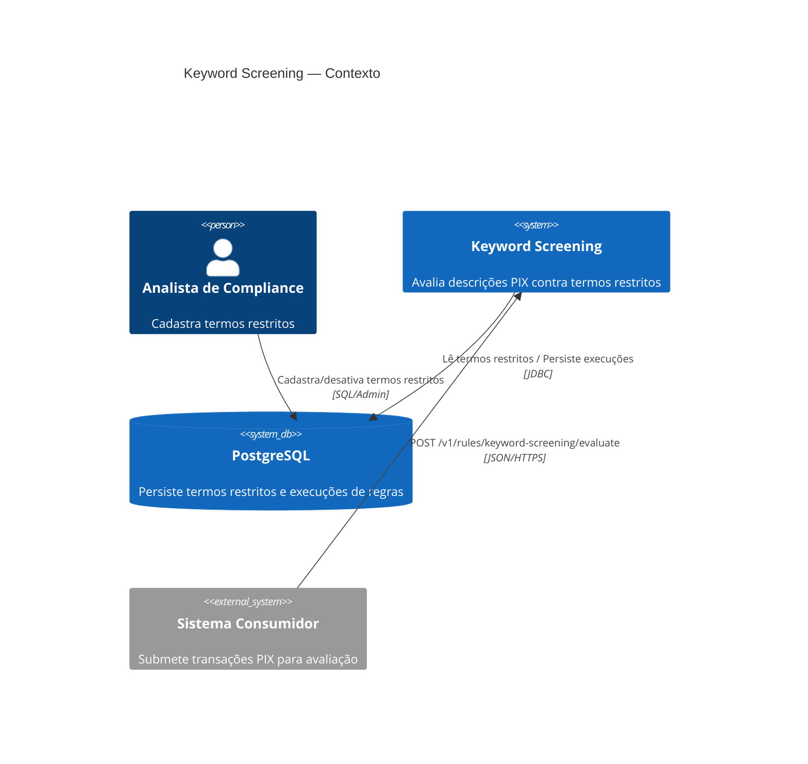
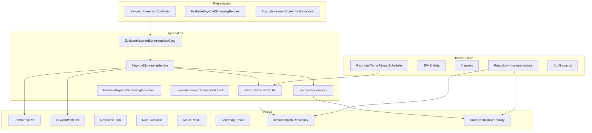
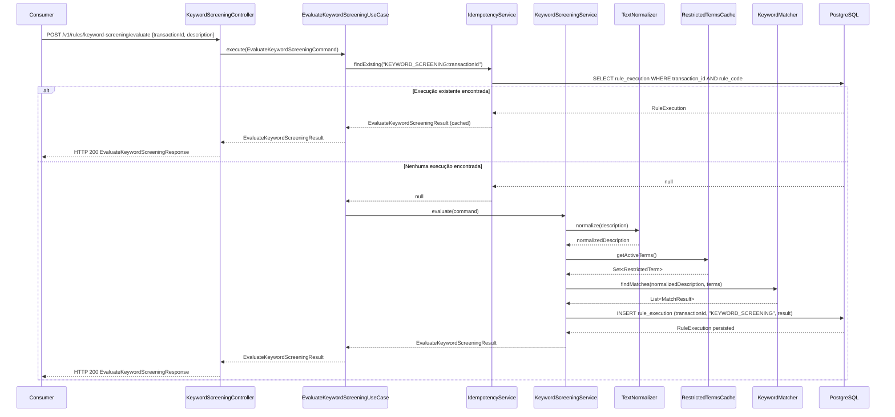
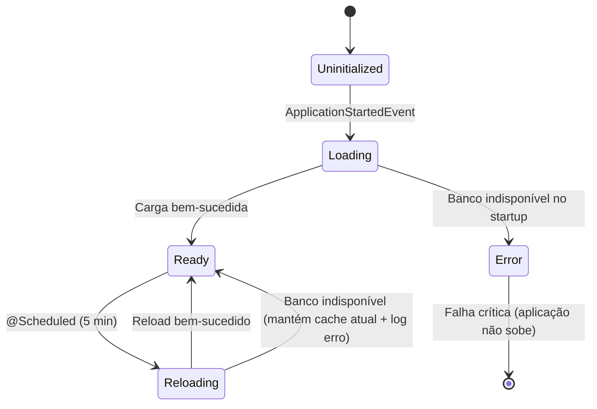
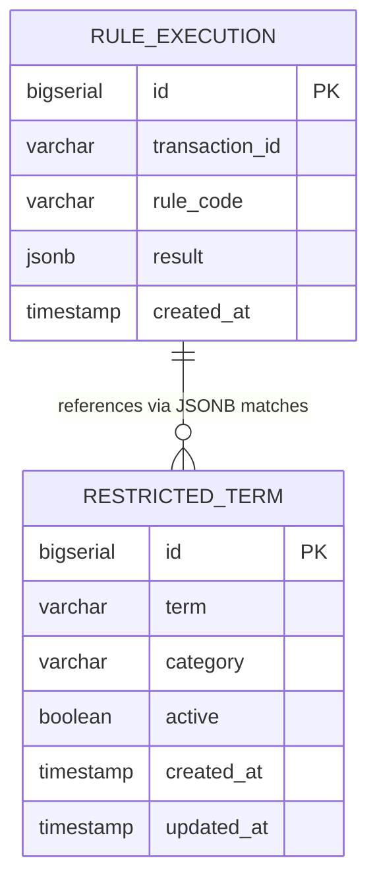

# Design Document — Keyword Screening

## Overview

A feature **Keyword Screening** implementa uma regra de screening que analisa a descrição de transações PIX em busca de termos restritos cadastrados pela área de Compliance. O objetivo é detectar, em tempo real e com alta performance (< 10ms), possíveis indícios de terrorismo, lavagem de dinheiro (AML), fraude, crime financeiro e sanções.

### Decisões de Design

| Decisão | Escolha | Justificativa |
|---|---|---|
| Cache em memória | `Set<RestrictedTerm>` com `@Volatile` | Leitura O(n) simples, sem dependência de infraestrutura externa, resiliência a falhas de banco |
| Idempotência | Constraint UNIQUE no banco + verificação prévia | Garante consistência sem lock distribuído; race condition tratada por limpeza pós-inserção |
| Normalização | Pipeline sequencial imutável | Determinismo e testabilidade; cada etapa é pura e componível |
| Extensibilidade | Interface `ScreeningRule` | Permite adicionar novas regras de screening sem alterar o núcleo do domínio |
| Persistência do resultado | JSONB no PostgreSQL | Flexibilidade para evoluir o schema do resultado sem migrações de coluna |

### Contexto de Extensibilidade

O bounded context `keyword-screening` é projetado para suportar múltiplas regras de screening via interface genérica `ScreeningRule`. A regra `KeywordScreening` é a primeira implementação concreta dessa interface.

---

## Architecture

### Diagrama de Contexto



### Diagrama de Camadas (DDD)



### Fluxo de Processamento



### Ciclo de Vida do Cache



---

## Components and Interfaces

### Interface de Extensibilidade

```kotlin
/**
 * Interface genérica para regras de screening.
 * Permite adicionar novas regras sem alterar o núcleo do domínio.
 */
interface ScreeningRule {
    val ruleCode: String
    fun evaluate(transactionId: String, description: String): ScreeningResult
}
```

### Domain Layer

#### TextNormalizer (Domain Service)

```kotlin
/**
 * Serviço de domínio puro (sem estado) responsável pela normalização de texto.
 * Pipeline: lowercase → remove acentos → remove caracteres especiais → compacta espaços.
 */
@Component
class TextNormalizer {

    /**
     * Normaliza o texto aplicando o pipeline completo.
     * Idempotente: normalize(normalize(s)) == normalize(s)
     */
    fun normalize(text: String): String

    private fun toLowerCase(text: String): String
    private fun removeAccents(text: String): String   // Normalizer.normalize(NFD) + regex [^\\p{ASCII}]
    private fun removeSpecialChars(text: String): String  // regex [^a-z0-9 ]
    private fun compactSpaces(text: String): String   // regex \\s+ → " ", trim()
}
```

#### KeywordMatcher (Domain Service)

```kotlin
/**
 * Serviço de domínio puro responsável por identificar termos restritos
 * em uma descrição já normalizada.
 */
@Component
class KeywordMatcher {

    /**
     * Retorna todos os MatchResults para termos encontrados na descrição normalizada.
     * Considera apenas termos ativos.
     * Complexidade: O(n * m) onde n = len(normalizedDescription), m = |activeTerms|
     */
    fun findMatches(
        normalizedDescription: String,
        activeTerms: Set<RestrictedTerm>
    ): List<MatchResult>
}
```

#### Value Objects e Entidades

```kotlin
/** Termo restrito cadastrado pela área de Compliance. */
data class RestrictedTerm(
    val id: Long,
    val term: String,        // armazenado já normalizado
    val category: Category,
    val active: Boolean,
    val createdAt: Instant,
    val updatedAt: Instant
)

/** Resultado de um match individual. */
data class MatchResult(
    val term: String,
    val category: Category
)

/** Resultado consolidado da execução da regra. */
data class ScreeningResult(
    val ruleCode: String,
    val matched: Boolean,
    val matches: List<MatchResult>
)

/** Aggregate root: execução persistida da regra para uma transação. */
data class RuleExecution(
    val id: Long? = null,
    val transactionId: String,
    val ruleCode: String,
    val result: ScreeningResult,
    val createdAt: Instant
) {
    /** Chave de idempotência: KEYWORD_SCREENING:{transactionId} */
    val idempotencyKey: String get() = "$ruleCode:$transactionId"
}

enum class Category {
    TERRORISM, AML, FRAUD, FINANCIAL_CRIME, SANCTIONS
}
```

#### Repositories (Domain Interfaces)

```kotlin
interface RestrictedTermRepository {
    fun findAllActive(): List<RestrictedTerm>
}

interface RuleExecutionRepository {
    fun findByTransactionIdAndRuleCode(transactionId: String, ruleCode: String): RuleExecution?
    fun save(ruleExecution: RuleExecution): RuleExecution
}
```

### Application Layer

#### EvaluateKeywordScreeningUseCase

```kotlin
interface EvaluateKeywordScreeningUseCase {
    fun execute(command: EvaluateKeywordScreeningCommand): EvaluateKeywordScreeningResult
}

data class EvaluateKeywordScreeningCommand(
    val transactionId: String,
    val description: String
)

data class EvaluateKeywordScreeningResult(
    val ruleCode: String,
    val matched: Boolean,
    val matches: List<MatchResult>
)
```

#### KeywordScreeningService

```kotlin
@Service
class KeywordScreeningService(
    private val textNormalizer: TextNormalizer,
    private val keywordMatcher: KeywordMatcher,
    private val restrictedTermsCache: RestrictedTermsCache,
    private val idempotencyService: IdempotencyService,
    private val ruleExecutionRepository: RuleExecutionRepository
) : EvaluateKeywordScreeningUseCase, ScreeningRule {

    override val ruleCode = "KEYWORD_SCREENING"

    override fun execute(command: EvaluateKeywordScreeningCommand): EvaluateKeywordScreeningResult

    override fun evaluate(transactionId: String, description: String): ScreeningResult
}
```

#### IdempotencyService

```kotlin
@Service
class IdempotencyService(
    private val ruleExecutionRepository: RuleExecutionRepository
) {
    /**
     * Verifica se já existe uma execução para o par (transactionId, ruleCode).
     * Retorna o resultado persistido ou null se não encontrado.
     */
    fun findExisting(transactionId: String, ruleCode: String): ScreeningResult?

    /**
     * Persiste o resultado da execução.
     * Em caso de violação de constraint UNIQUE (race condition),
     * recupera e retorna o resultado já persistido.
     */
    fun persist(transactionId: String, ruleCode: String, result: ScreeningResult): ScreeningResult
}
```

#### RestrictedTermsCache

```kotlin
@Component
class RestrictedTermsCache(
    private val restrictedTermRepository: RestrictedTermRepository,
    private val textNormalizer: TextNormalizer
) {
    @Volatile
    private var terms: Set<RestrictedTerm> = emptySet()

    /** Carrega os termos no startup. Falha crítica se banco indisponível. */
    @PostConstruct
    fun initialize()

    /** Recarrega os termos. Mantém cache atual se banco indisponível. */
    fun reload()

    /** Retorna snapshot imutável dos termos ativos normalizados. */
    fun getActiveTerms(): Set<RestrictedTerm>
}
```

### Infrastructure Layer

#### RestrictedTermsReloadScheduler

```kotlin
@Component
class RestrictedTermsReloadScheduler(
    private val restrictedTermsCache: RestrictedTermsCache
) {
    @Scheduled(fixedDelay = 300_000) // 5 minutos
    fun reload() {
        restrictedTermsCache.reload()
    }
}
```

#### JPA Entities

```kotlin
@Entity
@Table(name = "restricted_term")
class RestrictedTermEntity(
    @Id @GeneratedValue(strategy = GenerationType.IDENTITY)
    val id: Long = 0,
    val term: String,
    @Enumerated(EnumType.STRING)
    val category: Category,
    val active: Boolean,
    val createdAt: Instant,
    val updatedAt: Instant
)

@Entity
@Table(
    name = "rule_execution",
    uniqueConstraints = [UniqueConstraint(columnNames = ["transaction_id", "rule_code"])]
)
class RuleExecutionEntity(
    @Id @GeneratedValue(strategy = GenerationType.IDENTITY)
    val id: Long = 0,
    @Column(name = "transaction_id")
    val transactionId: String,
    @Column(name = "rule_code")
    val ruleCode: String,
    @Type(JsonType::class)
    @Column(columnDefinition = "jsonb")
    val result: String,   // ScreeningResult serializado como JSON
    val createdAt: Instant
)
```

### Presentation Layer

```kotlin
@RestController
@RequestMapping("/v1/rules/keyword-screening")
class KeywordScreeningController(
    private val evaluateKeywordScreeningUseCase: EvaluateKeywordScreeningUseCase
) {
    @PostMapping("/evaluate")
    fun evaluate(@Valid @RequestBody request: EvaluateKeywordScreeningRequest): ResponseEntity<EvaluateKeywordScreeningResponse>
}

data class EvaluateKeywordScreeningRequest(
    @field:NotBlank(message = "transactionId é obrigatório")
    val transactionId: String?,

    @field:NotBlank(message = "description é obrigatória")
    @field:Size(max = 140, message = "description deve ter no máximo 140 caracteres")
    val description: String?
)

data class EvaluateKeywordScreeningResponse(
    val ruleCode: String,
    val matched: Boolean,
    val matches: List<MatchResultResponse>
)

data class MatchResultResponse(
    val term: String,
    val category: String
)
```

---

## Data Models

### Modelo Relacional

```sql
-- Termos restritos cadastrados pela área de Compliance
CREATE TABLE restricted_term (
    id         BIGSERIAL    PRIMARY KEY,
    term       VARCHAR(255) NOT NULL,
    category   VARCHAR(50)  NOT NULL,
    active     BOOLEAN      NOT NULL DEFAULT TRUE,
    created_at TIMESTAMP    NOT NULL,
    updated_at TIMESTAMP    NOT NULL
);

CREATE INDEX idx_restricted_term_active ON restricted_term(active);

-- Execuções persistidas das regras de screening
CREATE TABLE rule_execution (
    id             BIGSERIAL    PRIMARY KEY,
    transaction_id VARCHAR(100) NOT NULL,
    rule_code      VARCHAR(20)  NOT NULL,
    result         JSONB        NOT NULL,
    created_at     TIMESTAMP    NOT NULL,
    CONSTRAINT uk_rule_execution UNIQUE(transaction_id, rule_code)
);

CREATE INDEX idx_rule_execution_lookup ON rule_execution(transaction_id, rule_code);
```

### Estrutura do JSONB `result`

```json
{
  "ruleCode": "KEYWORD_SCREENING",
  "matched": true,
  "matches": [
    { "term": "lavagem", "category": "AML" },
    { "term": "terrorismo", "category": "TERRORISM" }
  ]
}
```

### Diagrama ER



---

## Correctness Properties

*A property is a characteristic or behavior that should hold true across all valid executions of a system — essentially, a formal statement about what the system should do. Properties serve as the bridge between human-readable specifications and machine-verifiable correctness guarantees.*

A biblioteca de PBT escolhida é **[Kotest Property Testing](https://kotest.io/docs/proptest/property-based-testing.html)** (módulo `kotest-property`), que é a solução padrão para Kotlin e integra nativamente com JUnit 5 / Spring Boot Test.

---

### Property 1: Normalização é idempotente

*For any* string de entrada, aplicar a normalização duas vezes deve produzir o mesmo resultado que aplicar uma vez: `normalize(normalize(s)) == normalize(s)`.

**Validates: Requirements 2.5, 2.6**

---

### Property 2: Texto normalizado está em minúsculas e sem acentos nem caracteres especiais

*For any* string de entrada, o resultado de `normalize(s)` deve conter apenas caracteres ASCII minúsculos, dígitos e espaços simples — sem letras maiúsculas, sem diacríticos e sem pontuação.

**Validates: Requirements 2.1, 2.2, 2.3, 2.4**

---

### Property 3: Detecção de termos é invariante a variações de formatação

*For any* conjunto de termos restritos ativos e *for any* descrição que contenha pelo menos um desses termos (com qualquer variação de caixa, acentuação ou caracteres especiais), o resultado da avaliação deve ter `matched=true` e a lista de matches deve conter o termo correspondente.

**Validates: Requirements 1.1, 1.2, 2.6, 3.2, 3.3**

---

### Property 4: Ausência de termos implica matched=false e matches vazia

*For any* descrição que não contenha nenhum dos termos restritos ativos do cache, o resultado da avaliação deve ter `matched=false` e `matches` deve ser uma lista vazia.

**Validates: Requirements 1.3, 3.1**

---

### Property 5: Termos inativos não produzem matches

*For any* descrição que contenha apenas termos marcados como `active=false`, o resultado da avaliação deve ter `matched=false` e `matches` deve ser uma lista vazia.

**Validates: Requirements 3.5**

---

### Property 6: Termos no cache estão normalizados

*For any* conjunto de termos carregados no `RestrictedTermsCache`, cada termo armazenado deve satisfazer `term.term == normalize(term.term)` — ou seja, todos os termos estão na forma normalizada.

**Validates: Requirements 4.6**

---

### Property 7: Idempotência de avaliação

*For any* `transactionId` e `description` válidos, executar a avaliação duas vezes com os mesmos parâmetros deve retornar resultados idênticos, e a segunda execução não deve criar um novo `RuleExecution` no banco de dados.

**Validates: Requirements 5.1, 5.2, 5.3**

---

### Property 8: Round-trip de persistência do ScreeningResult

*For any* `ScreeningResult` gerado pela avaliação, persistir o resultado como `RuleExecution` e então recuperá-lo pelo par `(transactionId, ruleCode)` deve produzir um `ScreeningResult` equivalente ao original.

**Validates: Requirements 5.4, 5.6**

---

### Property 9: Requisições válidas retornam HTTP 200 com ruleCode="KEYWORD_SCREENING"

*For any* requisição com `transactionId` não vazio e `description` não vazia (até 140 caracteres), a resposta deve ser HTTP 200 e o corpo deve conter `ruleCode="KEYWORD_SCREENING"`.

**Validates: Requirements 1.4, 6.1, 6.2**

---

### Property 10: Requisições com transactionId em branco retornam HTTP 400

*For any* string composta exclusivamente de espaços em branco (incluindo string vazia) usada como `transactionId`, a resposta deve ser HTTP 400 com mensagem de erro descritiva.

**Validates: Requirements 6.3**

---

### Property 11: Requisições com description vazia retornam HTTP 400

*For any* requisição com `description` ausente ou vazia, a resposta deve ser HTTP 400 com mensagem de erro descritiva.

**Validates: Requirements 6.4**

---

**Reflection sobre redundância:**

- Properties 1 e 2 são complementares (não redundantes): Property 1 testa idempotência, Property 2 testa o conteúdo do resultado.
- Properties 3 e 4 são complementares: cobrem os dois casos mutuamente exclusivos (match / no-match).
- Property 5 é distinta de Property 4: testa especificamente o caso de termos inativos (não apenas ausência de termos).
- Properties 7 e 8 são complementares: Property 7 testa o comportamento de idempotência no nível de serviço, Property 8 testa a fidelidade da serialização/deserialização.
- Properties 10 e 11 são distintas: cobrem campos de validação diferentes.

---

## Error Handling

### Estratégia de Tratamento de Erros

| Cenário | Comportamento | HTTP Status |
|---|---|---|
| `transactionId` ausente/vazio/branco | Retornar erro de validação | 400 |
| `description` ausente/vazia | Retornar erro de validação | 400 |
| `description` > 140 caracteres | Retornar erro de validação | 400 |
| Banco indisponível no startup | Falha crítica — aplicação não sobe | N/A |
| Banco indisponível durante reload do cache | Manter cache atual, logar erro, continuar | N/A |
| Race condition na persistência (UNIQUE violation) | Recuperar resultado existente, retornar | 200 |
| Erro inesperado na avaliação | Retornar erro genérico | 500 |

### Global Exception Handler

```kotlin
@RestControllerAdvice
class GlobalExceptionHandler {

    @ExceptionHandler(MethodArgumentNotValidException::class)
    fun handleValidation(ex: MethodArgumentNotValidException): ResponseEntity<ErrorResponse>

    @ExceptionHandler(Exception::class)
    fun handleGeneric(ex: Exception): ResponseEntity<ErrorResponse>
}

data class ErrorResponse(
    val timestamp: Instant,
    val status: Int,
    val error: String,
    val message: String
)
```

### Tratamento de Race Condition na Idempotência

```
fun persist(transactionId, ruleCode, result):
    try:
        ruleExecutionRepository.save(RuleExecution(transactionId, ruleCode, result))
        return result
    catch DataIntegrityViolationException (UNIQUE constraint):
        // Race condition: outra thread persistiu primeiro
        existing = ruleExecutionRepository.findByTransactionIdAndRuleCode(transactionId, ruleCode)
        return existing?.result ?: result  // fallback seguro
```

### Resiliência do Cache

```
fun reload():
    try:
        newTerms = restrictedTermRepository.findAllActive()
        normalizedTerms = newTerms.map { normalize(it) }
        this.terms = normalizedTerms.toSet()  // substituição atômica via @Volatile
        log.info("Cache recarregado: ${normalizedTerms.size} termos ativos")
    catch Exception as e:
        log.error("Falha ao recarregar cache. Mantendo ${terms.size} termos anteriores.", e)
        // NÃO altera this.terms — mantém estado anterior
```

---

## Testing Strategy

### Abordagem Dual

A estratégia combina testes unitários com exemplos específicos e testes baseados em propriedades (PBT) para cobertura abrangente.

**Biblioteca PBT:** [Kotest Property Testing](https://kotest.io/docs/proptest/property-based-testing.html) (`kotest-property`)
**Configuração mínima:** 1000 iterações por propriedade (padrão Kotest; configurável via `PropertyTesting.defaultIterationCount`)

### Testes Unitários

| Componente | Cenários |
|---|---|
| `TextNormalizer` | Exemplos concretos: "Lavagem" → "lavagem", "café" → "cafe", "R$100,00" → "r 100 00", "  dois  espaços  " → "dois espacos" |
| `KeywordMatcher` | Match exato, match parcial (substring), sem match, termos inativos ignorados |
| `IdempotencyService` | Execução existente retorna resultado salvo; execução nova persiste e retorna; race condition tratada |
| `RestrictedTermsCache` | Inicialização carrega termos normalizados; reload substitui cache; falha no reload mantém cache |
| `KeywordScreeningService` | Fluxo completo com mock de dependências |
| `KeywordScreeningController` | Validação de request (400), resposta de sucesso (200) |

### Testes de Propriedade (PBT)

Cada teste de propriedade deve ser anotado com o tag correspondente:

```
// Feature: mf09-keyword-screening, Property N: <texto da propriedade>
```

| Property | Geradores | Verificação |
|---|---|---|
| P1: Normalização idempotente | `Arb.string()` | `normalize(normalize(s)) == normalize(s)` |
| P2: Conteúdo normalizado | `Arb.string()` com unicode | Resultado contém apenas `[a-z0-9 ]` e sem espaços duplos |
| P3: Detecção invariante a formatação | `Arb.list(Arb.term())` + descrição com termos injetados com variações | `matched=true`, todos os termos injetados presentes nos matches |
| P4: Ausência → matched=false | `Arb.string()` sem termos restritos | `matched=false`, `matches.isEmpty()` |
| P5: Termos inativos ignorados | `Arb.list(Arb.inactiveTerm())` + descrição com esses termos | `matched=false`, `matches.isEmpty()` |
| P6: Cache normalizado | `Arb.list(Arb.restrictedTerm())` | `∀ t ∈ cache: t.term == normalize(t.term)` |
| P7: Idempotência de avaliação | `Arb.string(minSize=1)` × 2 | Resultado idêntico na segunda chamada; 1 RuleExecution no banco |
| P8: Round-trip de persistência | `Arb.screeningResult()` | `deserialize(serialize(result)) == result` |
| P9: Válido → HTTP 200 + ruleCode | `Arb.string(minSize=1, maxSize=140)` × 2 | HTTP 200, `ruleCode="KEYWORD_SCREENING"` |
| P10: transactionId branco → HTTP 400 | `Arb.stringPattern("\\s*")` | HTTP 400 |
| P11: description vazia → HTTP 400 | `Arb.constant("")` + null | HTTP 400 |

### Testes de Integração

| Cenário | Tipo |
|---|---|
| Reload do cache após mudança no banco | Integration |
| Race condition na persistência (threads concorrentes) | Integration |
| Constraint UNIQUE no banco | Integration |
| Endpoint end-to-end com banco real (Testcontainers) | Integration |

### Testes de Smoke

| Cenário | Tipo |
|---|---|
| Endpoint `POST /v1/rules/keyword-screening/evaluate` responde | Smoke |
| Cache inicializado no startup com termos do banco | Smoke |
| Performance < 10ms para descrições de até 140 chars | Benchmark |

### Configuração Kotest

```kotlin
// build.gradle.kts
dependencies {
    testImplementation("io.kotest:kotest-runner-junit5:5.9.1")
    testImplementation("io.kotest:kotest-property:5.9.1")
    testImplementation("io.kotest.extensions:kotest-extensions-spring:1.3.0")
}

// Configuração global de iterações
object KotestConfig : AbstractProjectConfig() {
    override val propertyCheckIterations = 1000
}
```

```kotlin
// Exemplo de teste de propriedade
class TextNormalizerPropertyTest : StringSpec({

    val normalizer = TextNormalizer()

    // Feature: mf09-keyword-screening, Property 1: Normalização é idempotente
    "normalize é idempotente" {
        forAll(Arb.string()) { s ->
            normalizer.normalize(normalizer.normalize(s)) == normalizer.normalize(s)
        }
    }

    // Feature: mf09-keyword-screening, Property 2: Texto normalizado está em minúsculas e sem acentos nem caracteres especiais
    "normalize produz apenas caracteres válidos" {
        forAll(Arb.string()) { s ->
            val result = normalizer.normalize(s)
            result.matches(Regex("[a-z0-9 ]*")) && !result.contains("  ")
        }
    }
})
```
