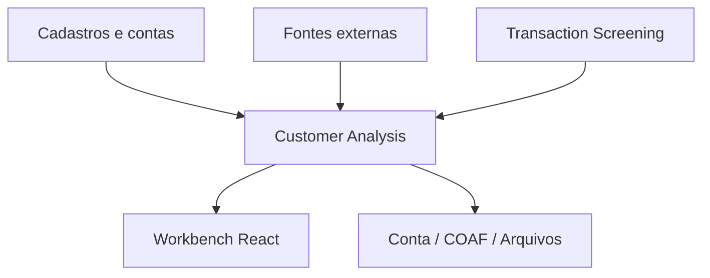
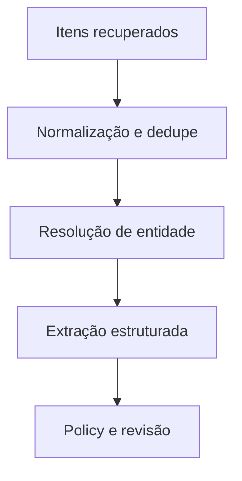

# `pld-customer-analysis` — arquitetura alvo

## Estilo arquitetural

Um backend Kotlin/Spring Boot implantado como **monólito modular**, com banco próprio e módulos de domínio fortes. Isso reduz a complexidade transacional do workflow e do dossiê, mantendo a fronteira de escala correta em relação ao motor transacional.

O termo “monólito modular” vale dentro deste serviço. Não significa unir os três repositórios ou bancos. Se um módulo futuro exigir escala/ownership independente, seus eventos e tabelas já delimitados permitem extração.

## Contexto



## Módulos internos

| Módulo | Responsabilidade | Objetos principais |
|---|---|---|
| `identity-access` | identidade corporativa, papéis, autorização e auditoria de acesso | Actor, Role, Permission |
| `party` | PF/PJ, snapshots, relações, conta referenciada e resolução de duplicidade | Party, PartySnapshot, PartyRelationship |
| `evidence` | catálogo/execução de fontes, evidência, fato e observação | SourceDefinition, SourceExecution, Evidence, Fact, Observation |
| `enrichment` | adaptadores e pipelines de mídia, processo, listas, nomes, país e endereço | Finding, NameMatch, LegalCaseFinding, MediaFinding |
| `analysis` | ciclo, política, requisitos, assessment, deriva e revalidação | AnalysisCycle, PolicyVersion, Assessment, ReviewSchedule |
| `case-management` | fila, atribuição, colaboração, pendência e agrupamento | Case, CaseTask, Comment, AttachmentRef |
| `decision` | decisões de conta/suspeição, aprovações e efeitos externos | AccountDecision, SuspicionDecision, Approval, AccountAction |
| `transaction-projection` | inbox e read model dos eventos transacionais | TransactionSignalView, TransactionEvaluationView |
| `dossier` | montagem, snapshot, manifesto, exportação e integridade | Dossier, DossierVersion, Export |
| `regulatory-reporting` | comunicação COAF, prazo, submissão, recibo e retificação | CoafCommunication, SubmissionAttempt |
| `timeline` | log regulatório projetado e consultas históricas | TimelineEntry |
| `integration` | outbox/inbox, schema adapters e conectores de sistemas internos | IntegrationEvent, InboxRecord, OutboxRecord |
| `workbench-api` | comandos e read models orientados às telas | QueueView, Party360View, CaseWorkspaceView |

Cada módulo expõe API Kotlin interna e eventos de domínio. Somente o módulo dono acessa suas tabelas. Ferramentas como Spring Modulith podem validar o grafo e executar testes isolados.

## Dependências permitidas

- `workbench-api` orquestra casos de uso por APIs públicas, sem acessar repositórios.
- `analysis` consome interfaces de `party` e `evidence`, não adapters externos.
- `case-management` referencia IDs de ciclo/finding; não incorpora aggregates inteiros.
- `decision` exige snapshot de assessment e cria efeitos via ports.
- `dossier` lê snapshots por interfaces de consulta versionada.
- `regulatory-reporting` referencia uma versão congelada de dossiê/decisão.
- `timeline` recebe eventos; não participa de invariantes transacionais de outros módulos.
- `enrichment` produz evidência/finding por contratos do módulo `evidence`.

Proibir ciclos de dependência em CI.

## Agregados e consistência

Evitar um mega-aggregate de cliente. Usar transações locais por aggregate e eventos internos/outbox para projeções.

| Aggregate root | Invariantes principais |
|---|---|
| `Party` | identidade/tipo, snapshots monotônicos, merge/split auditado |
| `SourceExecution` | status terminal único, tentativas e evidências ligadas |
| `AnalysisCycle` | transições válidas, política/snapshot fixados, fechamento controlado |
| `Assessment` | inputs e política imutáveis, resultado versionado |
| `Case` | transições, responsável, deduplicação e optimistic locking |
| `Decision` | ator, reason, inputs, aprovação e sucessão imutáveis |
| `DossierVersion` | conteúdo fechado/hash e versão monotônica |
| `CoafCommunication` | máquina de estados, payload versionado, envio idempotente |

Quando um comando atravessar aggregates, um process manager coordena passos e compensações. Não usar transação distribuída.

## Persistência

PostgreSQL é a opção natural para o modelo relacional e o ecossistema atual, sujeita ao padrão corporativo. Um banco/cluster lógico é exclusivo do serviço. Separar ownership por schemas ou prefixos e migrations do módulo.

| Módulo | Tabelas indicativas |
|---|---|
| party | `party`, `party_snapshot`, `party_identifier`, `party_alias`, `party_relationship`, `party_account_ref` |
| evidence | `source_definition_version`, `collection_plan`, `source_execution`, `evidence`, `fact_version`, `observation` |
| enrichment | `finding`, `media_item`, `media_finding`, `legal_case`, `legal_case_finding`, `list_match`, `name_match`, `address_assessment` |
| analysis | `analysis_cycle`, `policy_version`, `policy_requirement`, `assessment`, `assessment_input`, `derivation`, `review_schedule` |
| case | `analysis_case`, `case_link`, `case_assignment`, `case_task`, `case_comment`, `attachment_ref` |
| decision | `account_decision`, `suspicion_decision`, `decision_evidence`, `approval`, `account_action_attempt` |
| transaction projection | `transaction_event_inbox`, `transaction_evaluation_view`, `transaction_signal_view` |
| dossier | `dossier`, `dossier_version`, `dossier_manifest_item`, `dossier_export` |
| regulatory | `coaf_communication`, `coaf_payload_version`, `coaf_approval`, `coaf_submission_attempt` |
| timeline | `timeline_entry`, opcionalmente particionada por tempo/party |
| integration | `inbox_event`, `outbox_event`, `dead_letter_record` |

Usar JSON somente para payloads naturalmente variáveis e preservar campos consultados/relacionados em colunas tipadas. Não transformar o banco em depósito de respostas brutas sem classificação.

## Armazenamento de evidência e documentos

- Metadados e relações ficam no banco.
- Conteúdo permitido e arquivos ficam em object storage criptografado/versionado.
- `Evidence` guarda bucket lógico, object key opaca, version ID, hash, tamanho, mime type, classificação e retenção.
- URL assinada é curta e emitida após autorização; não persistir URL temporária.
- Antivírus/content validation antes de disponibilizar anexos.
- Quando licença proibir cópia, armazenar somente referência, metadados, hash permitido e observação/extração autorizada.

## Coleta e enriquecimento

### Ports

```text
PartyMasterDataPort
MediaSearchPort
LegalProcessDiscoveryPort
LegalProcessEnrichmentPort
RestrictedListPort
SanctionsPort
WarrantPort
GeocodingPort
IdentityResolutionPort
DocumentStoragePort
TextExtractionPort
TextClassificationPort
```

Adapters traduzem resposta do fornecedor para objetos canônicos e status de fonte. Trocar fornecedor não muda `Assessment`.

### Orquestração

Um `EvidenceCollectionProcess` durável:

1. congela o plano;
2. agenda execuções independentes com limites por fonte;
3. registra cada resultado;
4. reprocessa somente falhas elegíveis;
5. fecha quando requisitos terminam ou prazo/política define pendência;
6. solicita assessment.

Jobs precisam de lease/heartbeat e retomada; não manter thread/transação aberta enquanto aguarda fonte externa.

## Pipeline de mídia com Bedrock opcional



`TextExtractionPort`/`TextClassificationPort` podem ter adapter Amazon Bedrock. O adapter:

- escolhe modelo por configuração versionada;
- monta template controlado e delimita conteúdo como dado;
- exige JSON schema fechado;
- armazena hashes/referências de input e output protegidos;
- mede confiança/validação e devolve erro explícito;
- aplica quotas, timeout, circuit breaker e observabilidade;
- não recebe mais PII do que o necessário;
- permite replay offline controlado para avaliação de nova versão.

O domínio decide rota e suficiência; o modelo não chama diretamente portas de decisão.

## Motor de política do cliente

Não reutilizar o motor transacional por chamada remota. O novo backend possui políticas de ciclo/evidência/decisão com semântica própria. Pode compartilhar uma biblioteca puramente técnica de expressão somente se houver governança de versão; não compartilhar banco, deployment ou configuração.

Componentes:

- `PolicyCatalog`: versões, vigência, aprovação;
- `RequirementEvaluator`: cobertura e qualidade de evidências;
- `RiskAssessmentService`: combina facts/findings e explica contribuição;
- `RoutingPolicy`: automático, deriva, segundo aprovador ou retry;
- `ReviewPolicy`: validade e próximo ciclo;
- `DecisionPolicy`: quais decisões automáticas/humanas são permitidas.

Toda execução produz `Assessment` imutável.

## Casos e prevenção de retrabalho

Antes de criar caso:

1. procurar chave de origem idempotente;
2. procurar caso aberto da mesma parte com tipo/janela compatível;
3. aplicar `CaseGroupingPolicyVersion`;
4. anexar finding ao caso existente ou criar outro;
5. registrar por que agrupou/separou.

O read model da fila contém `partySummary`, origens, findings principais, idade, responsável, pendências e prioridade calculada. A prioridade não pode esconder o reason code.

## Decisões e efeitos externos

`IssueAccountDecision` persiste a decisão e outbox. Um adapter de `AccountDecisionPort` envia comando idempotente ao sistema dono da conta. O retorno vira `AccountActionAttempt`; o status confirmado chega por callback/evento/reconciliação.

Separar claramente:

```text
DECISION_ISSUED
ACTION_REQUESTED
ACTION_APPLIED
ACTION_FAILED_OR_UNKNOWN
```

O mesmo padrão vale para comunicação ao COAF: decisão, preparação, submissão e acknowledgement não são o mesmo estado.

## Dossiê e comunicação

### Dossiê

Um job recebe `asOf` e IDs de versões, constrói manifesto ordenado e renderiza artefatos. O manifesto é a fonte da integridade; PDF é uma representação. Guardar hash do manifesto e dos arquivos.

### COAF

`CoafSubmissionPort` abstrai canal. O adapter pode:

- gerar arquivo/lote para envio assistido;
- integrar webservice homologado;
- registrar retorno manual com dupla validação quando aplicável.

Segredo, certificado e credencial nunca entram no domínio/payload de auditoria. Timers de prazo são persistentes e observáveis.

## Timeline

Cada módulo emite `RegulatoryActivityRecorded` interno com:

```text
activityId
partyId / cycleId / caseId
activityType
businessOccurredAt / recordedAt
actor
summaryCode + safe parameters
objectType / objectId / objectVersion
correlationId / causationId
visibilityClassification
```

O módulo timeline projeta e filtra por autorização. A fonte de verdade continua no módulo de origem; a timeline pode ser reconstruída.

## API do Workbench

Rotas ilustrativas:

```text
GET  /v1/work-queue
GET  /v1/search
GET  /v1/parties/{partyId}/overview
GET  /v1/parties/{partyId}/timeline
GET  /v1/cases/{caseId}/workspace
POST /v1/cases/{caseId}:assign
POST /v1/cases/{caseId}/observations
POST /v1/cases/{caseId}/source-executions:retry
POST /v1/cases/{caseId}/decisions
POST /v1/decisions/{decisionId}:approve
POST /v1/decisions/{decisionId}:reject
POST /v1/dossiers
GET  /v1/dossiers/{dossierId}
POST /v1/coaf-communications/{id}:submit-for-review
POST /v1/coaf-communications/{id}:approve
POST /v1/coaf-communications/{id}:send
```

Comandos usam `Idempotency-Key`; atualizações usam ETag/version. Erros têm code estável, mensagem segura, `correlationId` e detalhes de validação permitidos.

## Busca

Começar com índices PostgreSQL adequados e normalização de nome. Adotar motor de busca separado somente quando volume/fuzzy search justificar. Índice é projeção reconstruível, com PII protegida e acesso equivalente ao sistema de origem.

## Deploy e escalabilidade

- stateless app instances para HTTP/consumers;
- workers configuráveis por tipo de fonte/job;
- rate limiter distribuído por credencial/fonte;
- schedulers com lock/lease;
- autoscaling separado por deployment/worker pool se necessário, mantendo o mesmo código modular;
- transaction screening escala de modo independente;
- migrations executadas de forma controlada antes do rollout incompatível.

## Testes arquiteturais

- grafo de módulos sem ciclos e sem acesso cross-module a repository;
- state-machine/property tests para ciclo, caso, decisão e COAF;
- contrato por adapter de fonte com respostas vazias/parciais/erro;
- contrato de eventos e idempotência;
- autorização por endpoint e por objeto;
- teste temporal “as of”;
- dossiê golden/manifest hash;
- duplicate/reorder/replay;
- workflow de ação externa com timeout e reconciliação;
- prompt injection/schema violation no adapter de IA;
- carga de fila/timeline e jobs de revalidação.

