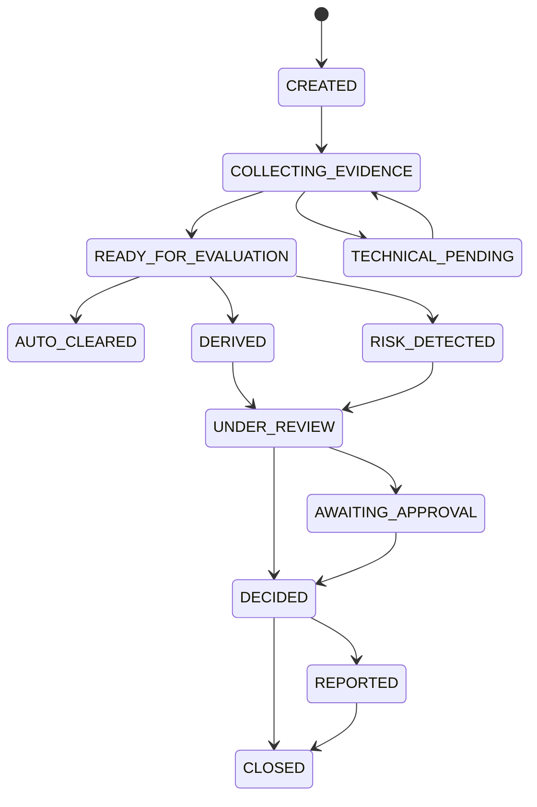

# Glossário e modelo de domínio compartilhado

Este glossário é normativo para nomes de APIs, eventos, telas e código. Traduções de UI podem variar, mas não devem alterar a semântica.

## Entidades e artefatos centrais

| Termo | Definição | Identidade / regra |
|---|---|---|
| `Party` | Sujeito analisado pelo programa de PLD. Pode ser pessoa física (`PERSON`) ou jurídica (`ORGANIZATION`). | `partyId` interno e estável; CPF/CNPJ são atributos protegidos, não IDs de integração. |
| `PartyRelationship` | Relação entre partes: sócio, administrador, representante, beneficiário final, procurador ou outra relação relevante. | Possui tipo, vigência, fonte e confiança. |
| `Account` | Conta ou relacionamento de negócio sobre o qual pode haver decisão operacional. | Referenciada por `accountId`; o cadastro mestre pode pertencer a sistema externo. |
| `AnalysisCycle` | Unidade temporal de avaliação de uma parte, aberta por onboarding, revisão, evento, alerta, requisição regulatória ou iniciativa manual. | Toda evidência, assessment e decisão pertence a um ciclo. |
| `Evidence` | Registro proveniente de uma fonte, preservado com conteúdo ou referência imutável, origem, horário, validade e integridade. | Nunca é sobrescrito; uma atualização cria outra versão. |
| `Observation` | Constatação humana ou contextual que não deve ser promovida automaticamente a fato objetivo. | Ex.: observação do analista ao visualizar Street View. |
| `Fact` | Valor normalizado extraído de evidência, cadastro ou projeção, acompanhado de qualidade e proveniência. | Um fato sem valor não vira `false`; carrega estado explícito. |
| `Finding` | Sinal relevante resultante de correlação, regra, busca ou análise, ainda sem representar a decisão final. | Pode ter severidade, confiança, evidências e regra/política. |
| `Assessment` | Avaliação versionada que reúne fatos/findings e aplica uma política para recomendar rota e conclusão. | Guarda versão de política, entradas e explicação. |
| `Derivation` / deriva | Encaminhamento a humano porque a política não permite concluir automaticamente com as evidências disponíveis. | Não equivale a suspeita, condenação, rejeição ou erro técnico. |
| `Case` | Contêiner do trabalho humano, ligado a uma `Party` e a um ou mais ciclos/findings. | É a única fila operacional dos analistas. |
| `AccountDecision` | Decisão sobre abertura, manutenção ou encerramento do relacionamento. | Eixo independente de `SuspicionDecision`. |
| `SuspicionDecision` | Conclusão sobre suspeição e eventual comunicação ao COAF. | Não altera a conta por implicação automática. |
| `Dossier` | Registro interno completo e versionado da análise, com dados, evidências, regras, decisões e trilha. | Pode ser regenerável e também congelado como snapshot. |
| `CoafCommunication` | Artefato curado e estruturado para comunicação ao COAF, originado de uma decisão explícita. | Não é sinônimo de dossiê e tem workflow próprio. |
| `TransactionEvaluation` | Execução determinística de regras sobre o snapshot de uma transação e fatos disponíveis. | Identificada por `evaluationId`; guarda versões e explicação. |
| `TransactionSignal` | Resultado transacional relevante publicado para análise do cliente/caso. | Não é, sozinho, uma conclusão de suspeição. |
| `Policy` | Conjunto versionado de requisitos, limites, regras, rotas e aprovações aplicáveis. | Uma decisão sempre aponta para a versão efetiva. |

## Tipos de ciclo

```text
ONBOARDING
PERIODIC_REVIEW
EVENT_DRIVEN_REVIEW
TRANSACTION_ALERT
REGULATORY_REQUEST
MANUAL_REVIEW
```

`EVENT_DRIVEN_REVIEW` cobre mudança cadastral, nova mídia negativa, novo processo, alteração societária, expiração de evidência ou outro evento configurado. `TRANSACTION_ALERT` identifica a origem, mas o trabalho humano continua no mesmo modelo de caso.

## Estado do ciclo de análise



`AUTO_CLEARED` fecha o ciclo automaticamente, mas não apaga as entradas ou a justificativa. `TECHNICAL_PENDING` é recuperável e não deve gerar conclusão negativa por ausência de resposta.

## Qualidade do valor de um fato

| Estado | Significado | Comportamento permitido |
|---|---|---|
| `PRESENT` | Valor obtido e válido na referência temporal. | Pode participar da avaliação. |
| `UNKNOWN` | A fonte respondeu, mas o valor não pôde ser determinado ou não existe. | Política decide se deriva; nunca converter implicitamente em falso. |
| `STALE` | Existia valor, mas sua validade expirou. | Pode ser exibido com aviso; uso decisório exige regra explícita. |
| `ERROR` | Falha ao obter, transformar ou validar o valor. | Retentar ou colocar em pendência técnica; não concluir ausência. |

O fato também carrega `observedAt`, `validUntil`, `source`, `evidenceId` e, quando aplicável, `confidence`.

## Resultado da execução de uma fonte

```text
SUCCESS_WITH_DATA
SUCCESS_NO_RESULTS
PARTIAL
CONFLICT
UNAVAILABLE
ERROR
EXPIRED
```

`SUCCESS_NO_RESULTS` é uma evidência operacional de que a consulta válida não retornou itens. `UNAVAILABLE` e `ERROR` significam que não se sabe o resultado.

## Motivos de deriva

```text
INSUFFICIENT_EVIDENCE
CONFLICTING_EVIDENCE
LOW_IDENTITY_CONFIDENCE
SOURCE_UNAVAILABLE
STALE_EVIDENCE
POLICY_REQUIRES_REVIEW
HIGH_IMPACT_ACTION
UNCLASSIFIED_SITUATION
```

A rota deve registrar um ou mais motivos, os requisitos de política não satisfeitos e quais ações podem resolver o caso. A especificação evita a expressão “100% de certeza”; usa suficiência de evidência definida na política.

## Decisões independentes

### Relacionamento / conta

No onboarding:

```text
APPROVE
APPROVE_WITH_CONDITIONS
REQUEST_INFORMATION
REJECT
```

Durante o relacionamento:

```text
MAINTAIN
RESTRICT
SUSPEND
TERMINATE_RELATIONSHIP
REQUEST_INFORMATION
```

### Suspeição

```text
NO_SUSPICION
KEEP_MONITORING
COMMUNICATE_TO_COAF
INCONCLUSIVE
```

### Rota da decisão

```text
AUTOMATIC
DERIVED_TO_ANALYST
MANDATORY_SECOND_APPROVAL
TECHNICAL_RETRY
```

Cada decisão registra `decisionId`, ciclo, ator, papel, instante, motivo estruturado, narrativa, política, fatos/findings/evidências considerados e decisão anterior substituída, quando houver.

## Estados da comunicação ao COAF

Fluxo principal:

```text
DRAFT → UNDER_REVIEW → APPROVED → READY_TO_SEND → SENT → ACKNOWLEDGED
```

Estados de exceção:

```text
REJECTED_FOR_CORRECTION
RECTIFICATION_REQUIRED
RECTIFIED
CANCELLED
SUBMISSION_FAILED
```

Nenhum estado de comunicação pode ser inferido apenas do estado da conta.

## Identidade de nomes, apelidos e marcações de cartão

- `OfficialName`: nome conforme fonte oficial/cadastral.
- `Alias`: nome social, nome anterior, apelido conhecido, transliteração ou outra forma atribuída por uma fonte.
- `CardDescriptor`: texto impresso/exibido em cartão ou descritor operacional; não deve ser tratado automaticamente como identidade civil.
- `NameMatch`: resultado de comparação, com algoritmo/versão, normalização, score, explicação e candidatos.
- `IdentityResolution`: conclusão sobre se registros representam a mesma parte, com confiança e evidências.

Um match aproximado é um `Finding`, nunca uma condenação nem uma decisão automática isolada.

