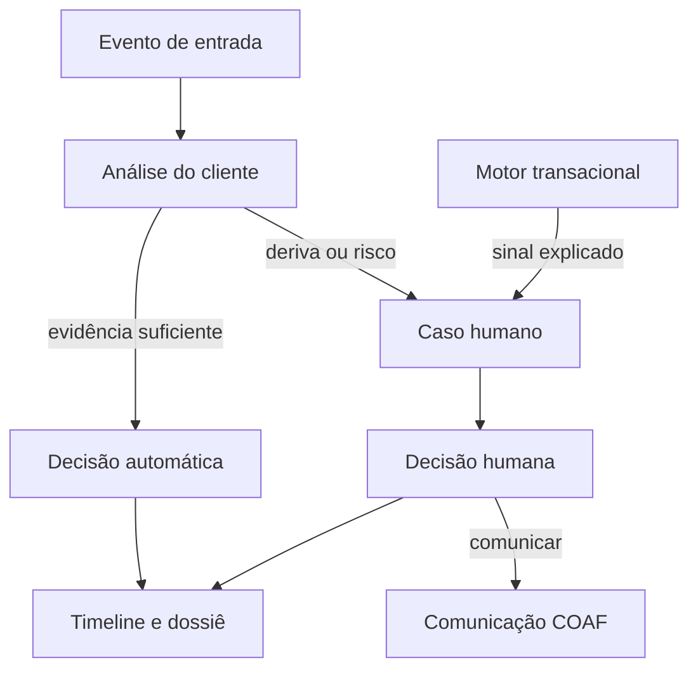
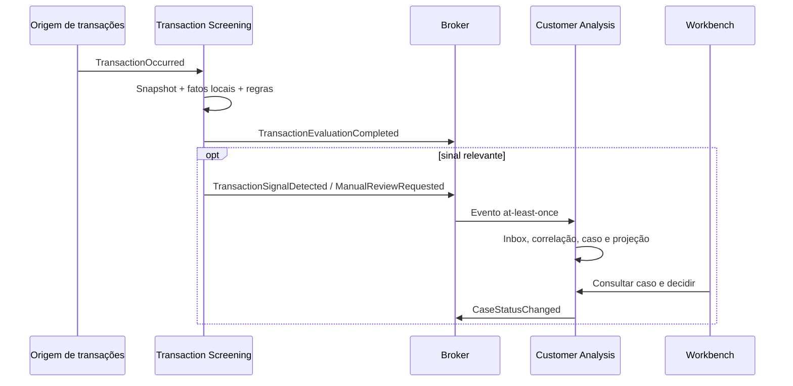
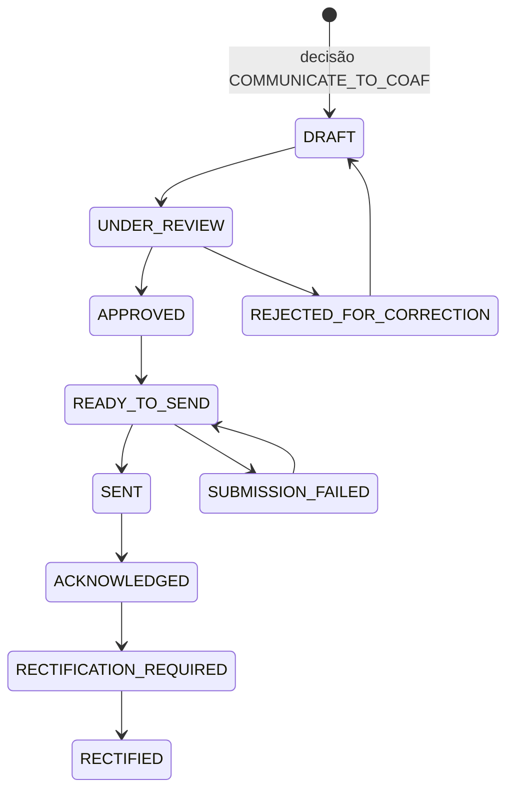

# Fluxos ponta a ponta

Os fluxos abaixo descrevem responsabilidades de domínio. Eles não dependem de a abertura de conta ser síncrona ou assíncrona: a decisão é publicada por porta/evento e o sistema de contas aplica conforme seu próprio contrato.

## Visão geral

## 1. Onboarding PF ou PJ

| Etapa | Responsável | Resultado persistido |
|---|---|---|
| Receber cadastro e relações | `pld-customer-analysis` | `Party`, `PartyRelationship`, snapshot e ciclo `ONBOARDING` |
| Planejar consultas conforme política | `pld-customer-analysis` | plano de coleta e versão de política |
| Executar fontes | adaptadores do novo backend | execuções, evidências, status e proveniência |
| Resolver identidade e normalizar fatos | novo backend | fatos PF/PJ, aliases, conflitos e confiança |
| Avaliar requisitos | novo backend | `Assessment`, findings e explicação |
| Rotear | novo backend | `AUTO_CLEARED`, `DERIVED`, `RISK_DETECTED` ou `TECHNICAL_PENDING` |
| Analisar exceção | analista no Workbench | caso, notas, anexos, ações e decisão |
| Decidir conta | motor de decisão do novo backend / analista autorizado | `AccountDecision` e evento/ordem de aplicação |
| Programar revisão | novo backend | próxima revisão e gatilhos ativos |
| Congelar registro | novo backend | timeline e versão de dossiê |

Regras essenciais:

- PJ inclui empresa, representantes, sócios, administradores e beneficiários finais conforme política; não cria outro workflow.
- Processos judiciais devem ser desambiguados antes de serem associados à parte. “Há processo” não equivale a condenação, e assunto/classe/movimentos precisam ser preservados.
- Mídia negativa é um finding contextual com fonte, data, entidade resolvida e classificação; não é decisão automática por palavra-chave.
- Mandados, sanções e listas restritivas devem manter qual lista, versão, data, match e atributos usados para desambiguação.
- Fonte indisponível leva a pendência técnica ou deriva conforme política, nunca a “sem ocorrência”.

## 2. Revisão periódica ou orientada por evento

Gatilhos possíveis:

- data de revalidação atingida;
- alteração de cadastro, renda, ocupação, atividade econômica ou quadro societário;
- nova evidência ou expiração de uma evidência anterior;
- mídia, processo, sanção, mandado ou país de risco alterado;
- padrão transacional relevante;
- solicitação manual ou regulatória.

Fluxo:

1. Abrir novo `AnalysisCycle` sem editar o ciclo anterior.
2. Calcular quais evidências ainda são válidas e quais precisam ser renovadas.
3. Coletar somente o necessário segundo política e minimização de dados.
4. Comparar fatos atuais com o snapshot anterior.
5. Explicar mudanças materiais e aplicar a versão vigente da política.
6. Encerrar automaticamente, derivar ou abrir caso.
7. Registrar eventual nova decisão de relacionamento/suspeição.
8. Manter lado a lado os estados “na época” e “atual”.

## 3. Análise transacional

O motor transacional:

- usa o snapshot da transação e a projeção local do risco vigente naquele instante;
- registra fatos presentes/ausentes, regras e versões;
- publica tanto avaliações quanto sinais relevantes;
- não cria a decisão humana final;
- pode aplicar uma ação técnica automática somente quando a política e o contrato com o sistema executor permitirem, sempre com `DecisionExecution` auditável.

O novo backend:

- evita um caso duplicado quando o evento é reentregue;
- agrupa sinais quando a política determinar correlação;
- mostra ao analista a explicação original, não uma reconstrução com regras atuais;
- conecta a investigação transacional à ficha e ao histórico do cliente.

## 4. Trabalho humano e deriva

1. O assessment cria ou atualiza um caso e registra motivos de deriva/findings.
2. A fila apresenta prioridade explicável, idade, origem e pendências; não existe separação obrigatória por mesa.
3. O analista assume ou recebe o caso, vê a visão 360 e os requisitos não satisfeitos.
4. Pode solicitar informação, retentar uma fonte, registrar observação ou anexar evidência.
5. Registra decisões de conta e suspeição em campos separados.
6. Ações de alto impacto podem exigir segundo aprovador conforme política, mesmo com a mesma equipe.
7. O caso é encerrado somente quando pendências obrigatórias estiverem resolvidas ou explicitamente dispensadas com justificativa e autorização.

## 5. Dossiê regulatório

O dossiê deve ser reprodutível para uma data de referência e conter:

- identificação e relações relevantes da parte;
- motivo, início e fim do ciclo;
- versões de cadastro consideradas;
- consultas executadas, inclusive vazias, parciais e indisponíveis;
- evidências e hashes/referências de integridade;
- fatos derivados, conflitos e confiança;
- regras/políticas e versões;
- findings, transações e correlações relevantes;
- decisões automáticas e humanas, atores e justificativas;
- aprovações, retificações e ações aplicadas à conta;
- comunicação ao COAF e comprovante, quando aplicável;
- timeline regulatória.

Gerar um snapshot fechado evita que uma consulta posterior apresente como histórica uma informação que só apareceu depois.

## 6. Comunicação ao COAF

Controles:

- a comunicação nasce de decisão explícita e referencia o dossiê/ciclo;
- campos enviados e narrativa são curados, não uma cópia irrestrita do banco;
- a porta `CoafSubmissionPort` isola envio manual assistido, lote ou webservice;
- cada tentativa guarda payload versionado, canal, instante, autor, status e comprovante sem expor segredo em logs;
- falha técnica não reverte a decisão nem duplica a comunicação;
- acesso e notificações devem respeitar o dever de sigilo e evitar tipping-off.

## 7. Google Maps e Street View

O frontend pode incorporar `StreetViewPanorama` na ficha de endereço, usando a API oficial já contratada pelo negócio.

Uso previsto:

1. Backend entrega endereço normalizado e coordenadas, quando existentes.
2. Frontend carrega Maps/Street View diretamente do Google e mantém atribuições.
3. Analista visualiza e, se relevante, registra uma `Observation` textual estruturada.
4. Persistir `panoId`, instante e ator é aceitável como referência operacional; imagem não deve ser copiada, armazenada ou reprocessada fora das permissões contratuais.
5. A observação não prova sozinha atividade, renda, domicílio ou existência de empresa.

## 8. Linha temporal mínima

Eventos regulatórios devem aparecer em ordem temporal com:

- instante do fato e instante do registro;
- tipo de evento;
- ator humano ou sistema;
- origem;
- resumo seguro para o papel do usuário;
- IDs correlacionados;
- versão anterior/nova quando houver mudança;
- links para evidências e decisões permitidas.

Não misturar a timeline com logs técnicos verbosos. Traces podem ser vinculados por `correlationId`, mas possuem retenção e público diferentes.

