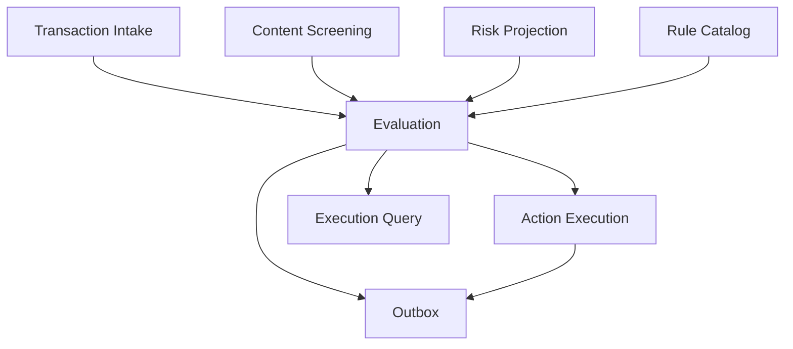

# `pld-transaction-screening` — arquitetura alvo

## Direção

Manter uma aplicação Spring Boot/Kotlin implantável como unidade, organizada em módulos internos com fronteiras verificáveis. A base atual já usa arquitetura hexagonal e contextos `screening`, `decision` e `alert`; a evolução preserva esse investimento, corrige ownership e adiciona confiabilidade de integração.

Não há justificativa, neste momento, para decompor o motor em vários microserviços: screening, resolução de fatos, decisão e auditoria participam do mesmo caminho crítico e escalam juntos. A separação importante é entre motor transacional e análise do cliente.

## Módulos



| Módulo | Ownership | Entradas | Saídas |
|---|---|---|---|
| `transaction-intake` | validação, deduplicação e snapshot da transação | evento/API legada | comando interno de avaliação |
| `content-screening` | termos restritos, matching, classificação contextual | descrições/campos textuais | matches explicados |
| `risk-projection` | projeção mínima e temporal do perfil do cliente | `CustomerRiskProfileUpdated` | fatos locais versionados |
| `rule-catalog` | definição, configuração, ruleset, aprovação e vigência | comandos administrativos | ruleset imutável efetivo |
| `evaluation` | fatos, expressões tri-state, decisão e explicação | snapshot + ruleset + projeção | `TransactionEvaluation` e sinais |
| `action-execution` | comando idempotente e reconciliação de ação | resultado autorizado | `DecisionExecution` |
| `event-publication` | outbox e schemas externos | eventos de domínio | eventos de integração |
| `execution-query` | read models e APIs históricas | projeções internas | respostas autorizadas |

Dependências apontam para contratos internos publicados; módulos não acessam repositórios/tabelas uns dos outros diretamente. Spring Modulith é uma opção para verificar dependências e testes de módulo, não um requisito de negócio.

## Mapeamento do código atual

| Código atual | Destino / tratamento |
|---|---|
| `br.com.screening.domain` e `application` | núcleo de `content-screening`; preservar regras de matching e reforçar versionamento/explicação |
| `br.com.decision.domain` e `application` | separar internamente `rule-catalog`, `evaluation` e `action-execution` |
| `CustomerRiskPort` / `CustomerRiskAdapter` REST | substituir gradualmente por consulta ao `risk-projection` local |
| `DecisionMadeEvent` / Spring application events | manter para comunicação interna; traduzir eventos externos pela outbox |
| `br.com.alert` | compatibilidade temporária; congelar features e retirar após migração da fila |
| `AnalystDecisionService` / histórico local | migrar decisão humana para o novo backend; manter somente ingestão de feedback técnico se houver caso de uso explícito |
| controllers atuais | preservar rotas durante transição; publicar API versionada alvo |

Eventos internos de aplicação não substituem a mensageria durável. Um listener interno pode persistir na mesma unidade, mas qualquer fato destinado a outro deploy precisa de outbox.

## Modelo principal

### `TransactionEvaluation` (aggregate root)

```text
evaluationId
transactionId
transactionEventId / transactionEventVersion
purpose
status
transactionSnapshotRef / snapshotHash
rulesetId / rulesetVersion
riskProfileId / riskProfileVersion
businessOccurredAt / evaluatedAt
factResults[]
ruleResults[]
decisionResult
explanation
correlationId / causationId
supersedesEvaluationId?
```

Estados sugeridos:

```text
RECEIVED → EVALUATING → COMPLETED
                    ↘ INDETERMINATE
                    ↘ FAILED
```

Falha técnica não publica “sem sinal”. `INDETERMINATE` representa conclusão do motor com lacunas tratadas pela política; `FAILED` representa execução que não pôde concluir.

### `FactResult`

```text
factCode
definitionVersion
quality: PRESENT | UNKNOWN | STALE | ERROR
typedValue?
observedAt?
validUntil?
source
errorCode?
```

### `ExpressionResult`

```text
result: TRUE | FALSE | INDETERMINATE
operator
leftOperandRef
rightOperandRef/value
reasonCode?
```

### `RuleSet`

Snapshot imutável das versões de regras/configurações aplicáveis a um contexto e instante. Uma avaliação aponta para um único `rulesetVersion`, mesmo que ele seja construído de várias configurações.

## Persistência por ownership

Nomes físicos são indicativos; cada tabela tem migration e constraints explícitas.

| Módulo | Tabelas principais |
|---|---|
| intake | `transaction_inbox`, `transaction_snapshot` |
| risk projection | `customer_risk_profile`, `customer_risk_profile_version`, `risk_event_inbox` |
| rule catalog | `rule_definition`, `rule_configuration_version`, `rule_set`, `rule_set_item`, `rule_approval`, `rule_activation` |
| evaluation | `transaction_evaluation`, `fact_result`, `rule_evaluation_result`, `decision_result`, `evaluation_explanation` |
| action execution | `decision_execution`, `action_attempt` |
| screening | `restricted_term_version`, `screening_match`, `classifier_execution` |
| integration | `outbox_event`, `inbox_event`, `dead_letter_record` |

Constraints críticas:

- unique na chave idempotente de avaliação live;
- unique em `(consumer_name, event_id)`;
- unique em `outbox_event.event_id`;
- versionamento monotônico por perfil/configuração;
- uma ativação efetiva por escopo incompatível/instante;
- FK lógica ou física de toda explicação para a avaliação imutável.

Para volumes grandes, particionamento/retention tiering pode ser adicionado após medir. Não remover fatos essenciais da explicação para reduzir custo sem uma política de retenção aprovada.

## Caminho da avaliação

1. Adapter recebe `TransactionOccurred`.
2. Inbox registra `eventId`; duplicata retorna o resultado conhecido.
3. Intake valida e cria snapshot/hash.
4. Serviço escolhe `RuleSet` efetivo pelo instante/finalidade.
5. Context builder resolve fatos do snapshot, screening e projeção local.
6. Avaliador executa expressões tri-state e reúne explicações.
7. Aggregate fecha resultado ou falha de forma explícita.
8. Repositório grava avaliação, sinais, execução requerida e outbox em uma transação.
9. Publisher envia eventos e marca outbox; reentrega é segura.
10. Executor de ação, se existir, usa command idempotente e reconcilia confirmação.

## Projeção de risco temporal

Guardar versões com `effectiveFrom` permite avaliar transação atrasada com o perfil que era efetivo no instante relevante. A política deve definir se usa `transactionOccurredAt` ou `processedAt`; isso fica registrado no `RuleSet`.

Se chegar versão `9` antes da `8`:

- persistir inbox das duas;
- nunca trocar a projeção atual de `9` para `8`;
- conservar `8` na história temporal se sua janela for válida;
- emitir métrica de gap/reorder e reconciliar quando o produtor oferecer mecanismo.

## Governança de regra

Comandos principais:

```text
CreateRuleDraft
UpdateRuleDraft
SubmitRuleForReview
ApproveRuleVersion
ScheduleRuleActivation
RetireRuleVersion
RollbackRuleSet
RunDryRun
RunBacktest
```

Invariantes ficam no domínio, não só na UI. A publicação `RuleConfigurationActivated` acontece após commit da ativação.

## APIs alvo

Rotas ilustrativas; confirmar convenções corporativas:

```text
GET  /v1/evaluations/{evaluationId}
GET  /v1/transactions/{transactionId}/evaluations
POST /v1/evaluations:replay

GET  /v1/rules
POST /v1/rules/{ruleCode}/versions
POST /v1/rules/{ruleCode}/versions/{version}:submit
POST /v1/rules/{ruleCode}/versions/{version}:approve
POST /v1/rules/{ruleCode}/versions/{version}:schedule

POST /v1/dry-runs
POST /v1/backtests
GET  /v1/jobs/{jobId}
POST /v1/jobs/{jobId}:cancel
```

Usar `Idempotency-Key` em comandos e ETag/versão em atualizações. Endpoints administrativos aplicam autorização no serviço.

## Segurança e dados

- A projeção de risco contém fatos mínimos, não cadastro completo.
- Snapshot transacional deve ter classificação, criptografia e acesso por finalidade.
- Explicação exibida a usuário é uma view segura; payload bruto do classificador tem acesso mais restrito.
- Nenhum nome/CPF/descrição livre entra em tag de métrica.
- Administração de regras registra leitura/exportação quando contiver dados de amostra.

## Estratégia de testes

- manter property-based tests existentes do domínio de regras;
- adicionar testes de verdade tri-state e combinações de fatos ausentes;
- golden tests de explicação e normalização;
- teste de módulo impedindo acesso cruzado a repositórios;
- contract tests dos eventos;
- integração Postgres/broker/outbox/inbox;
- carga sem backend de clientes disponível;
- caos: duplicidade, reorder, atraso de perfil, timeout de classificador e falha depois do commit antes da publicação;
- comparação shadow entre `Alert` legado e caso novo.

